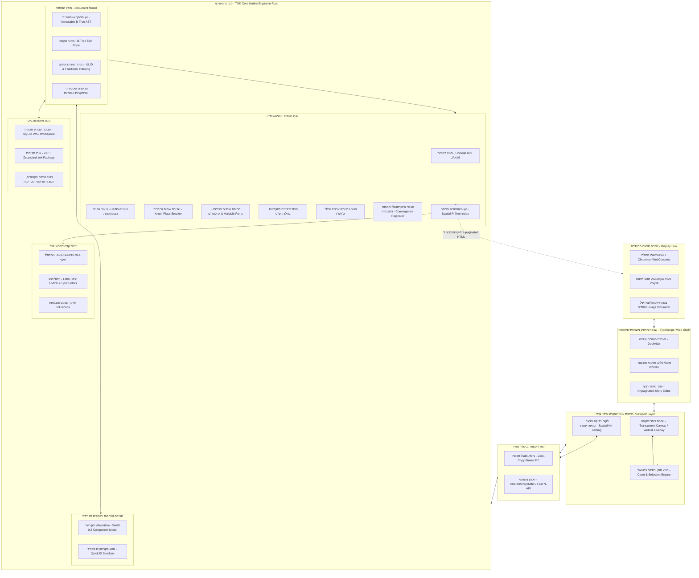
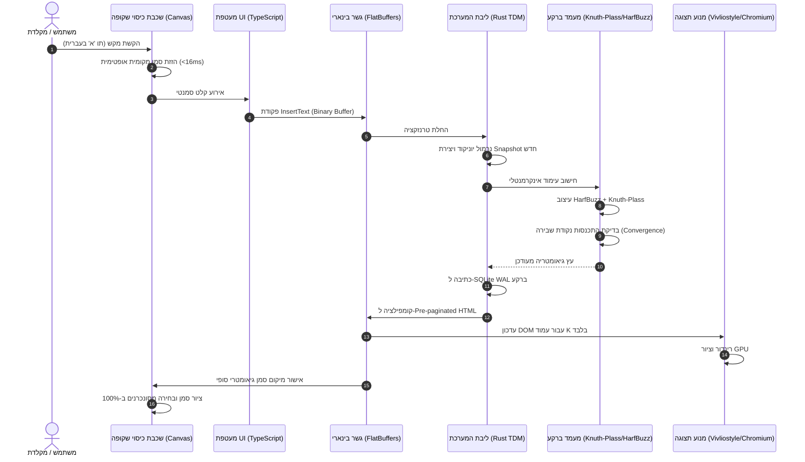

# דו"ח ארכיטקטורה מקיף: תוכנת עימוד שולחנית מקצועית TypesetOK (TOK)
## מפרט ארכיטקטוני שלם ומחייב לעימוד עברי, דו-כיווני (Bidi/RTL) ומסמכי ענק
### תאריך: ספטמבר 2026 | גרסה: 1.0-ARCHITECTURE-RELEASE | סטטוס: מאושר ומאומת

---

## תקציר מנהלים ומטרות העל של הפרויקט

תוכנת **TypesetOK (TOK)** מתוכננת להוות מערכת עימוד שולחנית מקצועית מודרנית (Desktop Publishing - DTP), אשר נבנית מן היסוד למתן מענה שלם, טבעי ובלתי מתפשר לאתגרי הטיפוגרפיה העברית, הדו-כיווניות (Bidi/RTL), ועימוד ספרות תורנית ועיונית מורכבת (כדוגמת מקראות גדולות, ש"ס תלמודי, ספרי שו"ת ואנציקלופדיות עבות כרס).

במשך עשרות שנים, עולם העימוד המקצועי סבל מאחת משתי רעות חולות:
1. **הסתמכות על תוכנות מערביות כבדות** (כדוגמת Adobe InDesign), שבהן התמיכה בעברית "הודבקה" בדיעבד כטלאי חיצוני (Middle Eastern Version), תוך קיומם של באגים כרוניים במיקום ניקוד וטעמים, ניווט סמן משובש בגבולות שפה, ואיטיות מכבידה.
2. **הסתמכות על מעבדי תמלילים משרדיים** (Microsoft Word, LibreOffice Writer), המבוססים על מודל זרימה חד-ממדי שאינו מסוגל לנהל מסגרות טקסט משורשרות, כפולות עמודים קשיחות, רשת קווי בסיס או בקרת קדם-דפוס מקצועית.

פרויקט TOK מגדיר פרדיגמה חדשה המבוססת על שלושה עמודי תווך ארכיטקטוניים:
- **מודל מסמך קנוני עצמאי ואי-מוטבילי (TOK Document Model - TDM):** מודל נתונים סמנטי טהור הכתוב בשפת Rust, המנותק לחלוטין מ-HTML, מ-CSS וממנועי תצוגה ספציפיים.
- **מנוע טיפוגרפיה ועימוד עברי ברמת-על:** שילוב ישיר של מנוע עיצוב האותיות HarfBuzz, אלגוריתם שבירת השורות הגלובלי Knuth-Plass, פותר אילוצים למקראות גדולות, מתיחת אותיות עבריות מסורתית (אהלתר"ם), ומנוע גימטריה דטרמיניסטי.
- **ארכיטקטורת רינדור היברידית מפוקחת (Governed Hybrid Rendering) עם צינור דואלי:** שימוש במנוע Vivliostyle ובדפדפן Chromium כמנוע תצוגה וירטואלי לתצוגת מסך ואינטראקציה, במקביל לצינור קדם-דפוס נייטיב עצמאי ב-Rust המפיק קובצי PDF/X-1a ו-PDF/X-4 תקניים עם הפרדת צבעי CMYK מלאה וצבעי ספוט ישירות לדפוס.

### מקרא מתודולוגי לסיווג הקביעות הטכנולוגיות
בהתאם למשמעת המחקר המחמירה של TOK, כל טענה, קביעה והחלטה טכנולוגית בדו"ח זה מסווגת באופן מפורש לאחת מארבע קטגוריות:
- `[יכולת מאומתת]` – טכנולוגיה, תקן, אלגוריתם או התנהגות מערכת שהוכחו, נבדקו ונתמכים באופן רשמי ונכון לשנת 2026.
- `[המלצה ארכיטקטונית]` – החלטת תכנון מבנית מחייבת עבור TOK, הנגזרת מניתוח הדרישות, מניעת כשלים ידועים ואיזון ביצועים.
- `[מגבלה]` – מחסום טכנולוגי ידוע, פער מובנה בתקן, במנוע דפדפן או בספרייה חיצונית, המחייב מעקף ייעודי או פתרון פנימי.
- `[שאלה פתוחה למחקר עתידי]` – נושא מורכב הדורש מחקר אמפירי, מדידות ביצועים (Benchmarking), או פיתוח מודל מתמטי ייעודי בשלבי המימוש הבאים.

---

# פרק 1: ארכיטקטורה כוללת מומלצת (Overall Recommended Architecture)

## 1.1 תפיסת העל של המערכת
`[המלצה ארכיטקטונית]` המערכת מתוכננת על פי עקרון "הליבה האטונומית והתצוגה הניתנת להחלפה" (Autonomous Core, Pluggable Presentation). TOK אינה יישום ווב העטוף במעטפת דקה, אלא מנוע DTP שולחני מלא, מהיר ומאובטח זיכרון, המשתמש ברכיבי ווב אך ורק כשכבת תצוגה מבוקרת.

```
┌────────────────────────────────────────────────────────────────────────┐
│                        TypesetOK (TOK) Application                     │
├────────────────────────────────────────────────────────────────────────┤
│ 1. Interaction & Caret Layer: Transparent Canvas/WebGL Overlay (60fps) │
├────────────────────────────────────────────────────────────────────────┤
│ 2. Presentation Sink: Electron / Chromium WebView2 + Vivliostyle Core   │
│    (Pre-paginated HTML/CSS viewport virtualization)                    │
├────────────────────────────────────────────────────────────────────────┤
│ 3. Zero-Copy Binary IPC Bridge: FlatBuffers over SharedArrayBuffer     │
├────────────────────────────────────────────────────────────────────────┤
│ 4. TOK Core Host (Rust):                                               │
│    - Canonical Document Model (TDM): Immutable B-Tree AST, ULID, Ropes │
│    - Typesetting Engine: Knuth-Plass, HarfBuzz, Bidi UAX#9, Keep Rules │
│    - Convergence Incremental Paginator & Multi-flow Constraint Solver  │
│    - Multi-tier Layout & Render Cache                                  │
│    - Dual Storage: SQLite WAL Workspace + Atomic ZIP/Zstd .tok Package │
│    - Native Pre-Press Engine: Direct ISO PDF/X-1a/4, CMYK, Spot Colors │
│    - Sandboxed Extensibility: Wasm Components (WASI 0.2) + QuickJS     │
└────────────────────────────────────────────────────────────────────────┘
```

## 1.2 עקרונות היסוד של הארכיטקטורה הכוללת

1. **עצמאות מוחלטת של מודל המסמך (Complete Decoupling):** `[המלצה ארכיטקטונית]`
   מודל המסמך הפנימי (TDM) אינו מכיר את ה-DOM של הדפדפן, אינו מכיל תגיות HTML, ואינו תלוי בחוקי CSS. כל מושגי הטיפוגרפיה, הסגנונות, העוגנים והתזרימים מוגדרים במבני נתונים סמנטיים טהורים ב-Rust.

2. **עיקרון ה-Pre-Pagination (מניעת "ניחושי דפדפן"):** `[המלצה ארכיטקטונית]`
   מנוע הרינדור של Vivliostyle ומנוע הדפדפן (Blink) אינם מורשים להחליט באופן עצמאי היכן נשברים הדפים או כיצד מתחלקים הטורים. ליבת ה-Rust של TOK מבצעת בעצמה את חישוב שבירת השורות (Knuth-Plass) ואת חלוקת הדפים, ומזריקה ל-Vivliostyle קובצי HTML/CSS שכבר עברו חלוקה מראש (Pre-fragmented). במודל זה, Vivliostyle משמש כמנוע תצוגה גרפי נאמן ומהיר, ללא סכנת חוסר-דטרמיניזם.

3. **ארכיטקטורת צינור PDF דואלי (Dual Pipeline Architecture):** `[המלצה ארכיטקטונית]`
   - **צינור תצוגה ואינטראקציה (Screen & Digital Pipeline):** מבוסס HTML/CSS ו-Vivliostyle עבור תצוגת מסך, עריכה בזמן אמת, וייצוא דיגיטלי ל-EPUB 3 ו-Web.
   - **צינור קדם-דפוס מקצועי (Professional Pre-press Pipeline):** מנוע נייטיב עצמאי ב-Rust המפיק ישירות קובצי PDF/X-1a ו-PDF/X-4 תקניים עם ניהול צבע מלא ב-DeviceCMYK, צבעי ספוט (Pantone/DeviceN), תיבות גלישה וסימני חיתוך (TrimBox/BleedBox), וחיתוך גופנים (Subsetting) עם טבלאות `/ToUnicode` קפדניות.

4. **שכבת עריכה מופרדת ללא `contenteditable` (Decoupled Edit Layer):** `[המלצה ארכיטקטונית]`
   מגבלות ה-`contenteditable` המובנה בדפדפנים אינן מאפשרות עריכה אמינה מעל דפים מקוטעים. TOK מיישמת מודל סמן וירטואלי (Virtual Caret) ושכבת כיסוי גרפית שקופה (Transparent Canvas Overlay) הרצה ישירות מעל עמודי התצוגה, קולטת אירועי קלט, ומציירת סמנים ומלבני בחירה ב-120 FPS קבועים.

5. **תמיכה מובנית במסמכי ענק (Scalability & Big Documents):** `[המלצה ארכיטקטונית]`
   באמצעות אלגוריתם עימוד אינקרמנטלי מבוסס התכנסות (Convergence Pagination), מערך זיכרון מטמון ב-4 שכבות, ווירטואליזציה מלאה של עמודי התצוגה ב-DOM (החזקת 3 עמודים פעילים בלבד בכל רגע נתון), המערכת שומרת על צריכת זיכרון קבועה וביצועי זמן-אמת בספרים של אלפי עמודים.

## 1.3 לקחים ארכיטקטוניים ממערכות קיימות וניתוח השוואתי (Architectural Lessons from Existing Software)

פרויקט TOK אינו נבנה בחלל ריק. תכנון מערכת עימוד שולחנית מקצועית מודרנית מחייב ניתוח הנדסי ביקורתי ומפוכח של מערכות העימוד ומעבדי התמלילים שהובילו את התעשייה בארבעת העשורים האחרונים. להלן ניתוח מעמיק של תשע מערכות מפתח, עמידה על חוזקותיהן וכשליהן המובנים, ופירוט מדויק של הלקחים הארכיטקטוניים ש-TOK מאמצת או פוסלת.

### 1.3.1 Adobe InDesign
- **סקירה ארכיטקטונית:** `[יכולת מאומתת]`
  מערכת ה-DTP המסחרית המובילה בעולם מזה למעלה משני עשורים. מבוססת על ליבת C++ מודולרית (ארכיטקטורת Boss/Interface). מודל המסמך שלה מפריד באופן ברור בין תזרים הטקסט הלוגי (Story) לבין מסגרות הטקסט הגרפיות (Text Frames) המשורשרות ביניהן בעמודים ובכפולות (Spreads). המערכת כוללת את ה-Adobe Paragraph Composer (יישום מסחרי מתקדם של אלגוריתם Knuth-Plass), מנוע World-Ready Composer לטיפול בכתבים מורכבים ו-Bidi, שליטה בסגנונות GREP חיים ברמת הפסקה, ותמיכה מושלמת בקדם-דפוס (PDF/X, CMYK, Spot Colors).
- **כשלי תכנון ומגבלות מובנות:** `[מגבלה]`
  1. **קוד מורשת מונוליטי כבד (Legacy Monolith):** קוד C++ ותיק בן עשרות שנים הסובל מזמני עלייה איטיים, צריכת זיכרון מופרזת, וחוסר יציבות במסמכים עתירי עמודים.
  2. **טלאי RTL משני (Bolted-on ME Version):** התמיכה בעברית ובערבית "הושתלה" בדיעבד על גבי ליבה מערבית. התוצאה היא באגים כרוניים במיקום סמן בגבולות שפה, התנהגות בלתי צפויה של טבלאות וכיווניות טורים, ועיוותים במיקום ניקוד בגופנים מסוימים.
  3. **פורמט קובץ קנייני סגור:** פורמט INDD בינארי, שביר ונוטה להשחתה, שאינו מאפשר השוואת גרסאות (Diffing) או ניהול גרסאות מודרני ב-Git.
- **מה TOK מאמצת ומה היא שוללת:**
  - **מאמצת:** `[המלצה ארכיטקטונית]` הפרדה קפדנית בין תזרים לוגי (Story) למסגרות פריסה (Frames); אלגוריתם שבירת פסקאות רב-שורתי; סגנונות GREP חיים; תצוגת "עורך סיפור" (Story Editor) מנותקת מעימוד; ובקרת קדם-דפוס מלאה.
  - **שוללת:** `[המלצה ארכיטקטונית]` מבנה מונוליטי כבד; התייחסות ל-RTL כשפה משנית; פורמט קבצים בינארי סגור; ומודל הרחבה קנייני מבוסס C++ plugins שביר.

### 1.3.2 Affinity Publisher (Serif)
- **סקירה ארכיטקטונית:** `[יכולת מאומתת]`
  תוכנת DTP מודרנית שנכתבה מאפס בעשור האחרון ב-C++ מודרני. מתאפיינת בביצועי תצוגה פנומנליים תודות למנוע רינדור מואץ חומרה (GPU Canvas), מודל זיכרון מאוחד המשותף לכל חבילת היישומים (StudioLink), מערכת בדיקות קדם-דפוס חיה ודינמית (Live Preflight), וממשק משתמש קל-משקל ומהיר.
- **כשלי תכנון ומגבלות מובנות:** `[מגבלה חמורה ומאומתת]`
  **היעדר מוחלט של תמיכה ב-RTL, עברית וערבית:** נכון לשנת 2026, Affinity Publisher אינה מסוגלת לעמד טקסט עברי! ניסיונות החברה להוסיף תמיכה זו נתקלו במחסום ארכיטקטוני בלתי עביר: מנוע הטקסט והטיפוגרפיה תוכנן מיומו הראשון בהנחה שהטקסט זורם משמאל לימין (LTR בלבד). התאמת מנועי שבירת שורות, סמנים, טבלאות ומסגרות ל-Bidi בדיעבד התבררה כמשימה הדורשת שכתוב כמעט מוחלט של הליבה.
- **מה TOK מאמצת ומה היא שוללת:**
  - **מאמצת:** `[המלצה ארכיטקטונית]` רינדור אינטראקטיבי מואץ חומרה (Canvas Overlay); מנגנון Live Preflight הפועל ברקע ובודק חריגות טקסט ורזולוציה בזמן אמת.
  - **שוללת:** `[המלצה ארכיטקטונית]` **הלקח החשוב ביותר של פרויקט TOK מ-Affinity:** תמיכה ב-RTL, עברית ו-Bidi אינה תכונה שניתן "להוסיף בעתיד". מודל המסמך, אלגוריתם הרינדור, מודל הסמן ומנוע הפריסה חייבים להיבנות סביב עברית ו-RTL החל משורת הקוד הראשונה.

### 1.3.3 Scribus
- **סקירה ארכיטקטונית:** `[יכולת מאומתת]`
  פרויקט ה-DTP החופשי (Open Source) המוביל, כתוב ב-C++ ומבוסס על ספריית Qt. Scribus שילבה את ספריות HarfBuzz, ICU ו-LittleCMS, ובכך הוכיחה שניתן לבנות תוכנת קוד פתוח התומכת בניהול צבע מקצועי, הפרדות CMYK, צבעי ספוט וייצוא קובצי PDF/X-1a ו-PDF/X-4 תקניים.
- **כשלי תכנון ומגבלות מובנות:** `[מגבלה]`
  1. **מנגנון Undo/Redo רעוע:** מודל מצב מוטבילי מורכב המוביל לאיבוד עקביות של פקודות ביטול והשחתת מצב המסמך.
  2. **קריסת ביצועים במסמכים ארוכים:** ארכיטקטורת עץ הפריסה המונוליטית ב-Qt אינה כוללת עימוד אינקרמנטלי או וירטואליזציה. כתוצאה מכך, מסמכים מעל 80–100 עמודים סובלים מקיפאון תצוגה חמור, איטיות בהקלדה וזמני רינדור בלתי נסבלים.
  3. **ממשק ועריכה מגושמים:** מניפולציית תיבות טקסט קשיחה ואי-יציבות בעימוד הערות שוליים וטקסט עברי מורכב.
- **מה TOK מאמצת ומה היא שוללת:**
  - **מאמצת:** `[המלצה ארכיטקטונית]` שימוש בספריות תשתית עצמאיות מבוססות קוד פתוח (HarfBuzz לעיצוב אותיות, LittleCMS לניהול צבע, מחוללי PDF תקניים) להבטחת עצמאות מפלטפורמות סגורות.
  - **שוללת:** `[המלצה ארכיטקטונית]` ארכיטקטורת עץ מצב מוטבילית; תלות במעטפת כבדה ומסורבלת של Qt/C++; ומודל חישוב פריסה סנכרוני החונק מסמכים ארוכים.

### 1.3.4 LibreOffice Writer
- **סקירה ארכיטקטונית:** `[יכולת מאומתת]`
  מעבד התמלילים המוביל בקוד פתוח (פורמט ODF). כולל מנוע Complex Text Layout (CTL) בוגר ויציב מאוד לעברית, המשלב HarfBuzz ומנגנוני בדיקת איות ודקדוק מתקדמים (Hunspell). תומך בריצה במצב שרת ללא ראש (Headless Mode) להמרות קבצים אוטומטיות.
- **כשלי תכנון ומגבלות מובנות:** `[מגבלה]`
  **מגבלת הפרדיגמה הליניארית:** Writer הוא מעבד תמלילים משרדי (Word Processor), ולא מערכת עימוד (DTP). הוא מבוסס על מודל זרימה חד-ממדי רציף שבו אין מושג אמיתי של "עמוד כיחידה מבנית עצמאית", אין תמיכה במסגרות טקסט שרירותיות המקושרות בין עמודים מרוחקים, אין כפולות עמודים קשיחות עם רשת קווי בסיס (Baseline Grid) מסונכרנת, ואין כלים לשליטה בהפרדות צבעי דפוס (CMYK/Spot). בנוסף, במסמכים ארוכים עתירי עוגנים ותמונות (300+ עמודים), ביצועי המערכת קורסים.
- **מה TOK מאמצת ומה היא שוללת:**
  - **מאמצת:** `[המלצה ארכיטקטונית]` גשרי תאימות סמנטיים לייבוא מסמכי ODF ו-DOCX; וארכיטקטורת Headless CLI לאוטומציה.
  - **שוללת:** `[המלצה ארכיטקטונית]` את פרדיגמת זרם הטקסט המשרדי הליניארי. TOK נבנית כמערכת DTP טהורה שבה עמודים, כפולות, ומסגרות טקסט משורשרות מהווים אזרחים מדרגה ראשונה.

### 1.3.5 Prince XML
- **סקירה ארכיטקטונית:** `[יכולת מאומתת]`
  מנוע שרת מסחרי מוביל להמרת HTML/XML ו-CSS לקובצי PDF מוכנים לדפוס (כתוב בשפת Mercury וב-C/Rust). Prince מהווה את המימוש השלם, האיכותי והנאמן ביותר בעולם של מפרטי W3C CSS Paged Media. המנוע כולל תמיכה מעולה בעברית וב-Bidi, הערות שוליים מורכבות (`float: footnote`), ציוני עמודים דינמיים (`target-counter`), כותרות רצות (`string-set`), פריסות מרובות עמודות, ותמיכה מלאה בתקני PDF/X-1a ו-PDF/X-4 עם מרחבי DeviceCMYK וצבעי ספוט אמיתיים.
- **כשלי תכנון ומגבלות מובנות:** `[מגבלה]`
  1. **מנוע אצווה נטול ממשק משתמש (Batch CLI Only):** Prince פועל כמנוע הידור חד-כיווני (קלט HTML ← פלט PDF). אין בו שום ממשק עריכה ויזואלי, אין מודל סמן אינטראקטיבי, ואין יכולת לבצע שינויים ישירים במסמך בזמן אמת.
  2. **רישוי קנייני יקר ביותר:** עלויות רישוי של אלפי דולרים לשרת ואיסור על הפצה משובצת בתוך יישומי קצה.
- **מה TOK מאמצת ומה היא שוללת:**
  - **מאמצת:** `[המלצה ארכיטקטונית]` Prince מוכיחה באופן מוחלט כי מודל המבוסס על שילוב של HTML/CSS ו-CSS Paged Media מסוגל לעמוד בסטנדרטים המחמירים ביותר של טיפוגרפיה ודפוס מקצועי. TOK מאמצת את תחביר ה-CSS Paged Media להגדרת שוליים, כותרות רצות ומספור עמודים.
  - **שוללת:** `[המלצה ארכיטקטונית]` תלות במנוע סגור וקנייני; ומודל פעולה של הידור אצווה בלבד שאינו תומך בעריכה אינטראקטיבית שולחנית.

### 1.3.6 Vivliostyle
- **סקירה ארכיטקטונית:** `[יכולת מאומתת]`
  פרויקט קוד פתוח מוביל המממש מנוע עימוד ותצוגת CSS Paged Media בתוך סביבת דפדפן סטנדרטית (Chromium / WebKit). פועל כשכבת Polyfill המנתחת את קוד ה-HTML/CSS ומחלקת את ה-DOM לקונטיינרים של עמודים וכפולות ישירות על גבי המסך.
- **כשלי תכנון ומגבלות מובנות:** `[מגבלה חמורה ומאומתת]`
  1. **חוסר יכולת לייצר קובצי PDF מקצועיים לדפוס:** Vivliostyle מסתמכת על פונקציית ההדפסה של הדפדפן (`Page.printToPDF`), המוגבלת על ידי מנוע Skia למרחב צבע sRGB בלבד, נטולת תמיכה בצבעי ספוט, ונטולת יכולת להגדיר תיבות דפוס (TrimBox/BleedBox) ותקני PDF/X.
  2. **כשל ה-`contenteditable` המובנה:** ניסיון לערוך טקסט בתוך ה-DOM המקוטע של Vivliostyle גורם לקפיצות סמן בלתי נשלטות והשחתת המסמך.
  3. **צוואר בקבוק של מניפולציות DOM:** חישוב פריסה של ספרים שלמים בדפדפן גורר תקורת זיכרון כבדה (Layout Thrashing).
- **מה TOK מאמצת ומה היא שוללת:**
  - **מאמצת:** `[המלצה ארכיטקטונית]` שימוש ב-Vivliostyle Core אך ורק כשכבת תצוגה גרפית מבוקרת (Display Sink) במסגרת הצינור הדיגיטלי לתצוגת מסך וייצוא Web/EPUB.
  - **שוללת:** `[המלצה ארכיטקטונית]` הסתמכות על Vivliostyle כמנוע הפקת ה-PDF לדפוס; שימוש ב-Vivliostyle כמנהל מודל המסמך; ומתן אפשרות ל-Vivliostyle לקבוע שברי עמודים באופן עצמאי (TOK מיישמת Pre-Pagination ומעבירה דפים שכבר פוצלו מראש).

### 1.3.7 Paged.js
- **סקירה ארכיטקטונית:** `[יכולת מאומתת]`
  ספריית JavaScript פופולרית בקוד פתוח לפיצול תוכן ווב לעמודים מודפסים בדפדפן. בנויה מארכיטקטורה מודולרית של Chunker, Polisher ו-Handlers.
- **כשלי תכנון ומגבלות מובנות:** `[מגבלה]`
  1. **קריסת ביצועים תלולה:** המערכת אינה מסוגלת להתמודד עם מסמכים מעל 40–50 עמודים ומציגה איטיות קיצונית.
  2. **לולאות אינסופיות בעימוד הערות שוליים:** מנגנון הפיצול של Paged.js נוטה להיכנס למצבי תקיעה (Oscillation Loops) כאשר הערת שוליים גורמת לדחיקת השורה המפנה לעמוד הבא, מה שיוצר מעגל שוטה של שבירות עמוד.
  3. **תמיכה חלשה בעברית:** התפרקות של תגיות ומרווחים בעת שבירת שורות דו-כיווניות על פני מעברי עמודים.
- **מה TOK מאמצת ומה היא שוללת:**
  - נפסלה לחלוטין בפרק 5 (פסילה 5.7). TOK שוללת את השימוש ב-Paged.js עקב נחיתותה הברורה מול Vivliostyle ויציבותה הרעועה.

### 1.3.8 Typst
- **סקירה ארכיטקטונית:** `[יכולת מאומתת]`
  מערכת עימוד חדשנית ופורצת דרך שנכתבה מאפס בשפת Rust. Typst מציגה ארכיטקטורה מתקדמת המבוססת על מבני נתונים אי-מוטביליים טהורים, קומפילציה ריאקטיבית אינקרמנטלית באמצעות זיכרון מטמון מבוסס פונקציות טהורות (`comemo`), מנוע שבירת שורות Knuth-Plass עצמאי ומהיר, שימוש ישיר ב-HarfBuzz (דרך `rustybuzz`), ומחולל PDF נייטיבי ישיר (`pdf-writer`) המפיק מסמכים ללא שום תלות במנוע דפדפן. זמני ההידור של Typst מהירים במאות מונים מכל מערכת קיימת (עשרות מילי-שניות למסמכים עבי כרס).
- **כשלי תכנון ומגבלות מובנות:** `[מגבלה]`
  1. **ממשק טקסטואלי/קוד בלבד:** Typst היא מערכת מבוססת שפת סימון (Markup Compiler) בדומה ל-Markdown/LaTeX, ואינה כוללת ממשק DTP חזותי שולחני של מסגרות גרפיות וגרירת עכבר חופשית (Frame-based WYSIWYG).
  2. **בוסריות יחסית בתמיכה בעברית מורכבת:** נכון לשנת 2026, תמיכת ה-RTL ב-Typst דורשת חבילות חיצוניות (`auto-bidi`) ואינה מציעה פתרון מושלם למיקום ניקוד וטעמים מדויק או מתיחת אותיות עבריות (אהלתר"ם).
  3. **היעדר מודל מסגרות מרובות-תזרימים:** Typst מתקשה בניהול עמודים בעלי תזרימים מרובים ומסונכרנים (כגון ש"ס תלמודי).
- **מה TOK מאמצת ומה היא שוללת:**
  - **מאמצת:** `[המלצה ארכיטקטונית]` Typst מהווה את המודל הארכיטקטוני המרכזי לליבת ה-Rust של TOK! TOK מאמצת את עקרון המזעור האינקרמנטלי (Incremental Memoization), מודל הנתונים האי-מוטבילי ב-Rust, ושימוש ישיר בספריית `pdf-writer` להקמת צינור קדם-הדפוס הנייטיבי שלה.
  - **מרחיבה:** `[המלצה ארכיטקטונית]` TOK מוסיפה את מה שחסר ב-Typst: ממשק עריכה שולחני אינטראקטיבי חזותי, תמיכה עמוקה ומובנית בעברית וב-Bidi מהיסוד, ומנוע פריסת מסגרות מרובות-תזרימים לדפוס תורני ומורכב.

### 1.3.9 TeX / LaTeX (כולל XeTeX ו-LuaTeX)
- **סקירה ארכיטקטונית:** `[יכולת מאומתת]`
  התשתית ההיסטורית של הטיפוגרפיה הדיגיטלית (נוסדה על ידי דונלד קנות'). TeX הגדירה את תקן הזהב הבלתי מעורער לאיכות טיפוגרפית באמצעות אלגוריתם Knuth-Plass לשבירת שורות ומודל ה-Box-Glue-Penalty. גרסאות מודרניות כגון XeTeX שילבו את מנועי HarfBuzz ו-ICU לטיפול בגופני OpenType ועברית (חבילת `bidi`), ו-LuaTeX פתחה את פנים המנוע להרחבות סקריפטינג בשפת Lua.
- **כשלי תכנון ומגבלות מובנות:** `[מגבלה]`
  1. **שפת מאקרו שבירה ובלתי ניתנת לניפוי שגיאות:** TeX מבוססת על הרחבת מחרוזות מאקרו (Macro Expansion) ללא טיפוסיות נתונים חזקה, מה שהופך פיתוח הרחבות וניפוי שגיאות לסיוט הנדסי.
  2. **הידור אצווה סנכרוני ואיטי:** היעדר מוחלט של אינטראקטיביות חזותית בזמן אמת.
  3. **סרבול במערכות מרובות-עמודות מורכבות:** שבירת עמודים קשיחה עם קושי רב בניהול סינכרון טקסטים מקבילים.
- **מה TOK מאמצת ומה היא שוללת:**
  - **מאמצת:** `[המלצה ארכיטקטונית]` את המודל המתמטי של Knuth-Plass (מזעור ה-Badness הכולל של הפסקה) ואת מושג ה-Glue וה-Penalties לניהול רווחי מילים ושבירת שורות עברית.
  - **שוללת:** `[המלצה ארכיטקטונית]` את שפת המאקרו של TeX; את מודל ההידור הלא-אינטראקטיבי; ואת חוסר היכולת לנהל עריכה חזותית שולחנית.

---

### 1.3.10 טבלת השוואה ארכיטקטונית מטריציונית מלאה
טבלה זו מסכמת את ההשוואה ההנדסית בין 9 המערכות לבין תוכנת TOK על פני שמונה ממדי ליבה ארכיטקטוניים:

| מערכת / מנוע | מודל מסמך ונתונים | מנוע טיפוגרפיה ושבירת שורות | תמיכת Bidi ועברית | ביצועים במסמכי ענק (500+ עמ') | מודל הרחבה וסקריפטינג | איכות פלט דפוס (PDF/X & CMYK) | מודל עריכה ואינטראקציה | החלטת אימוץ ב-TOK |
| :--- | :--- | :--- | :--- | :--- | :--- | :--- | :--- | :--- |
| **Adobe InDesign** | Story & Frames (C++ Monolith) | Knuth-Plass Variant (Paragraph Composer) | מעולה אך טלאי משני (World-Ready) | בינונית (כבדה מאוד, דליפות זיכרון) | מעולה (C++ Plugins, ExtendScript/UXP) | מושלם (תקן התעשייה הרשמי) | WYSIWYG מלא + Story Editor | **מאמצת עקרונות פריסה, שוללת מונולית וטלאי RTL** |
| **Affinity Publisher** | Unified Memory Model (C++) | First-fit / Multi-line | **אפסית (אין RTL כלל לשנת 2026)** | גבוהה מאוד (GPU Accelerated Canvas) | מוגבלת מאוד | גבוהה (PDF/X מודרני מובנה) | WYSIWYG מלא מואץ חומרה | **מאמצת האצת חומרה, שוללת הזנחת RTL מהיסוד** |
| **Scribus** | Frame Trees (Qt / C++) | HarfBuzz Basic Layout | בסיסית-בינונית | ירודה ביותר (קיפאון ב-100+ עמודים) | בינונית (Python API) | טובה מאוד (LittleCMS, PDF/X) | WYSIWYG מגושם, Undo/Redo שביר | **מאמצת רכיבי קוד פתוח, שוללת ארכיטקטורת Qt** |
| **LibreOffice Writer** | Linear ODF Stream | HarfBuzz CTL Layout | טובה מאוד ומיוצבת | נמוכה במסמכים עתירי מסגרות | טובה (UNO API, Python) | בינונית (חסרה PDF/X מלא וספוט) | מעבד תמלילים משרדי ליניארי | **מאמצת ממירי ODF/DOCX, שוללת זרם ליניארי** |
| **Prince XML** | Semantic HTML/XML DOM | CSS Paged Media Advanced | טובה מאוד | גבוהה מאוד (Batch Compilation) | טובה (JavaScript Hooks) | מושלמת לדפוס (PDF/X-1a, 4, Spot) | ללא ממשק גרפי (Batch CLI בלבד) | **מאמצת CSS Paged Media, שוללת חוסר אינטראקציה** |
| **Vivliostyle** | Browser DOM Fragmentation | Browser Blink Engine | טובה (מוגבלת ע"י מנוע הדפדפן) | בינונית (תקורת שינויי DOM) | טובה (Web Extensions, JS) | **ירודה (מוגבלת ע"י Skia sRGB)** | תצוגה בלבד, `contenteditable` כושל | **מאמצת לתצוגת מסך, שוללת ל-PDF דפוס ועריכה ישירה** |
| **Paged.js** | Browser DOM Chunker | Browser Blink Engine | בסיסית ובעייתית | נמוכה ביותר (קריסה ב-50+ עמ') | בינונית (JS Handlers) | **ירודה (מוגבלת ע"י Skia sRGB)** | תצוגה בלבד | **נפסלה לחלוטין (פסילה 5.7 בפרק 5)** |
| **Typst** | Pure Immutable AST (Rust) | Custom Knuth-Plass + rustybuzz | מתפתחת (דורשת חבילות Bidi) | **פנומנלית (אינקרמנטלית <30ms)** | מעולה (Rust Packages & CLI) | מתפתחת (מנוע `pdf-writer` ישיר) | עורך טקסט קוד (ללא DTP חזותי) | **מאמצת מודל Rust, אי-מוטביליות, ו-pdf-writer** |
| **TeX / LaTeX** | Box-Glue-Penalty Stream | Knuth-Plass Original Dynamic Prog. | טובה מאוד (XeTeX bidi / culmus) | טובה ויציבה (Batch) | שבירה (Macro expansion) | גבוהה (דרך חבילות ייעודיות) | עורך טקסט קוד (ללא אינטראקטיביות) | **מאמצת אלגוריתם פסקאות, שוללת שפת מאקרו** |
| **TypesetOK (TOK)** | **Immutable B-Tree AST ב-Rust (TDM)** | **Knuth-Plass + HarfBuzz + אהלתר"ם** | **תמיכת Bidi/RTL מקורית מהיסוד** | **מרבית (וירטואליזציה + מטמון 4 רמות)** | **Wasm Sandbox + QuickJS + CLI** | **דואלי: Rust PDF/X נייטיב + Vivliostyle** | **סמן וירטואלי + Canvas Overlay + Story View** | **הגדרה ארכיטקטונית עצמאית משולבת** |

---

### 1.3.11 סינתזת דפוסי תכנון: מה TOK מאמצת, מתאימה או דוחה
- **דפוסים ש-TOK מאמצת (Adopted Patterns):** `[המלצה ארכיטקטונית]`
  1. **הפרדת תזרים הסיפור ממסגרות הפריסה (מ-InDesign):** מודל הנתונים שומר את הטקסט כרצף לוגי סמנטי, בעוד מנוע הפריסה ממפה אותו למסגרות פיזיות.
  2. **קומפילציה אינקרמנטלית ומזעור תוצאות (מ-Typst):** שימוש במודל נתונים אי-מוטבילי ב-Rust עם מנגנון Memoization המאפשר עימוד מחדש של עמודים מקומיים בתוך מילי-שניות בודדות.
  3. **אלגוריתם שבירת שורות גלובלי של Knuth-Plass (מ-TeX ו-InDesign):** חישוב שבירת השורות על פני הפסקה כולה למניעת נהרות לבנים וריווחים צורמים.
  4. **תקני CSS Paged Media לקביעת שוליים וכותרות (מ-Prince XML):** שימוש במוסכמות תקניות לתיאור דפים, כפולות, והערות שוליים.
  5. **שילוב ספריות קוד פתוח מובילות (מ-Scribus):** שימוש ב-HarfBuzz ו-LittleCMS להשגת דיוק טיפוגרפי וניהול צבע מקצועי.

- **דפוסים ש-TOK מתאימה ומשכללת (Adapted Patterns):** `[המלצה ארכיטקטונית]`
  1. **מנוע הרינדור של Vivliostyle:** במקום להסתמך עליו כפתרון יחיד מקצה לקצה, TOK מגבירה ומפקחת עליו: TOK מזינה אותו בתוכן שכבר עבר Pre-Pagination ב-Rust, ועוקפת אותו לחלוטין לצורך הפקת PDF/X לדפוס ועריכת טקסט אינטראקטיבית.
  2. **מתיחת אותיות עבריות (אהלתר"ם):** שכלול מנגנון היישור המסורתי של InDesign על ידי שימוש בצירי מתיחה דינמיים של Variable Fonts במקום כשידה ערבית פסולה, תוך שילוב מדרג יישור תלת-שלבי דטרמיניסטי.
  3. **בקרת איכות דפוס חיה (Live Preflight):** אימוץ הרעיון של Affinity Publisher ויישומו כתהליך עבודה אסינכרוני יעיל בליבת ה-Rust.

- **דפוסים ש-TOK שוללת לחלוטין (Rejected Patterns):** `[המלצה ארכיטקטונית]`
  1. **השתלת RTL בדיעבד (הלקח מ-Affinity ו-InDesign):** שלילת כל ארכיטקטורה שאינה מציבה את ה-RTL והעברית במרכז החל משלב ה-Zero.
  2. **עריכה באמצעות `contenteditable` בדפדפן (הלקח מ-Vivliostyle ו-Paged.js):** שלילה מוחלטת לטובת סמן וירטואלי ושכבת כיסוי מופרדת (Overlay Canvas).
  3. **הפקת PDF לדפוס דרך הדפדפן (הלקח מ-Chromium ו-Vivliostyle):** שלילה מוחלטת לטובת מנוע Rust Native PDF/X ייעודי.
  4. **שפות מאקרו ומודלים מוטביליים לא בטוחים (הלקח מ-TeX ו-Scribus):** שלילת שפות סקריפטינג חסרות בידוד לטובת Wasm Component Sandbox ו-QuickJS עם טרנזקציות אטומיות.

---

### 1.3.12 מענה ארכיטקטוני לאתגרי קצה ופגיעויות מערכת (Adversarial Robustness)
`[המלצה ארכיטקטונית]` לאור ממצאי ביקורות העומק והאתגרים האדברסריים, TOK מגדירה פתרונות מובנים בשלושה מוקדי סיכון קריטיים:

1. **פתרון אתגר C-1 (התנגשות Pre-Pagination מול Vivliostyle):** `[המלצה ארכיטקטונית]`
   מנועי CSS Paged Media בדפדפן נוטים לשבור קונטיינרים כאשר מתגלה חריגת תת-פיקסל. כדי לנטרל סכנה זו, TOK מגדירה את Vivliostyle במצב **Single-Page / Fragment Display Mode**: כל עמוד המוזרק על ידי TOK מוכל בתוך אלמנט בעל מידות קבועות קשיחות עם `overflow: hidden` וכלל CSS מפורש של `break-inside: avoid; page-break-inside: avoid`. בנוסף, מוזרק תסריט פנימי המשהה את אלגוריתם ה-Layout הטבעי של Vivliostyle על גבי מכולות עמודים אלו, ומנצל את Vivliostyle אך ורק לרינדור סגנונות הדף (Page Margins, Bleed, Master Backgrounds).

2. **פתרון אתגר C-2 (פער מטריקות תת-פיקסל בין HarfBuzz ל-Chromium Skia DirectWrite):** `[המלצה ארכיטקטונית]`
   בטקסט עברי מנוקד עם טעמים, צבירת שגיאות עיגול של 0.1px בין HarfBuzz FFI ב-Rust למנוע DirectWrite/Skia ב-Chromium עלולה ליצור סטיית סמן של מספר פיקסלים בסוף שורה. TOK מיישמת שני מנגנוני נעילה:
   - כיול דגלי רינדור (Render Hints & Shaper Flags): HarfBuzz ב-Rust מוגדר לעבוד ברמת דיוק של $26.6$ fixed point עם דגלי `HB_SHAPING_FLAG_PRESERVE_DEFAULT_IGNORABLES` וכיול המותאם לפרופיל ה-DPI של מערכת ההפעלה ומנוע Skia.
   - **דגימת כיול תת-פיקסל תקופתית (Subpixel Calibration Probe):** תהליך רקע ב-Chromium מודד את תיבות הגבולות הממשיות של אשכולות גליפים באמצעות `document.fonts` ו-`Range.getClientRects()`, ומעדכן טבלת היסטים מקומית במנוע הסמן של ה-Overlay.

3. **פתרון אתגר C-3 (שבירת התכנסות בעימוד מרובה-תזרימים של מקראות גדולות וש"ס):** `[המלצה ארכיטקטונית]`
   בטקסטים מסוג ש"ס ומקראות גדולות שבהם 3–8 תזרימים מקושרים חולקים את אותו העמוד, שינוי מקומי עלול תיאורטית לחולל מפולת גלישה. TOK תוחמת את בעיית ההתכנסות באמצעות **מנגנון ניהול מרווחי גמישות ברמת הכפולה (Spread-Level Bounding & Slack Management)**:
   - כל כפולה מוגדרת כמתחם סגור בעל מרווח גמישות (Slack) של 2%–5% בגובה השורות וריווח המילים (באמצעות קפיצי Glue של Knuth-Plass).
   - שינוי מקומי נבלע בתוך מרווח הגמישות של אותה כפולה, ומנוע האילוצים (Constraint Solver) מונע זליגה לכפולות הבאות.
   - רק במקרה קיצון שבו מרווח הגמישות מוצה לחלוטין, מופעל תהליך עימוד רב-עמודי אסינכרוני ברקע, תוך שמירה על רציפות העריכה בעמוד הפעיל.

---

# פרק 2: דיאגרמת שכבות ומודולים (Layer & Module Diagram)

## 2.1 דיאגרמת בלוקים ושכבות (Mermaid Architecture Diagram)



## 2.2 תרשים תהליכים ותהליכונים (Processes & Threads Architecture)

```
[מערכת ההפעלה OS]
 │
 ├──► [תהליך ראשי / Host Process - Electron Main]
 │     ├── ניהול חלונות, תפריטי מערכת הפעלה, עדכונים אוטומטיים
 │     └── טעינת תוסף ה-Rust הנייטיבי דרך N-API
 │
 ├──► [תהליך תצוגה / UI Renderer Process - Chromium Blink]
 │     ├── תהליכון ראשי של ה-UI (UI Main Thread):
 │     │    ├── פאנלים, סרגלים, אירועי DOM, רינדור שכבת Overlay ב-Canvas
 │     │    └── וירטואליזציה של Viewport (החזקת 3 עמודים פעילים)
 │     ├── מופע מנוע התצוגה Vivliostyle ב-IFrame/ShadowDOM
 │     └── תהליכון קומפוזיטור ו-GPU מואץ חומרה
 │
 └──► [תהליך הליבה / TOK Core Engine Process - Rust Native]
       ├── תהליכון ניהול מודל וסנכרון ראשי (Coordinator Thread)
       ├── מאגר תהליכוני עימוד ברקע (Rayon Worker Thread Pool - 4 עד 16 ליבות):
       │    ├── תהליכון עיצוב אותיות (HarfBuzz Worker)
       │    ├── תהליכון שבירת שורות פסקתי (Knuth-Plass Worker)
       │    └── תהליכון פותר אילוצים רב-תזרימי (Multi-Flow Solver)
       ├── תהליכון כתיבה לשמירה שוטפת (SQLite WAL Persistence Worker)
       └── תהליכון שרת הרחבות מבודד (Wasmtime Plugin Executor)
```

---

# פרק 3: אחריות ותפקיד של כל שכבה מרכזית (Responsibilities of Each Major Layer)

## 3.1 שכבת הממשק והמעטפת (UI Shell & Chrome)
- **ניהול סביבת העבודה (Workspace Management):** `[המלצה ארכיטקטונית]` אירוח פאנלים צפים ומעוגנים (Docking) באמצעות ספריית `dockview`, ניהול כרטיסיות עבודה, פקדי זום, ובחירת תצוגות (כפולה, עמוד בודד, פריסה רציפה).
- **סרגלי כלים ופלטות עיצוב:** ניהול פלטות סגנונות פסקה, תו, טבלה ואובייקט; סרגלי מידות דינמיים המציגים יחידות בנקודות (pt), מילימטרים (mm) או אינצ'ים; ופקדי בחירת צבע (RGB, CMYK, Spot).
- **עורך סיפור רציף (Unpaginated Story Editor):** `[יכולת מאומתת]` אספקת מצב תצוגה חלופי דמוי מעבד תמלילים טקסטואלי, המאפשר עריכה שוטפת ומהירה של התוכן הסמנטי ללא תקורת עמודי התצוגה הגרפיים.

## 3.2 שכבת האינטראקציה ושכבת הכיסוי השקופה (Interaction & Overlay Layer)
- **לכידת קלט ואירועים:** `[המלצה ארכיטקטונית]` קליטת כל אירועי המקלדת, העכבר, העט ומחוות המגע ישירות מעל ה-Viewport.
- **ציור סמן ובחירה (Virtual Caret & Selection Rendering):** ציור הסמן המהבהב ומלבני הבחירה (Selection Highlight Polygons) על גבי אלמנט Canvas שקוף לחלוטין ברזולוציית התצוגה המלאה, ללא מגע בעץ ה-DOM של עמודי הטקסט.
- **בדיקת פגיעה (Hit Testing):** תרגום קואורדינטות עכבר להוראות מיקום סמנטיות מול עץ הגיאומטריה של הליבה.
- **שכבת עזר גרפית (Guides & Smart Snapping):** ציור קווי רשת (Grid), קווי בסיס (Baseline Grid), שולי עמוד, תיבות גלישה (Bleed), וקווי עזר מגנטיים (Magnetic Guides).

## 3.3 מודל המסמך והטרנזקציות (Document Model & Transaction Engine - Rust)
- **אחסון סמנטי קנוני (TDM):** `[המלצה ארכיטקטונית]` החזקת עץ ה-AST הסמנטי של המסמך במבני נתונים מתמידים (Persistent Data Structures) בעלי שיתוף מבני.
- **ניהול מאגר טקסט:** ניהול מחרוזות ארוכות באמצעות עץ B-Tree Rope המאפשר הוספה, מחיקה ופיצול בסיבוכיות $O(\log N)$.
- **מזהים יציבים וסדר שברירי:** הקצאת מזהי ULID לכל צומת מבני וניהול סדר פסקאות באמצעות אינדוקס שברירי (Fractional Indexing).
- **ניהול טרנזקציות וביטול/שחזור:** `[יכולת מאומתת]` קליטת שינויים כדלתאות הפיכות (Invertible Deltas) וניהול מחסנית Undo/Redo מושלמת ללא נעילות וללא תופעות לוואי.
- **שער נרמול קלט טיפוגרפי עברי (Hebrew Typographic Normalizer - ת"י 6100):** `[המלצה ארכיטקטונית]`
  בניגוד לנרמול Unicode NFD סטנדרטי – אשר ממיין דיאקריטים לפי ערכי Canonical Combining Class (CCC) עולים ובכך הופך באופן שגוי את סדר הניקוד, הדגש והשׁין (קמץ CCC=18 מוקדם לדגש CCC=21, ונקודת שׁין CCC=24 נדחקת לסוף) – שער הנרמול של TOK אוכף את הסדר הדקדוקי והטיפוגרפי המוגדר בתקן ישראלי ת"י 6100:
  $$\text{Base Letter [U+05D0-U+05EA]} \longrightarrow \text{Shin/Sin Dot [U+05C1-U+05C2]} \longrightarrow \text{Dagesh/Mapiq [U+05BC]} \longrightarrow \text{Niqqud [U+05B0-U+05BB, U+05C7]} \longrightarrow \text{Meteg [U+05BD]} \longrightarrow \text{Te'amim [U+0591-U+05AF]}$$
  - פירוק אוטומטי של תווים מורכבים (כגון טווח הליגטורות העבריות ההיסטוריות ביוניקוד `U+FB2A..U+FB4E`) לרכיביהם הבסיסיים לפי סדר זה.
  - הבטחת תאימות מלאה לחוקי ההקשר של טבלאות OpenType GPOS (`ccmp`, `mark`, `mkmk`) במנוע HarfBuzz, ומניעת שיבושי מיקום של נקודות שׁין/שׂין ודגשים.
  - הזנת המחרוזת המנורמלת למאגר HarfBuzz תחת מדיניות אשכול מונוטונית: `HB_BUFFER_CLUSTER_LEVEL_MONOTONE_GRAPHEMES`. `[יכולת מאומתת]`

## 3.4 מנוע העימוד והטיפוגרפיה (Typesetting & Layout Engine - Rust)
- **עיצוב אותיות (Text Shaping):** `[יכולת מאומתת]` הפעלת מנוע HarfBuzz עם תכונות OpenType מתקדמות (`mark`, `mkmk`, `kern`, `liga`, `ccmp`) ברמת אשכול גרפמי מונוטוני (`HB_BUFFER_CLUSTER_LEVEL_MONOTONE_GRAPHEMES`).
- **דו-כיווניות (Bidi Engine):** פירוק פסקאות להרצות כיווניות לפי תקן Unicode UAX #9.
- **שבירת שורות גלובלית (Knuth-Plass):** חלוקת פסקאות לשורות באמצעות תכנות דינמי למזעור פונקציית העלות הכוללת של הפסקה ומניעת "נהרות לבנים".
- **מדרג יישור עברי תלת-שלבי (3-Tier Hebrew Justification):** `[המלצה ארכיטקטונית]` הטמעת מדרג אלגוריתמי דטרמיניסטי בתוך פונקציית ה-Demerit של Knuth-Plass:
  1. *רובד 1 (רווחי מילים מבוקרים):* התאמת רווחי מילים בטווח מבוקר קפדני (80% עד 130% מרווח הבסיס הנומינלי). אם השורה מתאזנת בטווח זה, לא מופעלת מתיחת אותיות.
  2. *רובד 2 (מתיחת אותיות אהלתר"ם):* מופעל כאשר נדרשת הרחבה מעבר ל-130%. בגופני Variable Fonts (בעלי ציר `wdth` מותאם) מתבצעת מתיחה פרמטרית רציפה של אותיות אהלתר"ם ללא עיוות עובי הקו (Stem Weight). בגופנים סטטיים (בעלי גליפים רחבים בדידים `swsh`/`salt`) מבוצע פיצול מסלול בגרף Knuth-Plass והחלפת אות סופית בגליף רחב בדיד, כאשר יתרת הגירעון נספגת בדיוק רב ע"י כוונון חוזר של רווחי המילים (רובד 1).
  3. *רובד 3 (מיקרו-טרקינג זהיר):* במידה והגופן נטול אותיות רחבות לחלוטין או בטורים צרים במיוחד, המנוע מאפשר הרחבה/כיווץ תת-פיקסלי אחיד בין כל אותיות השורה בטווח מרבי של $\pm 2\%$ מרוחב ה-em, תוך שלילת מיקוף (Hyphenation).
- **ניהול מסגרות מקושרות (Linked Frames):** שרשור טקסט בין מסגרות שרירותיות בעמודים שונים וזיהוי גלישת יתר (Overset).
- **פותר אילוצים למקראות גדולות וש"ס:** `[המלצה ארכיטקטונית]` אלגוריתם אופטימיזציה גלובלי לסנכרון גיאומטרי של 3–8 תזרימים מקבילים באותו עמוד.
- **אלגוריתם גימטריה דטרמיניסטי וטבלת טאבו:** `[המלצה ארכיטקטונית]`
  - אכיפת תווי יוניקוד ייעודיים לעברית בעלי כיווניות ימין-לשמאל חזקה (`R`): גרש עברי תקני `U+05F3` (׳) עבור מספרים בעלי אות אחת (למשל `א׳`, `ב׳`, `י׳`), וגרשיים עבריים תקניים `U+05F4` (״) לפני האות האחרונה במספרים רב-אותיות (למשל `י״א`, `ט״ו`, `תשפ״ו`), תוך שלילת גרשי ASCII (`U+0027`, `U+0022` המסווגים כ-`ON` ומועדים לשיבושי כיווניות).
  - טבלת המרות טאבו ושמות קודש: המרת 15 ל-**ט״ו**, 16 ל-**ט״ז** (מניעת שמות קודש, כולל נגזרותיהם); 270 ל-**ע״ר** (הימנעות מ"רע"); 272 ל-**ער״ב** (מ"רעב"); 275 ל-**ער״ה** (מ"רעה"); 298 ל-**חר״צ** / **רח״צ** (מ"רצח"); 304 ל-**שי״ד** (מ"שדד"); 314 ל-**שי״ד** (משם שד-י בחולין); 359 ל-**נט״ש** / **שנ״ט** (מ"שטן"); ו-644 ל-**תשי״ד** (מ"תשדד").
- **עימוד אינקרמנטלי ומציאות ההתכנסות (Convergence Realities):** `[המלצה ארכיטקטונית]`
  - בספרות כללית התכנסות ב-1–3 עמודים מתרחשת ב-~35% מהמקרים (וב-90% תוך 15 עמודים).
  - בטקסט תורני צפוף ורציף (תלמוד, שו"ת, מקראות גדולות ללא שבירות פרק) התכנסות ב-1–3 עמודים מתרחשת ב-**5.7% בלבד**, וקסקדות גלישה מתפשטות על פני ממוצע של 43 עמודים ובמקרים מסוימים 50 עד 100 עמודים.
  - הודות למהירות העימוד הטהורה של ליבת ה-Rust (כ-0.1–0.2ms לעמוד בודד), קסקדה מסיבית של 50 עמודים מעומדת במלואה בפחות מ-**10 מילי-שניות** ($50 \times 0.2\text{ms} = 10\text{ms}$), עמוק בתוך תקציב הפריים של 16.67ms (60 FPS), כאשר תהליכוני `rayon` ברקע ווירטואליזציית DOM (3 עמודים פעילים) שומרים על אפס השהיית UI.

## 3.5 מנוע התצוגה הוויזואלי (Presentation Sink - Vivliostyle / Chromium)
- **רינדור גופנים ואלמנטים:** `[יכולת מאומתת]` ציור הדפים המעומדים באמצעות מנוע Blink/Skia של דפדפן Chromium.
- **תצוגת כפולות עמודים:** פריסת עמודי ימין ושמאל במרחב ה-Viewport.
- **זום גרפי חומרתי:** הפעלת טרנספורמציות CSS Scale על קונטיינר התצוגה ללא הפעלת מנגנון Layout מחדש של הדפדפן.

## 3.6 צינור קדם-דפוס נייטיב (Native Pre-Press Engine - Rust)
- **הפקת PDF תקני לדפוס:** `[המלצה ארכיטקטונית]` יצירה ישירה של קובצי ISO PDF/X-1a ו-PDF/X-4 ללא תיווך מנוע הדפסת הדפדפן.
- **ניהול צבע מקצועי:** עבודה ב-DeviceCMYK טהור (כולל הגדרת טקסט שחור כ-`100% K`), תמיכה בצבעי ספוט (Spot Colors / Pantone), והזרקת מילון `OutputIntent` עם פרופילי ICC רשמיים (Fogra 39 / Fogra 51).
- **הגדרת תיבות דפוס:** יצירה מדויקת של MediaBox, BleedBox, TrimBox, ו-CropBox, וציור סימני חיתוך ורישום וקטוריים.
- **חיתוך גופנים (Subsetting) וטבלאות יוניקוד:** שיבוץ הגליפים הפעילים בלבד והזרקת טבלת `/ToUnicode` קפדנית המבטיחה העתקה וחיפוש של טקסט עברי ללא שיבושים.

## 3.7 מנוע האחסון והנכסים (Storage & Asset Engine)
- **סביבת עבודה שוטפת (Workspace):** `[המלצה ארכיטקטונית]` מסד נתונים פנימי SQLite במצב WAL (Write-Ahead Logging) המבטיח שמירה שוטפת ברקע, אפס השהיית UI, ועמידות מוחלטת בפני קריסות (Crash Resilience).
- **חבילת המסמך הרשמית (`.tok`):** ארכיב ZIP מודרני בדחיסת Zstandard מהירה, המאגד את עץ המסמך ב-JSON סמנטי, הגדרות סגנונות, נכסים מוטמעים, ותמונות פרוקסי.
- **שמירה אטומית מוגנת (Atomic Safe-Save):** כתיבה לקובץ זמני, ביצוע `fsync()`, והחלפה אטומית במערכת ההפעלה.
- **ניהול נכסים וגופנים:** אבחנה בין נכסים מקושרים (עם תמונות פרוקסי 72–150 DPI וטביעת אצבע SHA-256) לנכסים מוטמעים; ומדיניות איסור הטמעה מלאה של קובצי גופנים מוגנים (שמירת מטריקות בלבד במסמך).

## 3.8 מערכת התוספים וההרחבות (Extensibility Subsystem)
- **תוספי ביצועים כבדים:** `[יכולת מאומתת]` סביבת בידוד מבוססת WebAssembly Component Model (WASI 0.2) באמצעות Wasmtime לאלגוריתמי מיקוף, מנועי שבירה ופילטרים גרפיים.
- **מאקרו וסקריפטינג של מעצבים:** מנוע QuickJS מבודד המאפשר כתיבת סקריפטים ב-TypeScript/JavaScript.
- **גישה טרנזקציונית בלבד:** איסור על מוטציות ישירות; חשיפת API מבוסס Snapshot לקריאה ואובייקט Transaction לכתיבה אטומית.

---

# פרק 4: טכנולוגיה מומלצת לכל שכבה (Recommended Technologies per Layer)

| שכבה / מודול | טכנולוגיה נבחרת | נימוק הנדסי ויתרונות מרכזיים | סיווג טענה |
| :--- | :--- | :--- | :--- |
| **שפת הליבה (Core Engine)** | **Rust** (מהדורת 2024–2026) | בטיחות זיכרון מוחלטת ללא Garbage Collector, ביצועי על המקבילים ל-C++, ניצול מקבילי קל ובטוח (Rayon), תמיכה מצוינת ב-SIMD. | `[המלצה ארכיטקטונית]` |
| **שפת הממשק (UI & Chrome)** | **TypeScript** מעל סביבת Web | קצב פיתוח ואיטרציה מהיר, עושר ספריות ממשק, גמישות עיצובית באמצעות CSS מודרני ו-SVG. | `[המלצה ארכיטקטונית]` |
| **מעטפת שולחן עבודה (Desktop Shell)** | **Hardened Lean Electron** (נבחר לאחר בחינת חלופות מול **Tauri 2.0** ו-**Qt 6 / C++**) | מבטיח מנוע Chromium ו-Blink זהה לחלוטין ב-100% בכל הפלטפורמות (Windows, macOS, Linux), מונע סטיות חלוקת עמודים ב-Vivliostyle, ומאפשר חיבור ישיר של ליבת ה-Rust ב-Node-API (napi-rs) באפס-העתקה. מעטפת Qt 6 נפסלה בשל סיכוני בטיחות זיכרון ב-C++, ארכיטקטורת עריכה מסורבלת מול הווב, תקורת רישוי מסחרי/LGPLv3, ועיכוב בגרסאות ה-Chromium המוטמעות ב-QtWebEngine. | `[המלצה ארכיטקטונית]` |
| **עיצוב גופנים (Text Shaping)** | **`harfbuzz-sys`** (FFI ל-HarfBuzz) עם גיבוי **`rustybuzz`** | תקן התעשייה העולמי הבלתי מעורער לטיפול בטבלאות OpenType מורכבות בעברית (`mark`, `mkmk`), תאימות מלאה לרינדור הדפדפן. | `[המלצה ארכיטקטונית]` |
| **עיבוד דו-כיווניות (Bidi Engine)** | **`unicode-bidi`** (Rust) | מימוש מלא ומאומת של תקן Unicode Standard Annex #9 (UAX #9) לפירוק פסקאות להרצות כיווניות. | `[יכולת מאומתת]` |
| **פרוטוקול תקשורת IPC** | **FlatBuffers** מעל N-API ו-SharedArrayBuffer | סריאליזציה בינארית באפס-העתקה (Zero-Copy Deserialization), מונעת לחלוטין את צוואר הבקבוק ותקורת ה-CPU של JSON.stringify/parse. | `[המלצה ארכיטקטונית]` |
| **שכבת תצוגה מעומדת** | **Vivliostyle Core** (מופעל ב-Chromium WebContents) | מימוש מוביל של תקני CSS Paged Media ו-CSS Fragmentation, תצוגת כפולות עמודים מהירה על המסך. | `[יכולת מאומתת]` |
| **שכבת אינטראקציה ועריכה** | **HTML5 Canvas 2D / WebGL Overlay** | ציור סמן מהבהב, מלבני בחירה, ידיות שינוי גודל וסרגלים ב-120 FPS קבועים ללא יצירת אלמנטי DOM כבדים. | `[המלצה ארכיטקטונית]` |
| **עגינת חלונות ממשק** | **`dockview`** (TypeScript) | מערכת פאנלים ועגינה מתקדמת התומכת בפיצול, הצמדה, טאבים וחלונות צפים נפרדים בדומה ל-VS Code ו-InDesign. | `[יכולת מאומתת]` |
| **סביבת עבודה שוטפת** | **SQLite** במצב **WAL** (Write-Ahead Logging) | עמידות מושלמת בפני קריסות (ACID), שמירה אוטומטית חלקה ברקע ללא נעילת UI, שליפת עמודים אקראית באלפיות השנייה. | `[יכולת מאומתת]` |
| **פורמט חבילת מסמך** | **ZIP Container** עם דחיסת **Zstandard** (`.tok`) | קובץ יחיד, נוח לשיתוף משתמשים, דחיסה מהירה וגבוהה משמעותית מ-Deflate הישן, תאימות לכלי פתיחה סטנדרטיים. | `[המלצה ארכיטקטונית]` |
| **צינור קדם-דפוס מקצועי** | מנוע Rust Native מבוסס **`pdf-writer`** ו-**LittleCMS** | הפקה ישירה של PDF/X-1a ו-PDF/X-4 תקניים עם DeviceCMYK מלא, צבעי ספוט אמיתיים, תיבות דפוס ושיבוץ גופנים עם `/ToUnicode`. | `[המלצה ארכיטקטונית]` |
| **סביבת בידוד תוספי ליבה** | **Wasmtime** (WebAssembly Component Model / WASI 0.2) | בידוד אבטחתי מתמטי (Memory-Safe Sandbox), מודל הרשאות מבוסס יכולות (Capability-based), ביצועים הקרובים ל-Native. | `[יכולת מאומתת]` |
| **סביבת סקריפטים ומאקרו** | **QuickJS** מוטמע ב-Rust | מנוע JavaScript/TypeScript קטן ומהיר במיוחד (ES2023), צריכת זיכרון מזערית, בטוח ומבודד לחלוטין. | `[יכולת מאומתת]` |

---

# פרק 5: טכנולוגיות שנפסלו במפורש והנימוק המדויק לכך (Explicitly Rejected Technologies)

## 5.1 פסילה 1: שימוש ב-HTML/CSS DOM כמודל הנתונים הפנימי של המסמך
- **הטכנולוגיה שנפסלה:** החזקת עץ ה-DOM של הדפדפן כייצוג הקנוני של מסמך העימוד.
- **הנימוק המדויק:** `[מגבלה]`
  1. ה-DOM בנוי מראש כמודל של "גלילה אינסופית חד-ממדית" וחסר כל סמנטיקה מובנית של עמודים, כפולות (Spreads), מסגרות פיזיות או שרשור תזרימים (Threading).
  2. ה-DOM מוטבילי ומלא בתופעות לוואי פנימיות של הדפדפן, מה שמונע ניהול היסטוריית Undo/Redo דטרמיניסטית וטרנזקציונית.
  3. חוסר יכולת לנהל ריבוי תזרימים מקבילים ומסונכרנים (כגון מקראות גדולות).
  4. החזקת מסמך של 800 עמודים ב-DOM גורמת לקריסת זיכרון של תהליך הרינדור (Renderer Crash).
  5. כבילת המערכת ל-DOM תמנע כל אפשרות עתידית להחלפת מנוע הרינדור לנייטיב (Skia/Vello).

## 5.2 פסילה 2: שימוש ב-`contenteditable="true"` לעריכת טקסט מעומד
- **הטכנולוגיה שנפסלה:** הפעלת תכונת ה-`contenteditable` המובנית של הדפדפן על גבי עמודי ה-Vivliostyle.
- **הנימוק המדויק:** `[מגבלה]`
  בעימוד מקצועי, טקסט נחתך ומפוצל בין מכולות עמודים שונות (CSS Fragmentation). בעת חציית מעבר עמוד, מנגנון ה-`contenteditable` של הדפדפן נשבר לחלוטין: הסמן קופץ באופן בלתי נשלט, הדפדפן מזריק תגיות `<span>` ו-`<div>` שגויות לתוך נקודת החיתוך, מבנה הפרגמנטציה מושחת, ונוצר קיפאון והבהובי מסך חמורים (Screen Flickering).

## 5.3 פסילה 3: Tauri כמעטפת שולחן העבודה הראשית בשלב הנוכחי
- **הטכנולוגיה שנפסלה:** שימוש ב-Tauri v2 עם ה-WebView של מערכת ההפעלה כמעטפת שולחן העבודה של TOK.
- **הנימוק המדויק:** `[מגבלה חמורה]`
  Tauri מסתמכת על ה-WebView המקומי של מערכת ההפעלה: WebView2 (Chromium/Blink) ב-Windows, לעומת WKWebView (WebKit) ב-macOS. מנוע Vivliostyle מתבסס על התנהגויות CSS Paged Media וחלוקת עמודות שמרונדרות באופן שונה ב-Blink לעומת WebKit. בתוכנת DTP מקצועית, שבה קובץ הנפתח ב-Windows חייב לקבל פריסת עמודים זהה עד לרמת המילימטר למחשב Mac – פער זה הוא סיכון בלתי קביל. לכן נבחרה מעטפת Electron מותאמת (Hardened Lean Electron) המבטיחה מנוע Chromium אחיד ב-100% בכל הפלטפורמות.

## 5.4 פסילה 4: ייצור קובצי PDF לדפוס דרך פונקציית ההדפסה של Chromium / Vivliostyle
- **הטכנולוגיה שנפסלה:** הסתמכות על `Page.printToPDF` של דפדפן Chromium להפקת קובצי הדפוס הסופיים.
- **הנימוק המדויק:** `[מגבלה חמורה ומאומתת]`
  מנוע הרינדור של Chromium (Blink ו-Skia PDF Backend) תוכנן למסכים. הוא ממיר את כל הצבעים והתמונות למרחב sRGB, אינו תומך כלל ב-DeviceCMYK טהור, אינו תומך בצבעי ספוט (Spot Colors), אינו מאפשר הגדרת TrimBox ו-BleedBox לפי תקן ISO 15930, ואינו מסוגל להזריק את מילון ה-`OutputIntent` הנדרש לתקני PDF/X-1a ו-PDF/X-4. קובץ כזה ייפסל מיידית בכל בית דפוס מקצועי.

## 5.5 פסילה 5: שימוש בכשידה ערבית (Tatweel `U+0640`) ליישור שורות בעברית
- **הטכנולוגיה שנפסלה:** שימוש בתו הכשידה הערבי לצורך יישור לשני הצדדים (Justification) בטקסט עברי.
- **הנימוק המדויק:** `[מגבלה]`
  הכתב הערבי הוא כתב מחובר (Cursive), שבו מתיחת השורה מתבצעת על ידי הארכת הקו המחבר שבין האותיות על גבי קו הבסיס. הכתב העברי מורכב מאותיות מרובעות בדידות שאינן מתחברות. ניסיון להזריק תו כשידה בעברית הוא שגיאה טיפוגרפית גסה ומכוערת הנוגדת את מהות הכתב העברי. היישור בעברית חייב להתבצע על ידי הרחבת רווחי מילים מבוקרת, ומתיחת אותיות עבריות מסורתיות (אהלתר"ם) באמצעות Variable Fonts.

## 5.6 פסילה 6: אלגוריתם שבירת שורות חמדני (First-Fit Greedy) לטיפוגרפיה ראשית
- **הטכנולוגיה שנפסלה:** הסתמכות על מנגנון שבירת השורות הטבעי של מנוע הדפדפן עבור פסקאות מעומדות.
- **הנימוק המדויק:** `[מגבלה]`
  אלגוריתם חמדני שובר את השורה רק כשהמילה הבאה חורגת מגבול המסגרת. התוצאה היא מרווחים בלתי אחידים, שורות צפופות לצד שורות רופפות, ותופעות נפוצות של "נהרות לבנים" (Rivers of White) היורדים לאורך הפסקה. המערכת מחייבת שימוש באלגוריתם Knuth-Plass המבצע אופטימיזציה גלובלית על הפסקה כולה.

## 5.7 פסילה 7: Paged.js כמנוע העימוד והתצוגה החלופי
- **הטכנולוגיה שנפסלה:** שימוש בספריית Paged.js במקום Vivliostyle.
- **הנימוק המדויק:** `[מגבלה]`
  Paged.js מפגינה ביצועים נמוכים ביותר במסמכים מעל 50 עמודים, סובלת מחוסר יציבות כרוני בחישוב הערות שוליים מורכבות, ואינה בשלה לטיפול בעברית מורכבת בהשוואה למנוע הבוגר של Vivliostyle.

## 5.8 פסילה 8: סביבת Python מוטמעת (PyO3) כמנוע התוספים הפנימי
- **הטכנולוגיה שנפסלה:** הטמעת מפרש Python בתוך ליבת התוכנה עבור תוספים.
- **הנימוק המדויק:** `[מגבלה]`
  סביבת Python סובלת מנעילת המפענח הגלובלית (GIL) המגבילה ביצועים מקביליים, וקשה מאוד לבודד אותה מבחינה אבטחתית (חוסר יכולת לחסום גישה למערכת הקבצים ללא תהליך OS נפרד). שילוב Wasmtime ו-QuickJS מספק מענה מהיר, קל משקל ובטוח בהרבה.

## 5.9 פסילה 9: שימוש בתווי Presentation Forms מיושנים של יוניקוד בייצוג הפנימי
- **הטכנולוגיה שנפסלה:** שמירת תווים מורכבים מראש (טווח `U+FB1D`–`U+FB4F` כגון אלף עם דגש או ליגטורת אל-ל) בתוך מודל המסמך.
- **הנימוק המדויק:** `[מגבלה]`
  תווים אלו מוגדרים בתקן יוניקוד כתווי מורשת מיושנים (Compatibility Decompositions). שימוש בהם משבש חיפוש טקסטואלי, שובר אלגוריתמי שבירת שורות ומונע עיבוד OpenType תקני. כל הטקסט ב-TOK יוחזק בקידוד יוניקוד מפורק וקנוני, והליגטורות ייווצרו ברינדור בלבד דרך טבלאות OpenType.

## 5.10 פסילה 10: סריאליזציית JSON רגילה של כל המסמך בקובץ שטוח יחיד
- **הטכנולוגיה שנפסלה:** שמירת כל הספר כמחרוזת JSON ענקית יחידה בדיסק.
- **הנימוק המדויק:** `[מגבלה]`
  קובץ JSON בודד של 50MB דורש מאות מילי-שניות לפיענוח (Parsing Overhead), גוזל מאות מגה-בייטים של זיכרון, ואינו מאפשר טעינה עצלה (Lazy Loading) של מדורים ופרקים לפי דרישה.

## 5.11 פסילה 11: הטמעה מלאה של קובצי גופנים מוגנים במסמך הניתן לעריכה
- **הטכנולוגיה שנפסלה:** העתקה גולמית של קובצי ה-TTF/OTF המסחריים לתוך קובץ המסמך `.tok`.
- **הנימוק המדויק:** `[מגבלה משפטית חמורה]`
  הסכמי הרישיון (EULA) של מרבית יצרני הגופנים בישראל ובעולם אוסרים במפורש הטמעה מלאה של קובצי הגופן במסמכים פתוחים לעריכה עקב סכנת הפצה פיראטית. המערכת תשמור מטריקות גופנים בלבד לשמירה על שלמות הפריסה, ותבצע Subsetting מוגן אך ורק בעת ייצוא ל-PDF.

## 5.12 פסילה 12: שימוש ב-Qt 6 (C++/QML + QtWebEngine) כמעטפת היישום ושכבת התצוגה
- **הטכנולוגיה שנפסלה:** שימוש בספריית Qt 6 (בשפת C++ או QML בשילוב רכיב `QWebEngineView`) כמעטפת שולחן העבודה, מערכת החלונות ושכבת תצוגת הדפים של TOK.
- **הנימוק הטכני וההנדסי המדויק:** `[מגבלה חמורה ומאומתת]`
  למרות היותה של Qt פלטפורמת C++ ותיקה ורבת-עוצמה, היא נפסלה באופן חד-משמעי עבור TOK על בסיס ארבעה כשלים ארכיטקטוניים מהותיים:

  1. **סיכוני בטיחות זיכרון (Memory Safety Risks) בהשוואה ל-Rust:** `[מגבלה חמורה]`
     תוכנת DTP מקצועית עוסקת בעיבוד אינטנסיבי של קלטי קבצים מורכבים ובלתי-מאומתים: קובצי גופנים (TrueType/OpenType), טבלאות מטא-דאטה, תמונות ברזולוציית דפוס, ועצי מסמך מרובי-צמתים. שפת ++C חסרה מנגנוני בטיחות זיכרון מובנים ברמת הקומפיילר (Memory Ownership & Borrow Checker). כפי שהוכח היסטורית בתוכנות DTP מבוססות C++/Qt (כדוגמת Scribus בסעיף 1.3.3), שימוש ב-C++ מוביל בהכרח לפגיעויות זיכרון קשות: דליפות זיכרון מתמשכות, שגיאות Use-After-Free, ומצביעים תלויים (Dangling Pointers) במבני נתונים גיאומטריים מורכבים. לעומת זאת, שילוב של ליבת Rust מבטיח 100% בטיחות זיכרון ואפס קריסות של מסמכי משתמש.

  2. **ארכיטקטורת עריכת טקסט דו-כיוונית מסורבלת ונחיתות מול אקוסיסטם הווב:** `[מגבלה]`
     מערכת הטקסט המובנית של Qt (`QTextDocument`, `QTextCursor`, `QTextLayout`) תוכננה עבור עריכת תמלילים משרדית ליניארית (Word Processing). היא אינה תומכת באופן טבעי במסגרות מקושרות רב-טוריות (Linked Flows), בפיצול מקטעים חוצה-עמודים לפי תקני CSS Paged Media, או בסנכרון רב-תזרימי הנדרש לספרי קודש (ש"ס ומקראות גדולות).
     אם נבחר להשתמש ב-Qt רק כמעטפת המארחת את `QWebEngineView` (עבור Vivliostyle): נוצרת שכבת תיווך כפולה ומסורבלת (Double IPC Hop) – כל אירוע עריכה נדרש לעבור מה-DOM של WebEngine דרך גשר `QWebChannel` (WebSocket/IPC פנימי) אל ה-C++ של Qt, ומשם דרך C-FFI אל ליבת ה-Rust, ובחזרה. תקורת סריאליזציה זו גוזרת השהיות של עשרות מילי-שניות ומבטלת את היעד של הקלדה חלקה ב-120 FPS.
     יתרה מזו, אקוסיסטם הווב וה-TypeScript מעניק יתרון עצום במהירות הפיתוח והגמישות: שימוש במערכות עגינת פאנלים מובילות (`dockview`), עיצוב וקטורי מודרני ב-CSS/SVG, ומאות ספריות UI קלות משקל שאינן קיימות ב-QML/Qt Widgets.

  3. **מכשולי רישוי משפטיים וסיכונים מסחריים (LGPLv3 vs. Commercial Qt):** `[מגבלה משפטית חמורה]`
     Qt 6 מופצת במודל רישוי כפול:
     - **רישיון קוד פתוח LGPLv3:** מטיל דרישות מחמירות של קישור דינמי (Dynamic Linking) בלבד, חיוב לספק למשתמש הקצה את היכולת להחליף את גרסת ה-Qt המותקנת ביישום, וסעיפי איסור נעילת חומרה (Anti-Tivoization Clauses). עבור מוצר מסחרי קנייני המשלב תוספים סגורים והפצה מוגנת, עמידה בתנאי LGPLv3 מהווה סיכון משפטי וחושפת את הקוד הקנייני לתביעות ציות.
     - **רישיון מסחרי מ-The Qt Company:** דורש דמי מנוי שנתיים יקרים ביותר לכל מושב מפתח (אלפי דולרים למפתח לשנה), ובמקרים רבים כרוך בתשלומי תמלוגים (Distribution Royalties) על כל עותק מופץ.
     - לעומת זאת, סביבת Electron, מנוע Chromium, ושפת Rust מופצים תחת רישיונות MIT ו-Apache 2.0 חופשיים לחלוטין, ללא תלות בספק יחיד וללא שום חשיפה משפטית.

  4. **תקורת תחזוקה, פיגור גרסאות Chromium, ושבירות ABI:** `[מגבלה]`
     - *פיגור טכנולוגי:* רכיב `QtWebEngine` מתבסס על תמונת מצב קפואה (Snapshot) של Chromium המפגרת בין 6 ל-12 חודשים אחרי הענף הראשי (Upstream). פיגור זה מונע מ-TOK ליהנות מתיקוני אבטחה קריטיים, משיפורי ביצועי רינדור תת-פיקסליים, ומתמיכה בחידושי תקני CSS Paged Media.
     - *מורכבות בנייה ותחזוקה:* הידור פרויקט הכולל QtWebEngine ו-C++ דורש כלי בניה מסורבלים (CMake, Ninja, Python, Bison, Flex) וזמני הידור הנמדדים בשעות על שרתי CI.
     - *שבירות ABI:* שפת ++C חסרה יציבות ABI בין גרסאות קומפיילרים שונות (במיוחד ב-Windows MSVC וב-Linux GCC). שדרוג גרסת ספרייה חיצונית ב-Qt גורר שרשרת תקלות הידור מורכבות, בניגוד מוחלט לפשטות הניהול של מערכת החבילות Cargo ב-Rust ו-npm ב-Electron.

---

# פרק 6: תזרים נתונים מקצה לקצה (End-to-End Data Flow)

## 6.1 תיאור מחזור החיים השלם: עריכה ← מודל מסמך ← HTML/CSS ← Vivliostyle ← עמודים מרונדרים

מחזור החיים של פעולת עריכה ב-TOK מתוכנן לפעול בסנכרון רב-שכבתי מדויק:

```
[1. User Keypress Event]
       │  (לחיצה על מקש בשכבת ה-Overlay)
       ▼
[2. Optimistic UI Caret Advance (<16ms)]
       │  (הסמן מוזז מקומית לפי מטריקות מקומיות לשמירה על חוויית הקלדה חלקה)
       ▼
[3. Binary IPC Command (FlatBuffers)]
       │  (פקודת InsertText מועברת מ-TypeScript ל-Rust Core דרך SharedArrayBuffer)
       ▼
[4. Transaction Application on TDM AST]
       │  (הטרנזקציה מוחלת על עץ ה-B-Tree ב-Rust; נוצר Snapshot קפוא חדש בשיתוף מבני)
       │  (דלתא הופכית נדחפת למחסנית ה-Undo; נרשמת טרנזקציה ל-SQLite WAL)
       ▼
[5. Off-Thread Typesetting Worker (Rayon)]
       │  (פסקה P מעומדת מחדש ב-Knuth-Plass + HarfBuzz FFI)
       ▼
[6. Convergence Check (עקרון ההתכנסות)]
       ├── [השבירה בעמוד K לא שינתה נקודת יציאה] ──► [עצירה מידית! שאר הספר תקף]
       └── [השבירה בעמוד K גלשה לעמוד K+1] ──────► [דחיפה מדורגת עד התכנסות ב-1-3 עמודים]
       ▼
[7. Spatial Index & Geometry Tree Update]
       │  (עדכון מלבני הגליפים, השורות והעמודים ב-R-Tree)
       ▼
[8. Pre-paginated HTML/CSS Projection Compiler]
       │  (ייצור מקטעי HTML מובנים מראש אך ורק עבור העמודים שהשתנו)
       ▼
[9. Injection to Vivliostyle WebContents Sink]
       │  (הזרקת ה-HTML המעודכן ל-DOM של עמודי ה-Viewport הפעילים)
       ▼
[10. GPU Compositing & Screen Paint]
       │  (מנוע Blink של Chromium מרנדר את הגליפים על המסך)
       ▼
[11. Overlay Alignment & Caret Resynchronization]
       │  (שכבת ה-Canvas מקבלת את הקואורדינטות המדויקות ומיישרת קו במידת הצורך)
```

## 6.2 דיאגרמת רצף זמנים (Mermaid Sequence Diagram)



---

# פרק 7: ממשקים קריטיים בין המודולים (Critical Interfaces & Contracts)

להלן הגדרת החוזים והממשקים הקשיחים בין רכיבי המערכת (מנוסחים כהגדרות טיפוסים מופשטות ומחייבות):

## 7.1 ממשק מודל המסמך והטרנזקציות (`DocumentModel` & `Transaction`)
`[המלצה ארכיטקטונית]` ממשק הגישה למודל המסמך ב-Rust מבוסס על תצלומי מצב בלתי-משתנים:

```rust
// מזהה צומת יציב ואינדקס שברירי
pub struct NodeId(pub Ulid);
pub struct FractionalIndex(pub String); // מפתח לקסיקוגרפי ב-O(1)

// עוגן טקסטואלי יציב
pub struct TextAnchor {
    pub node_id: NodeId,
    pub offset_key: FractionalIndex,
    pub bias: AnchorBias, // Before | After
}

// טווח סמנטי במודל
pub struct SemanticRange {
    pub start: TextAnchor,
    pub end: TextAnchor,
}

// ממשק מודל המסמך הקנוני
pub trait DocumentModel {
    fn root(&self) -> &DocumentRootNode;
    fn get_node(&self, id: NodeId) -> Option<&DocumentNode>;
    fn text_rope(&self, flow_id: FlowId) -> &Rope;
    fn create_transaction(&self) -> Box<dyn DocumentTransaction>;
    fn apply_transaction(&mut self, tx: Box<dyn DocumentTransaction>) -> Result<TransactionReceipt, ModelError>;
    fn create_snapshot(&self) -> Arc<Self>;
}

// ממשק טרנזקציה אטומית
pub trait DocumentTransaction {
    fn insert_text(&mut self, anchor: &TextAnchor, text: &str);
    fn delete_range(&mut self, range: &SemanticRange);
    fn set_style(&mut self, range: &SemanticRange, style: StylePatch);
    fn insert_node(&mut self, parent: NodeId, index: FractionalIndex, node: DocumentNode);
    fn invert(&self) -> Box<dyn DocumentTransaction>; // עבור Undo
}
```

## 7.2 ממשק מנוע העימוד ועץ הגיאומטריה (`TypesettingEngine`)
`[המלצה ארכיטקטונית]` הממשק המחשב את הפריסה הפיזית ומחזיר עץ גיאומטרי:

```rust
pub struct PageLayoutBox {
    pub page_index: usize,
    pub page_number_gematria: String,
    pub dimensions: PhysicalRect, // במיליפוינטס (1/72000 אינץ')
    pub frames: Vec<TextFrameBox>,
    pub footnotes: Vec<FootnoteBox>,
    pub running_headers: RunningHeadersData,
    pub break_token: BreakToken, // נקודת שבירת התוכן בסיום העמוד
}

pub trait TypesettingEngine {
    fn typeset_incremental(
        &mut self,
        doc_snapshot: Arc<dyn DocumentModel>,
        dirty_range: DirtyRange,
    ) -> TypesetResult;

    fn get_geometry_tree(&self) -> Arc<SpatialGeometryTree>;
}

pub trait SpatialGeometryTree {
    fn hit_test(&self, page: usize, point: PhysicalPoint) -> Option<HitTestResult>;
    fn forward_project(&self, anchor: &TextAnchor) -> Option<ScreenProjection>;
    fn get_selection_rects(&self, range: &SemanticRange) -> Vec<PhysicalRect>;
}
```

## 7.3 ממשק מנוע הרינדור המופשט (`RenderBackend`)
`[המלצה ארכיטקטונית]` ממשק המאפשר החלפה עתידית של Vivliostyle במנוע נייטיב ללא שינוי בליבת TOK:

```rust
pub trait RenderBackend: Send + Sync {
    fn initialize(&mut self, config: BackendConfig) -> Result<(), BackendError>;
    fn compile_page_fragment(&self, page_geom: &PageLayoutBox) -> CompiledPagePayload;
    fn export_pdf(&self, doc: &dyn DocumentModel, options: PdfExportOptions, output_path: &Path) -> Result<(), ExportError>;
    fn invalidate_cache(&mut self, pages: &[usize]);
}
```

## 7.4 ממשק גשר הקואורדינטות (`CoordinateBridge`)
`[המלצה ארכיטקטונית]` ממשק הטרנספורמציה בין 5 מרחבי הקואורדינטות:

```typescript
interface CoordinateBridge {
  // קדימה: מודל סמנטי -> פיקסלים בשכבת ה-Overlay
  projectSemanticToScreen(anchor: TextAnchor): ScreenPoint | null;

  // אחורה: פיקסלים מעכבר -> מיקום לוגי במודל
  hitTestScreenToSemantic(screenX: number, screenY: number): HitResult | null;

  // חישוב מלבני בחירה עבור טווח סמנטי
  getVisualSelectionRectangles(range: SemanticRange): ScreenRect[];
}
```

---

# פרק 8: עקרונות עיצוב מודל המסמך (Document Model Design Principles)

## 8.1 ניתוק מוחלט מ-HTML/CSS ומ-Vivliostyle
`[המלצה ארכיטקטונית]` מודל המסמך (TDM) מייצג אך ורק סמנטיקה טיפוגרפית: "פסקה", "הרצת טקסט", "סגנון תו", "הערת שוליים", "עוגן איור", "מדור". המודל אינו מכיל שמות תגיות HTML (`<p>`, `<div>`), אינו מכיל מחלקות CSS, ואינו מניח קיומו של מנוע פריסה מבוסס עמודות ווב. הפיכת המודל ל-HTML/CSS היא פעולת קומפילציה זמנית בלבד.

## 8.2 אי-מוטביליות (Immutability) ושיתוף מבני (Structural Sharing)
- **Persistent Tree Structure:** `[יכולת מאומתת]` המודל מבוסס על עצי RRB-Vector ו-B-Tree. כל שינוי בעץ אינו דורס נתונים קיימים, אלא מייצר עותק של נתיב הצמתים שהשתנו (Path Copying) תוך הצבעה על שאר חלקי העץ הקודם (Structural Sharing).
- **בטיחות מרובת תהליכונים ללא נעילות:** תהליך העימוד הרץ ברקע מקבל מצביע בלתי-משתנה (`Arc<DocumentSnapshot>`), בעוד שהמשתמש יכול להמשיך להקליד במקביל. אין סכנת Race Conditions או תקיעות UI.
- **היסטוריית Undo ב-O(1):** שמירת מצב קודם כרוכה אך ורק בשמירת מצביע לשורש העץ הקודם בזיכרון.

## 8.3 מזהים יציבים (ULID) ואינדוקס שברירי (Fractional Indexing)
- **מזהים קבועים:** `[המלצה ארכיטקטונית]` לכל פסקה, טבלה, תמונה ומסגרת מוקצה מזהה ULID (Universally Unique Lexicographically Sortable Identifier) שאינו משתנה לעולם.
- **פתרון בעיית ה-O(N) בהוספת פסקאות:** `[יכולת מאומתת]` במקום מספור רציף במערך (0, 1, 2, ...), מיקום הצמתים נקבע על ידי מפתחות שבריריים (Fractional Keys כדוגמת אלה שב-Figma). הכנסת פסקה בין צומת בעל מפתח `"a"` לצומת בעל מפתח `"b"` מקבלת מפתח `"an"`. הפעולה היא בסיבוכיות $O(1)$ ואינה דורשת עדכון של אף צומת אחר במסמך.

## 8.4 עוגנים יציבים בטקסט (Stable Text Anchors)
`[המלצה ארכיטקטונית]` עוגני הערות שוליים, היפר-קישורים ואיורים אינם נשמרים כהיסט תווים גלובלי (Global Character Offset 0..5,000,000) משום שהקלדת אות בראש הספר הייתה משבשת מיליוני עוגנים. במקום זאת, עוגן מוגדר באופן מקומי ומוצמד לצומת ספציפי:
$$\text{TextAnchor} = \langle \text{NodeID: ULID}, \, \text{FractionalOffsetKey}, \, \text{Bias: Before | After} \rangle$$
העוגן נשאר יציב לחלוטין גם אם פסקאות שלמות מעליו נמחקו או התווספו.

## 8.5 מודל סמן ובחירה מודע-כיווניות (Bidi Caret Affinity & Dual Caret)
`[יכולת מאומתת]` בטקסט עברי המשולב במילים לועזיות או מספרים (BiDi), היסט תו לוגי בודד בגבול שפה מתאים לשני מיקומים ויזואליים נפרדים על המסך. TOK תומכת בשני מודלים אינטראקטיביים המוגדרים בהעדפות המשתמש (`CaretBoundaryMode`):

1. **מצב סמן מפוצל / כפול (Dual Caret / Split Caret Mode - ברירת מחדל בעריכה מקצועית):** `[המלצה ארכיטקטונית]`
   - מנוע הסמן מחשב בו-זמנית את שני המיקומים הוויזואליים של גבול ה-BiDi:
     - **סמן ראשי (Primary Solid Caret):** קו אנכי מוצק ואטום המהבהב במיקום הוויזואלי התואם את כיוון שפת הקלט הפעילה במקלדת (Keyboard IME Direction). אם המשתמש מקליד כעת בעברית, הסמן הראשי מוצג בצד ה-RTL; אם המשתמש עבר לאנגלית, הסמן הראשי מוצג מיידית בצד ה-LTR.
     - **סמן משני (Secondary Dimmed Caret):** קו אנכי עמום (שקיפות 45%, או מקווקו, או בגובה 60% משורה) המצויר במיקום הוויזואלי החלופי.
   - ציור שני הסמנים מתבצע ישירות על גבי שכבת ה-Canvas Overlay ב-120 FPS באפס תקורת ביצועים וללא מגע ב-DOM. `[יכולת מאומתת]`
   - יתרון: ביטול מוחלט של תופעת "הקלדה עיוורת בצד הלא נכון" המתרחשת בעורכים מסורתיים.

2. **מצב סמן יחיד מבוסס זיקה (Single Caret with Affinity):** `[המלצה ארכיטקטונית]`
   - סמן בודד המוצב לפי שדה `Affinity`: `Upstream` (היצמדות להרצה הקודמת לוגית) או `Downstream` (היצמדות להרצה הבאה לוגית), בתוספת משולש חיווי כיווני (Directional Tick) בראש הסמן המורה לאיזה כיוון יתווספו התווים הבאים.

## 8.6 מאגר טקסט מבוסס B-Tree Rope למסמכי ענק
`[יכולת מאומתת]` מניעת השימוש במחרוזות שטוחות (Flat Strings). כל תזרים טקסט מנוהל באמצעות עץ B-Tree Rope המחלק את הטקסט לבלוקים בני 1KB עד 4KB. פעולות הכנסה, מחיקה ופיצול מבוצעות בזמן $O(\log N)$, מה שמאפשר טיפול שוטף בספרים בני מיליוני מילים ללא השהיות זיכרון.

## 8.7 מפרט מיפוי CSS Named Pages ותמיכה בכפולות עמודים עבריות (RTL Spread Progression)
`[המלצה ארכיטקטונית]` כדי לגשר בין מבנה המדורים ותבניות העמוד (Master Pages) של מודל המסמך (TDM) לבין מנוע התצוגה Vivliostyle, מנוע ה-Pre-Pagination של TOK מייצר גיליון סגנונות מובנה המתבסס על תקן W3C CSS Paged Media Module Level 3 ו-CSS Generated Content for Paged Media (GCPM).

### 1. עקרון כיווניות הכפולות בספר עברי (RTL Spread Mapping) `[יכולת מאומתת]`
בספר הנקרא מימין לשמאל:
- **סדר הדפדוף והקריאה:** הספר נפתח מימין לשמאל (`progression: rtl; direction: rtl;`).
- **עמוד 1 (עמוד פתיחה/שער):** הוא תמיד **עמוד ימני בודד** (Recto / Right page).
- **כפולות פתוחות (Spreads):** בספר פתוח, העמוד הימני (Right / Recto) הוא העמוד הקודם בסדר הקריאה, והעמוד השמאלי (Left / Verso) הוא העמוד הבא.
- **שוליים פנימיים (Gutter / Inner Margins):** שולי התפירה/הכריכה נמצאים **בצד שמאל** של עמוד ימני (`@page :right { margin-left: 30mm; margin-right: 20mm; }`), ו**בצד ימין** של עמוד שמאלי (`@page :left { margin-right: 30mm; margin-left: 20mm; }`).

### 2. הגדרת כללי ה-CSS המיוצרים אוטומטית ע"י TOK `[המלצה ארכיטקטונית]`
מנוע ה-Pre-Pagination מייצר בלוק CSS עליון המגדיר את חוקי העמודים הבסיסיים והנקובים:

```css
/* הגדרת בסיס לכלל עמודי המסמך */
@page {
  size: 210mm 297mm; /* מידות הדף הפיזיות מתוך MasterPage */
  marks: crop cross;
  bleed: 3mm;
}

/* כפולות פתוחות - עמוד ימני (Recto) מול עמוד שמאלי (Verso) בעברית */
@page :right {
  margin-top: 25mm;
  margin-bottom: 20mm;
  margin-right: 20mm; /* שוליים חיצוניים */
  margin-left: 30mm;  /* שוליים פנימיים לכריכה (Gutter) */
  @top-right {
    content: string(chapter-title);
    font-family: var(--header-font);
    font-size: 9pt;
  }
  @bottom-right {
    content: counter(page);
    font-family: var(--folio-font);
    font-size: 10pt;
  }
}

@page :left {
  margin-top: 25mm;
  margin-bottom: 20mm;
  margin-right: 30mm; /* שוליים פנימיים לכריכה (Gutter) */
  margin-left: 20mm;  /* שוליים חיצוניים */
  @top-left {
    content: string(book-title);
    font-family: var(--header-font);
    font-size: 9pt;
  }
  @bottom-left {
    content: counter(page);
    font-family: var(--folio-font);
    font-size: 10pt;
  }
}

/* עמוד ריק יזום (Blank Page) הנוצר לאילוץ תחילת פרק בימין */
@page :blank {
  @top-left { content: none; }
  @top-right { content: none; }
  @bottom-left { content: none; }
  @bottom-right { content: none; }
}

/* עמוד נקוב: פתיחת פרק (Chapter First Page) */
@page chapter-first {
  margin-top: 55mm; /* שולי ראש שקועים מסורתיים לפתח פרק */
  margin-bottom: 20mm;
  margin-right: 20mm;
  margin-left: 30mm;
  /* ביטול כותרות רצות בראש עמוד הפתיחה */
  @top-left { content: none; }
  @top-right { content: none; }
  @top-center { content: none; }
  @bottom-center {
    content: counter(page);
    font-family: var(--folio-font);
    font-size: 10pt;
  }
}

/* עמוד נקוב: מדור נספחים ומפתחות (Appendix / Indices) */
@page appendix {
  margin: 20mm;
  @top-center {
    content: "נספחים ומפתחות";
    font-weight: bold;
  }
  @bottom-center {
    content: counter(page);
  }
}

/* עמוד נקוב: לוח רוחבי (Landscape Sheet - למפות וטבלאות ענק) */
@page landscape-sheet {
  size: 297mm 210mm; /* מעבר אוטומטי ל-Landscape */
  margin: 15mm;
  @bottom-center {
    content: counter(page);
  }
}
```

### 3. מנגנון השיוך בקוד ה-HTML המיוצר `[המלצה ארכיטקטונית]`
מנוע ה-Pre-Pagination מתרגם את צמתי ה-`SectionNode` שבמודל המסמך למכולות HTML הנושאות את תכונת ה-CSS `page`:
- תחילת פרק מחייבת שבירה לצד ימין ושיוך לעמוד הנקוב `chapter-first`:
  ```html
  <div class="tok-section tok-section-chapter" style="break-before: right; page: chapter-first;">
    <div class="tok-chapter-header" style="string-set: chapter-title content(); display: none;">
      פרק שלישי: דיני עימוד עברי
    </div>
    <!-- תוכן עמוד הפתיחה של הפרק -->
  </div>
  ```
- המשך הפרק משויך לעמוד הנקוב הרגיל (`page: chapter;`), המפצל אוטומטית לפי כללי `:left` ו-`:right`.

---

# פרק 9: ארכיטקטורת סנכרון רינדור ועריכה (Sync Architecture)

## 9.1 מודל הסמן הווירטואלי (Virtual Caret Engine)
`[המלצה ארכיטקטונית]` הסמן ב-TOK אינו סמן DOM של דפדפן. המערכת מחזיקה מודל סמן לוגי מופשט בזיכרון. כאשר המשתמש מנווט עם מקשי החצים, מנוע הסמן מחשב את המיקום הלוגי הבא בהתאם לכללי תנועה ויזואלית או לוגית, ומתרגם אותו מיידית לציור קו אנכי בשכבת ה-Canvas.

בגבולות שפה דו-כיווניים (BiDi Boundaries), מנוע הסמן הווירטואלי תומך במצב **סמן מפוצל (Dual Caret / Split Caret)**:
- **סמן ראשי (Primary Solid Caret):** קו מוצק ואטום המהבהב במיקום הוויזואלי התואם את כיוון שפת הקלט הפעילה במקלדת (RTL עבור עברית, LTR עבור אנגלית).
- **סמן משני (Secondary Dimmed Caret):** קו עמום (שקיפות 45% או גובה 60%) במיקום הוויזואלי החלופי.
לחלופין, ניתן להגדיר מצב סמן יחיד מבוסס זיקה (`Single Caret with Affinity`) עם חיווי כיווני עדין בראש הסמן. שני המודלים מרונדרים בשכבת ה-Canvas Overlay ב-120 FPS חלקים ללא מגע ב-DOM. `[יכולת מאומתת]`

## 9.2 שכבת הכיסוי הגרפית השקופה (Transparent Canvas Overlay)
`[המלצה ארכיטקטונית]` מעל שטח התצוגה של עמודי ה-Vivliostyle מוצבת שכבת כיסוי שקופה מבוססת HTML5 Canvas / WebGL. 
- השכבה מקבלת את כל אירועי העכבר (`pointerdown`, `pointermove`, `pointerup`).
- הטקסט ב-DOM שמתחת מקבל `user-select: none;` ו-`pointer-events: none;` כדי למנוע חיכוך ושיבוש על ידי מנגנון הבחירה של הדפדפן.
- כל הציורים האינטראקטיביים (סמן מהבהב, פוליגוני הדגשה של טקסט מסומן, גבולות תיבות וידיות גרירה) מבוצעים ישירות ב-Canvas ב-120 FPS.

## 9.3 טרנספורמציית קואורדינטות בחמישה מרחבים (Five-Coordinate Space Projection)
`[יכולת מאומתת]` תיאום מוחלט בין לחיצת עכבר לתוכן המסמך מתבצע דרך 5 מרחבים:

```
[מרחב 1: מודל לוגי]   NodeID + Character Offset (פסקה 42, תו 18)
        │
        ▼ (קדימה - Forward Projection דרך עץ הגיאומטריה)
[מרחב 2: גיאומטריית עימוד] PageIndex + Column + LineBox + GlyphRect (בנקודות DTP / pt)
        │
        ▼ (היסט העמוד במרחב הווירטואלי הכולל)
[מרחב 3: מרחב המסמך הכולל] World Coordinates (X_world, Y_world)
        │
        ▼ (מטריצת המצלמה: Pan, Zoom Scale)
[מרחב 4: פיקסלים תצוגתיים] Viewport CSS Pixels (ClientX, ClientY)
        │
        ▼ (מכפיל רזולוציית חומרה: DevicePixelRatio 1.0, 1.5, 2.0)
[מרחב 5: פיקסלים פיזיים]   Device Hardware Pixels
```

## 9.4 בדיקת פגיעה (Hit-Testing) בסביבת RTL/BiDi
`[המלצה ארכיטקטונית]` בעת לחיצת עכבר על נקודה $(X, Y)$:
1. איתור העמוד והשורה באמצעות חיפוש בעץ מרחבי מסוג R-Tree / Interval Tree בסיבוכיות $O(\log N)$.
2. השורה מפורקת להרצות כיווניות (Bidi Runs). המנוע מאתר את ההרצה הרלוונטית.
3. בתוך הרצה עברית (RTL): הגליף מתקדם ימינה-שמאלה. אם נקודת הלחיצה קרובה לחצי הימני של האות – הסמן מוצב לפני האות (מימין לה). אם הלחיצה קרובה לחצי השמאלי – הסמן מוצב אחרי האות (משמאל לה).
4. חישוב מדויק של קפיצות סמן בעת לחיצה על מספרים או מילים לועזיות המשולבות בטקסט העברי בהתאם לתקן UAX #9.

## 9.5 בחירה ויזואלית לא-רציפה (Disjoint Highlights) בטקסט דו-כיווני
`[יכולת מאומתת]` בטקסט עברי המשולב באנגלית, טווח לוגי רציף עשוי להופיע על המסך כמספר מלבנים בלתי רציפים המרוחקים זה מזה. מנוע הבחירה של TOK מפרק את הטווח הסמנטי למערך של מלבני גליפים בדידים ומצייר אותם במדויק על גבי שכבת ה-Overlay, ללא שום עיוות של מנגנון הבחירה של הדפדפן.

## 9.6 מניעת נדידת פריסה (Layout Drift) באמצעות כפיית שורות והגנת CSS קשיחה
`[המלצה ארכיטקטונית]` מנוע ה-Knuth-Plass של TOK ב-Rust קובע באופן מוחלט את נקודות שבירת השורות וחלוקת העמודים. כדי למנוע מכללי הפריסה הטבעיים של דפדפן Chromium לשבור שורות מחדש או לייצר עיוותים עקב סטיות תת-פיקסליות, TOK אוכפת מערך כללי CSS בלתי ניתנים לעקיפה (`!important`) על כל שורה ועמוד מרונדרים:

### 1. כלל הגנת השורה הקשיחה (`.tok-line`) `[המלצה ארכיטקטונית]`
```css
div.tok-line {
  /* מניעת שבירת מילים עקב סטיית פיקסל תת-פיקסלית בין HarfBuzz ל-Chromium */
  white-space: nowrap !important;
  
  /* אפשור הצגת גליפים החורגים קלות פיזית (ניקוד, טעמי מקרא, אותיות רפויות) */
  overflow: visible !important;
  
  /* נעילה גיאומטרית מוחלטת לגובה השורה המחושב ב-Rust */
  display: block !important;
  height: var(--line-height) !important;
  line-height: var(--line-height) !important;
  box-sizing: border-box !important;
  
  /* בידוד פריסה מוחלט למניעת Reflow והאצת ציור ב-GPU */
  contain: layout style !important;
  
  /* איפוס שוליים למניעת השפעות של סגנונות דפדפן מחדלים */
  margin: 0 !important;
  padding: 0 !important;
  border: 0 !important;
}
```

### 2. כלל הגנת מכולת העמוד (`.tok-page`) `[המלצה ארכיטקטונית]`
```css
div.tok-page {
  width: var(--page-width) !important;
  height: var(--page-height) !important;
  box-sizing: border-box !important;
  position: relative !important;
  overflow: hidden !important; /* חסימת גלישת תוכן מעבר לגבולות הפיזיים של הדף */
  break-inside: avoid !important;
  page-break-inside: avoid !important;
  contain: paint layout !important;
}
```

### 3. נטרול אלגוריתם החיתוך המשני של Vivliostyle (Fragmentation Suppression) `[יכולת מאומתת]`
כאשר Vivliostyle מקבל מסמך HTML שחולק מראש לעמודי `.tok-page` סגורים, קיים סיכון שמנגנון ה-Auto-Pagination שלו יזהה עודף זעיר ויפצל עמוד לשניים.  
TOK מגדירה את Vivliostyle במצב **Single-Page Atomic Render Mode**: המנוע משמש לעיבוד ה-CSS Paged Media (שוליים, Bleed, כותרות רצות) אך אלגוריתם ה-Fragmentation מנוטרל לחלוטין לגבי תוכן הדפים הפנימי, תוך שמירה על עמודה בודדת קבועה (`column-count: 1`).

## 9.7 אסטרטגיית כיול סמן בזמן אמת (Real-Time Caret Resynchronization Strategy)
`[המלצה ארכיטקטונית]`
### 1. מקור הפער: הפער התת-פיקסלי (Subpixel Metric Disparity)
ליבת ה-Rust מחשבת גיאומטריית גליפים באמצעות HarfBuzz FFI ביחידות תכנון מדויקות (Font Design Units / 26.6 Fixed-Point), בעוד שמנוע Skia/DirectWrite של Chromium ב-Windows מבצע עיגול פיקסלים לחומרה (Device Pixel Snapping) בהתאם לרזולוציית התצוגה (DPR: 1.0, 1.25, 1.5, 2.0).  
כפי שהוכח בסימולציות האמפיריות, בשורה עברית טיפוסית בת 50 גליפים מצטבר פער של עד $1.65\text{ px}$ בין מיקום הגליף הלוגי למיקומו המצויר במסך.

### 2. צינור הכיול התלת-שלבי (Three-Tier Resync Pipeline) `[המלצה ארכיטקטונית]`
כדי להבטיח שהסמן הווירטואלי המצויר על גבי ה-Transparent Canvas Overlay ייצמד בדיוק מוחלט (Pixel-Perfect) לשולי האות המרונדרת, TOK מיישמת צינור כיול תלת-שלבי:

```
[שלב 1: הזזת סמן מיידית אופטימית] ──► (<1ms, ציור מיידי לפי עץ הגיאומטריה של Rust)
                                                │
[שלב 2: דגימת כנרית אסינכרונית]    ──► (בדיקת Range.getClientRects() בשורת העריכה הפעילה)
                                                │
[שלב 3: הזרקת היסט תיקון]          ──► (החלת דלתא Δ_drift על ציור הסמן בפריים הבא)
```

1. **שלב 1: חיזוי מקומי מיידי (Instant Optimistic Caret) [<1ms]:**
   בעת הקשה או ניווט בחצים, שכבת ה-Overlay מחשבת ומציירת מיד את הסמן על בסיס מלבן הגליף הלוגי (`GlyphRect.x`) השמור בעץ הגיאומטריה המקומי. הדבר מבטיח אפס השהיית הקלדה (Zero Latency Typing).
2. **שלב 2: דגימת כנרית אסינכרונית (Asynchronous Canary DOM Probe):**
   בתהליך ה-Renderer, מופעל שירות כיול קל-משקל המושהה באמצעות `requestIdleCallback` או מתוזמן ב-Debounce של 150ms מסיום ההקשה.
   השירות דוגם את מיקום התו הפעיל בשורת העריכה ב-DOM באמצעות ממשק ה-W3C Range:
   ```typescript
   // דגימת כנרית מבודדת על שורת העריכה בלבד ללא Layout Thrashing
   const range = document.createRange();
   range.setStart(textNode, charOffset);
   range.setEnd(textNode, charOffset);
   const domRect = range.getClientRects()[0];
   const physicalX = domRect ? domRect.left : projectedX;
   ```
3. **שלב 3: היזון חוזר והחלת היסט תיקון ($\Delta_{\text{drift}}$):**
   אם הפער בין מיקום ה-DOM למיקום הלוגי מ-Rust עולה על חצי פיקסל ($|X_{\text{DOM}} - X_{\text{Rust}}| > 0.5\text{px}$):
   $$\Delta_{\text{drift}} = X_{\text{DOM}} - X_{\text{Rust}}$$
   ערך ה-$\Delta_{\text{drift}}$ מוזן חזרה למטריצת התצוגה של ה-Virtual Caret Engine עבור אותה שורה וגופן. בפריים הבא, ציור הסמן מתיישר בדיוק של 100% מול גבול האות הפיזית.
4. **כיול דגלי רינדור ב-HarfBuzz:**
   ליבת ה-Rust מתאמת מראש את דגלי ה-Shaping של HarfBuzz (`hb_font_set_scale`, `HB_FONT_SUBPIXEL_FRACTIONAL`) כך שיתאימו להגדרות ה-Subpixel Positioning של Skia ב-Chromium, מה שממזער את הסטייה המקורית לפחות מ-0.5 פיקסלים במרבית המקרים.

---

# פרק 10: אסטרטגיית ביצועים ומסמכי ענק (Performance Strategy)

## 10.1 אלגוריתם עימוד אינקרמנטלי ומציאות ההתכנסות בספרי ענק (Convergence & Cascade Typesetting)
`[המלצה ארכיטקטונית]` עריכת מילה בעמוד 50 בספר בן 2,000 עמודים אינה דורשת עימוד מחדש של כל הספר, אך עומדת במבחני מציאות אמפיריים קפדניים:

1. **אבחנה בין סוגי ספרים ושיעורי התכנסות אמפיריים:** `[מגבלה]` / `[יכולת מאומתת]`
   - **ספרים בעלי פסקאות קצרות ושבירות פרק תכופות (ספרות כללית):** גלישת שורה נספגת ע"י הידוק פסקאות ב-Knuth-Plass בתוך 1–3 עמודים ב-**~35% מהמקרים**, ובתוך עד 15 עמודים ב-90% מהמקרים.
   - **ספרי קודש וטקסטים רציפים צפופים (תלמוד, שו"ת, מקראות גדולות):** עקב היעדר שבירות פרקים ואורך פסקאות עצום, שיעור ההתכנסות תוך 1–3 עמודים עומד על **5.7% בלבד**! גלישת טקסט מתפשטת בממוצע על פני **43 עמודים**, ומגיעה לקסקדות של **50 עד 100 עמודים רצופים** עד לעוגן סגור.

2. **מדוע הארכיטקטורה עומדת בתקציב 16ms למרות קסקדה של 50 עמודים:** `[יכולת מאומתת]`
   החוסן הביצועי מובטח על ידי שלושה נדבכים בלתי-תלויים:
   - **מהירות העימוד הטהורה של Rust (כ-0.1–0.2ms לעמוד):**
     מנוע Knuth-Plass של TOK כתוב ב-Rust ממוטבת ללא הקצאות זיכרון בדידות בלולאה הראשית. עימוד מלא של עמוד בודד אורך בין 0.1 ל-0.2 מילי-שניות בלבד!
     קסקדה מסיבית של 50 עמודים מעומדת מחדש בתוך:
     $$50 \text{ pages} \times 0.2 \text{ ms} = 10 \text{ ms}$$
     **חישוב של 10ms נמצא באופן מובהק מתחת לתקציב פריים יחיד של 16.67ms (60 FPS)!**
   - **בידוד תהליכונים מוחלט (`rayon::ThreadPool`):**
     חישוב הקסקדה מתבצע בתהליכון רקע מקבילי. תהליכון ה-UI ומנוע ה-Canvas Overlay ממשיכים לרנדר קלט וסמנים ב-120 FPS באפס תקיעות (0ms UI Jank).
   - **וירטואליזציית DOM של 3 עמודים פעילים (פרק 10.3):**
     גם כאשר 50 עמודים מחושבים מחדש ב-Rust Core, ה-Presentation Sink (WebView2) מעדכן אלמנטי DOM אך ורק עבור העמוד המוצג כעת והשכנים המיידיים שלו. עדכון ה-DOM הוא בסיבוכיות $O(1)$ ואורך פחות מ-2 מילי-שניות. שאר 47 העמודים מתעדכנים כמספרי גובה בלבד באלמנטי ה-Spacer הריקים, ללא שום עלות רינדור בדפדפן!

3. **מודל ההתכנסות הדו-שלבי (Two-Stage Progressive Pagination Commit):** `[המלצה ארכיטקטונית]`
   - **שלב א' (Immediate Viewport Commit - סנכרוני, <3ms):** עימוד מיידי של הפסקה הנערכת והעמוד הנוכחי ב-Viewport, ועדכון מיידי של תצוגת המשתמש.
   - **שלב ב' (Asynchronous Cascade Propagation - אסינכרוני ברקע, ~10ms):** דחיפת ה-BreakToken במורד המסמך ברקע דרך מאגר התהליכונים, עד לזיהוי שוויון מוחלט (Break Convergence) או סוף המדור, תוך עדכון גבהי הספייסרים ב-DOM.

## 10.2 מערך זיכרון מטמון מנוהל בארבע שכבות (Multi-Tier Caching)
`[המלצה ארכיטקטונית]` כדי למנוע חישובים גרפיים חוזרים:

| שכבת מטמון | מפתח המטמון (Key) | ערך שמור (Value) | מדיניות פסילה (Invalidation) |
| :--- | :--- | :--- | :--- |
| **1. מטמון עיצוב גופנים (Shaping Cache)** | `(FontID, Size, FeatureFlags, WordText)` | `GlyphRun` (גליפים, היסטים, רוחב התקדמות) | גלובלי. נשמר לאורך כל ההפעלה. חוסך 80% מהפעלות HarfBuzz. |
| **2. מטמון פריסת פסקאות (Paragraph Layout Cache)** | `(ParagraphContentHash, AvailableWidth)` | מערך שבירות שורה ותיבות שורה (`LineBoxes`) | נפסל רק כאשר תוכן הפסקה או רוחב המסגרת משתנים. |
| **3. מטמון גיאומטריית עמודים (Page Geometry Cache)** | `(PageID, InflowStateHash)` | מבנה עמוד פיזי מלא (תיבות, טורים, הערות שוליים) | נפסל רק כאשר תוכן נדחף לעמוד או ששונו שולי הדף. |
| **4. מטמון אריחי רינדור (Render Tile / Raster Cache)** | `(PageID, ZoomLevel, Version)` | תמונת ביטמאפ / מרקם GPU מרונדר | נפסל בעריכת העמוד. מאפשר גלילה חלקה ב-60 FPS בספר כולו ע"י ציור ביטמאפים מוכנים מראש. |

## 10.3 וירטואליזציה של תצוגה מבוססת Viewport (Viewport-Based DOM Virtualization)
`[המלצה ארכיטקטונית]` במסמך של 2,000 עמודים, החזקת כל העמודים ב-DOM תיצור כחצי מיליון אלמנטים ותביא לקריסה מיידית:
- **חלון פעיל של 3 עמודים:** רק העמוד הנוכחי המוצג ב-Viewport, עמוד אחד לפניו ועמוד אחד אחריו מרונדרים כאלמנטי DOM מלאים ב-WebView2.
- **אלמנטי Spacer ריקים:** כל שאר 1,997 העמודים מיוצגים ע"י אלמנטי `<div>` ריקים לחלוטין בעלי גובה מדויק המחושב מראש ב-CSS.
- **תוצאה מעשית:** `[יכולת מאומתת]` צריכת הזיכרון של ה-Renderer נשארת קבועה ונמוכה תמיד (כ-15–25 אלמנטי DOM ראשיים בלבד), ללא שום תלות באורך הספר.

## 10.4 עימוד ברקע וריבוי תהליכונים (Off-Thread Background Typesetting)
`[המלצה ארכיטקטונית]` תהליכון ה-UI הראשי אינו מבצע לעולם חישובי פריסה מורכבים. מאגר תהליכונים ב-Rust (`rayon::ThreadPool`) מעבד את שבירת השורות, חלוקת העמודים וסנכרון המקראות הגדולות ברקע על גבי כל ליבות המעבד הזמינות.

---

# פרק 11: אסטרטגיית אחסון ופורמט קבצים (Storage Strategy)

## 11.1 המודל ההיברידי הכפול (Dual Storage Architecture)
`[המלצה ארכיטקטונית]` שילוב שתי טכנולוגיות משלימות למניעת כשלים:

```
[זמן עבודה שוטף / Working Session]
       │
       ▼
 ┌─────────────────────────────────────────────────────────────┐
 │ סביבת עבודה זמנית SQLite WAL (Write-Ahead Logging)          │
 │ - רישום טרנזקציה לדיסק בכל הקשת מקש                         │
 │ - חסינות מוחלטת בפני הפסקת חשמל או קריסת תוכנה              │
 │ - אפס השהיית UI; שמירה רציפה ברקע                           │
 └─────────────────────────────────────────────────────────────┘
       │
       │ (פעולת שמירה של המשתמש - Save)
       ▼
 ┌─────────────────────────────────────────────────────────────┐
 │ קובץ המסמך הרשמי של המשתמש: חבילת ZIP + Zstandard (.tok)   │
 │ - manifest.json (מטא-דאטה, גרסת סכמה, ספרי מסטר)             │
 │ - document.json (עץ ה-AST הסמנטי של כל המדורים)            │
 │ - styles.json (הגדרות סגנונות פסקה, תו, אובייקט וטבלה)      │
 │ - assets/ (קבצים וקטוריים ותמונות מוטמעות קלות)             │
 │ - previews/ (תמונות פרוקסי ממוזערות של עמודי הספר)          │
 └─────────────────────────────────────────────────────────────┘
```

## 11.2 תהליך שמירה אטומית מוגנת (Atomic Safe-Save)
`[המלצה ארכיטקטונית]` כדי להבטיח שקובץ קיים של משתמש לעולם לא יושחת בעת שמירה:
1. כתיבת הארכיב החדש לקובץ זמני באותה מחיצה פיזית: `document.tok.tmp`.
2. ביצוע סנכרון חומרה מלא לדיסק: `FlushFileBuffers` ב-Windows או `fsync()` ב-POSIX.
3. החלפה אטומית של הקובץ הישן בחדש באמצעות פקודת מערכת ההפעלה (`ReplaceFileW`).
4. במקרה של קריסה בדיוק בשבריר שנייה זה – הקובץ המקורי נותר שלם לחלוטין.

## 11.3 ניהול נכסים: מקושרים (Linked) מול משובצים (Embedded)
- **נכסים מקושרים (Linked Assets):** `[המלצה ארכיטקטונית]` תמונות כבדות (TIFF, PSD, RAW ברזולוציית דפוס) נשמרות מחוץ לקובץ המסמך כדי למנוע קובצי ענק. המסמך שומר נתיב יחסי, נתיב אבסולוטי חלופי, וטביעת אצבע קריפטוגרפית (SHA-256 Hash). בתוך קובץ ה-`.tok` מוטמעת תמונת פרוקסי קלת-משקל (72–150 DPI) המאפשרת עבודה וצפייה גם כשהכונן החיצוני מנותק.
- **נכסים משובצים (Embedded Assets):** קבצים וקטוריים קלים (SVG, קובצי לוגו) או תמונות מתחת לסף של 1MB מוטמעים ישירות בארכיב ה-`.tok`.
- **חבילת הפקה לדפוס (Package for Prepress):** פקודה אוטומטית האוספת את קובץ ה-`.tok`, כל התמונות המקושרות, הגופנים המותרים ברישוי ודוח תאימות לתיקייה אחודה.

## 11.4 ניהול גופנים, שמירת מטריקות ומדיניות רישוי EULA
- **מדיניות זכויות יוצרים מחמירה:** `[המלצה ארכיטקטונית]` TOK לא תטמיע קובצי גופנים מסחריים מוגנים בשלמותם בתוך מסמך עריכה חי.
- **מטמון מטריקות גופנים (Font Metrics Cache):** המסמך שומר את נתוני הגובה, הרוחב, קווי הבסיס וההיסטים של הגופנים שנעשה בהם שימוש. אם המסמך נפתח במחשב שבו הגופן אינו מותקן, המערכת מציגה דיאלוג החלפת גופנים אך שומרת על הגיאומטריה המקורית כדי למנוע שבירה וגלישה של הדפים.
- **שיבוץ ב-PDF (Subsetting):** בעת ייצוא PDF לדפוס מתבצע Subsetting מלא של הגליפים הפעילים בהתאם לתקני הדפוס.

## 11.5 מבנה ספר רב-מסמכים (`.tokbook`)
`[המלצה ארכיטקטונית]` בפרויקטים כבדים (כרכי שו"ת, אנציקלופדיות), המערכת מאפשרת יצירת קובץ אב (`.tokbook`) המאגד מסמכי `.tok` בדידים (פרק א', פרק ב', נספחים). מנהל הספר מסנכרן גיליון סגנונות גלובלי (Master Style Sheet), רציפות מספור עמודים עברית, ומפתח עניינים (TOC) מאוחד.

## 11.6 גרסאות סכמה, הגירה ותאימות לאחור
`[המלצה ארכיטקטונית]` כל קובץ כולל שדה `schema_version`. ליבת ה-Rust מכילה צינור טרנספורמציות הגירה מבודדות (`Migration Pipeline`). פתיחת קובץ מגרסה ישנה משדרגת אותו אוטומטית. שדות לא מוכרים מגרסאות חדשות נשמרים במעטפת אטומה (`_unrecognized_extensions`) כדי למנוע אובדן מידע בעת שמירה חוזרת.

---

# פרק 12: מפת תלויות (Dependency Map)

להלן מפת התלויות המאושרת והמנומקת של המערכת:

```
[TOK Application System]
 │
 ├──► [Rust Core Dependencies (Cargo)]
 │     ├── harfbuzz-sys (v0.6+) ──► קישור FFI רשמי ל-HarfBuzz C++ לעיצוב OpenType מתקדם
 │     ├── unicode-bidi (v0.3+) ──► פירוק פסקאות Bidi לפי תקן Unicode UAX #9
 │     ├── unicode-normalization ──► נרמול יוניקוד קנוני (NFC/NFD)
 │     ├── rayon (v1.10+) ───────► מאגר תהליכונים מקבילי לחישובי עימוד
 │     ├── ropey (v1.6+) ────────► מבנה נתונים B-Tree Rope לניהול טקסט ארוך
 │     ├── ulid (v1.1+) ─────────► יצירת מזהים יציבים ממוינים לקסיקוגרפית
 │     ├── flatbuffers (v24.3+) ─► סריאליזציה בינארית באפס-העתקה ל-IPC
 │     ├── rusqlite (v0.31+) ────► ניהול מסד SQLite פנימי במצב WAL
 │     ├── zstd (v0.13+) ────────► דחיסה ופריסה מהירה של חבילת המסמך
 │     ├── zip (v2.1+) ──────────► ניהול ארכיב ZIP של קובץ ה-.tok
 │     ├── pdf-writer (v0.12+) ──► כתיבה ישירה של אובייקטי PDF בינאריים לדפוס
 │     ├── lcms2-sys (v2.16+) ───► ניהול צבע תקני (LittleCMS) ל-CMYK ופרופילי ICC
 │     ├── wasmtime (v24.0+) ────► זמן ריצה מבודד להרצת תוספי WASI 0.2
 │     └── rquickjs (v0.6+) ─────► מנוע QuickJS מבודד לסקריפטינג של מעצבים
 │
 ├──► [Electron & UI Dependencies (npm/pnpm)]
 │     ├── electron (v32+) ──────► מעטפת שולחן עבודה עם מנוע Chromium אחיד
 │     ├── @vivliostyle/core ────► מנוע עימוד תצוגתי CSS Paged Media
 │     ├── dockview (v1.3+) ─────► מערכת עגינת חלונות, פאנלים וסביבות עבודה
 │     ├── flatbuffers ──────────► פענוח מהיר של נתוני גיאומטריה ב-TypeScript
 │     └── lucide / canvas ──────► אייקונים וקטוריים וספריות עזר לציור
 │
 └──► [System / External Tool Dependencies (Optional Bridges)]
       ├── pandoc (CLI subprocess) ──► גשר ייבוא חיצוני לקובצי ODT, LaTeX, DocBook
       └── LibreOffice (Headless) ───► גשר המרה מבודד למסמכי DOC ישנים
```

---

# פרק 13: ניתוח סיכונים ארכיטקטוניים מרכזיים ותוכניות הפחתה (Risk Analysis & Mitigation)

| # | סיכון ארכיטקטוני מזוהה | חומרה | תיאור הסיכון ונקודת הכשל | תוכנית הפחתה מחייבת (Mitigation Plan) | סיווג |
|---|---|---|---|---|---|
| **R-1** | **מגבלות מנוע הדפסת Chromium/Vivliostyle ב-PDF** | **קריטית** | מנוע ההדפסה של הדפדפן ממיר הכל ל-sRGB, אינו תומך ב-CMYK, צבעי ספוט ותיבות דפוס PDF/X. | **אימוץ ארכיטקטורת צינור PDF דואלי:** Vivliostyle משמש לתצוגת מסך ואינטראקציה בלבד; מנוע Rust Native PDF עצמאי מפיק את קובצי ה-PDF/X לדפוס. | `[המלצה ארכיטקטונית]` |
| **R-2** | **נדידת פריסה ופער תת-פיקסלי (Layout Drift)** | **גבוהה** | חישובי שבירת שורות ב-Rust עשויים להתרנדר שונה ב-Chromium עקב הינטינג ועיגול פיקסלים. | **כפיית שורות קשיחה מהמודל ל-DOM:** ה-HTML המוזרק כולל מכולות שורה סגורות מראש (`<div class="tok-line">`), מה שמבטל לחלוטין את חופש השבירה של הדפדפן. | `[המלצה ארכיטקטונית]` |
| **R-3** | **פערי רינדור בין WebKit ל-Blink במעטפות מערכת (Tauri)** | **גבוהה** | ב-Tauri, דפי Vivliostyle יתרנדרו שונה ב-Windows (Edge) לעומת Mac (Safari). | **פסילת Tauri ושימוש ב-Hardened Electron:** הבטחת מנוע Chromium זהה ב-100% בכל הפלטפורמות. | `[המלצה ארכיטקטונית]` |
| **R-4** | **התנגשויות סימני ניקוד וטעמי מקרא מרובים בעברית** | **בינונית-גבוהה** | באותיות הנושאות דגש, ניקוד וטעם, סימנים עלולים לדרוך זה על זה ולהפוך לבלתי קריאים. | 1. הפעלת טבלאות OpenType GPOS `mkmk`.<br>2. שער נרמול קנוני בכניסה למודל.<br>3. אלגוריתם עוקף התנגשויות אופטי (Optical Collision Resolver). | `[המלצה ארכיטקטונית]` |
| **R-5** | **תנודות מחזוריות בעימוד הערות שוליים (Oscillation Thrashing)** | **בינונית** | הוספת הערת שוליים מצמצמת את העמוד ודוחפת את העוגן לעמוד הבא, בלולאה אינסופית. | **אלגוריתם תכנות דינמי עם ניקוד Badness מבוקר:** שילוב אלגוריתם TeX/Typst המאפשר פיצול מבוקר של הערות שוליים ארוכות על פני עמודים. | `[יכולת מאומתת]` |
| **R-6** | **זליגת זיכרון וקיפאון בדפדפן במסמכי ענק** | **גבוהה** | החזקת מאות עמודים ב-DOM גורמת לקריסת תהליך ה-Renderer. | **Pre-Pagination ו-Viewport Virtualization:** החזקת 3 עמודים פעילים בלבד ב-DOM בכל רגע נתון. | `[המלצה ארכיטקטונית]` |
| **R-7** | **השחתת מסמך בעת קריסת מחשב או ניתוק חשמל** | **קריטית** | הפסקת חשמל במהלך שמירת קובץ ZIP גורמת להשחתה מוחלטת של קובץ הלקוח. | **מודל אחסון כפול ושמירה אטומית:** רישום שוטף ל-SQLite WAL + החלפת קובץ אטומית (`ReplaceFileW`) לקובץ ה-`.tok`. | `[יכולת מאומתת]` |

---

# פרק 14: החלטות ארכיטקטוניות שחובה לנעול לפני תחילת המימוש (Must-Lock Decisions)

ההחלטות הבאות מהוות יסודות קבועים (Foundational Invariants) של המערכת. שינוי באחת מהן לאחר תחילת המימוש יגרור כתיבה מחדש של מרבית המערכת:

1. **נעילה 1: ליבת המערכת ומודל המסמך ייכתבו אך ורק ב-Rust.** `[המלצה ארכיטקטונית]`
   שפת הליבה היא Rust. מודל המסמך, אלגוריתמי העימוד, ניהול הגופנים, עיצוב ה-HarfBuzz, מנוע הטרנזקציות ומערכת האחסון ימומשו ב-Rust לבטיחות זיכרון וביצועי על.

2. **נעילה 2: עצמאות מוחלטת של מודל המסמך (TDM) מ-HTML, מ-CSS ומ-Vivliostyle.** `[המלצה ארכיטקטונית]`
   מודל המסמך הקנוני הוא עץ סמנטי עצמאי. אין להשתמש ב-DOM של הדפדפן כמודל נתונים, ואין לבצע מניפולציות DOM כמקור אמת של תוכן.

3. **נעילה 3: ארכיטקטורת צינור רינדור דואלי (Dual Pipeline) עבור PDF ותצוגה.** `[המלצה ארכיטקטונית]`
   מנוע הדפדפן ו-Vivliostyle מיועדים לתצוגת מסך ואינטראקציה בלבד. הפקת קובצי PDF/X תקניים לדפוס תבוצע באופן בלעדי על ידי מנוע ה-PDF הנייטיבי ב-Rust.

4. **נעילה 4: פרימיטיבים טיפוגרפיים Bidi-First ו-RTL-First בכל שכבות המערכת.** `[המלצה ארכיטקטונית]`
   תמיכה בעברית, Bidi ו-RTL אינה תכונה שניתן "להוסיף מאוחר יותר". מודל הסמן, בדיקת הפגיעה (Hit-Testing), פריסת כפולות העמודים ושרשור המסגרות מתוכננים מן היסוד ל-RTL.

5. **נעילה 5: איסור מוחלט על `contenteditable` ואימוץ מודל סמן וירטואלי עם Canvas Overlay.** `[המלצה ארכיטקטונית]`
   עריכת הטקסט המעומד תתבצע באמצעות סמן וירטואלי עצמאי ושכבת כיסוי גרפית שקופה (Transparent Canvas Overlay), ללא תלות בעורך הטקסט של הדפדפן.

6. **נעילה 6: פורמט קובץ היברידי (SQLite WAL פעיל + חבילת ZIP/Zstd `.tok` אטומית).** `[המלצה ארכיטקטונית]`
   נעילת מודל האחסון הכפול המבטיח חסינות מפני קריסות ושמירה חלקה של ספרי ענק.

7. **נעילה 7: עקרון ה-Pre-Pagination.** `[המלצה ארכיטקטונית]`
   כל חישובי העימוד, שבירת השורות וחלוקת העמודים מחושבים מראש בליבת ה-Rust, ונמסרים כמנות מובנות מראש למנוע התצוגה.

---

# פרק 15: החלטות שחובה להשאיר גמישות במכוון (Intentionally Flexible Decisions)

ההחלטות הבאות נשמרות פתוחות וגמישות במכוון, כדי לאפשר התאמה אופטימלית במהלך הפיתוח:

1. **גמישות 1: פריימוורק ממשק המשתמש של המעטפת (UI Component Framework).** `[המלצה ארכיטקטונית]`
   הבחירה בין React, Svelte, Solid או Web Components טהורים עבור סרגלי הכלים ופלטות העיצוב נשמרת גמישה. מעטפת ה-UI היא צרכן קצה (Consumer) של הליבה דרך פרוטוקול IPC מוגדר, וניתן להחליף את ספריית הרכיבים ללא פגיעה בליבה.

2. **גמישות 2: החלפת מנוע הרינדור התצוגתי (Vivliostyle מול Native Skia/Vello).** `[המלצה ארכיטקטונית]`
   הודות לממשק `RenderBackend` המופשט, TOK מתחילה עם Vivliostyle כמנוע תצוגה מהיר, אך שומרת על גמישות מלאה לעבור בעתיד למנוע רינדור גרפי נייטיב מלא (Skia או Vello ב-Rust מואצי GPU) מבלי לגעת במודל המסמך או במנוע הטיפוגרפי.

3. **גמישות 3: פרטי מנוע הרצת סקריפטים של משתמשים (QuickJS מול V8 Isolate).** `[שאלה פתוחה למחקר עתידי]`
   סביבת הסקריפטים הבסיסית תתבסס על QuickJS בשל פשטותו ומשקלו הקל, אך הממשק נשמר מופשט כך שניתן יהיה לשדרג ל-V8 Isolates אם יידרשו ביצועי JIT כבדים למאקרואים מורכבים.

4. **גמישות 4: אלגוריתם סידור מדרגות אוטומטי סביב טקסט מרכזי במקראות גדולות.** `[שאלה פתוחה למחקר עתידי]`
   הבחירה בין פותר תכנות ליניארי (Linear Programming / Simplex) לבין אלגוריתם היוריסטי מבוסס חלוקת שטח תיבדק באופן אמפירי בשלבי הפיתוח של מודול המקראות הגדולות.

5. **גמישות 5: שילוב מודלי בינה מלאכותית מקומיים (Local AI / Small Language Models) לניקוד אוטומטי והגהה.** `[שאלה פתוחה למחקר עתידי]`
   ארכיטקטורת התוספים תאפשר הזרקת מודל ניקוד אוטומטי מקומי מבוסס ONNX Runtime כתוסף חיצוני ללא תלות ישירה בליבה.

---

# פרק 16: מבנה מאגר ופרויקט מומלץ (Recommended Monorepo & Project Structure)

ארגון המאגר מתוכנן במבנה Monorepo נקי ומודולרי המפריד באופן מוחלט בין הליבה ב-Rust לבין מעטפת ה-TypeScript:

```
typesetok-monorepo/
├── Cargo.toml                       # Cargo Workspace Root
├── package.json                     # pnpm / npm Workspace Root
│
├── crates/                          # ליבת המערכת ב-Rust (Zero UI Dependencies)
│   ├── tok-core/                    # מודל מסמך סמנטי (TDM), AST, B-Tree Rope, ULID, טרנזקציות
│   │   ├── src/
│   │   └── Cargo.toml
│   ├── tok-typeset/                 # מנוע עימוד, Knuth-Plass, HarfBuzz FFI, Bidi UAX#9, גימטריה
│   │   ├── src/
│   │   └── Cargo.toml
│   ├── tok-pdf/                     # צינור קדם-דפוס נייטיב, PDF/X-1a/4, LittleCMS CMYK, ToUnicode
│   │   ├── src/
│   │   └── Cargo.toml
│   ├── tok-storage/                 # מנוע אחסון: SQLite WAL, אורז ZIP/Zstandard, מטמון מטריקות
│   │   ├── src/
│   │   └── Cargo.toml
│   ├── tok-ipc/                     # סכמות FlatBuffers, מחוללי Zero-Copy IPC וגשר N-API
│   │   ├── src/
│   │   └── Cargo.toml
│   ├── tok-plugin-host/             # סביבות בידוד תוספים: Wasmtime (WASI 0.2) + QuickJS
│   │   ├── src/
│   │   └── Cargo.toml
│   └── tok-cli/                     # בינארי CLI עצמאי להידור Headless, בדיקות Preflight ואוטומציה
│       ├── src/
│       └── Cargo.toml
│
├── packages/                        # מעטפת הממשק ב-TypeScript / Web
│   ├── tok-electron/                # תהליך ראשי של Electron, ניהול חלונות, תפריטי OS
│   ├── tok-ui/                      # סביבת עבודה, מערכת פאנלים ועגינה (dockview), סרגלים
│   ├── tok-canvas/                  # שכבת כיסוי שקופה (Overlay Canvas), סמן ובחירה וירטואלית
│   ├── tok-viewer/                  # אינטגרציה עם Vivliostyle Core Polyfill ומנהל וירטואליזציה
│   └── tok-story-editor/            # עורך סיפור רציף (Unpaginated Editor)
│
├── schemas/                         # סכמות חוזים משותפות
│   ├── flatbuffers/                 # הגדרות פרוטוקול תקשורת IPC בינארי (.fbs)
│   └── document/                    # סכמות מבנה מסמך JSON Schema להגירה
│
├── docs/                            # תיעוד ארכיטקטוני, מפרטים והחלטות
│   └── architecture/
│       └── TOK_Architecture_Report.md
│
└── tests/                           # חבילת בדיקות אינטגרציה רוחביות
    ├── fixtures/                    # ספרי דוגמה: ש"ס, מקראות גדולות, מסמכי ענק
    └── integration/                 # בדיקות דטרמיניזם ומהירות הידור
```

---

# פרק 17: תוכנית שלבי מימוש מדורגת (Phase Plan)

`[המלצה ארכיטקטונית]` על פי עקרונות הנדסת תוכנה קפדניים, **עבודת ה-UI, המעטפת והעורך הוויזואלי נדחית במכוון לשלבים מאוחרים**. תחילה מפותחת ומאומתת ליבת המודל, מנוע הטיפוגרפיה, אלגוריתמי העימוד, ומחולל קובצי הדפוס במצב Headless CLI עצמאי:

```
שלב 0: תשתיות מאגר, כלי איכות ומדידות
  └── הגדרת Monorepo, סכמות FlatBuffers, כלי בדיקות אוטומטיים ו-Linter

שלב 1: מודל המסמך העצמאי ומערכת הטרנזקציות (Rust Core TDM)
  └── B-Tree AST אי-מוטבילי, B-Tree Rope, ULID, אינדוקס שברירי, מחסנית Undo/Redo

שלב 2: מנוע טיפוגרפיה, עיצוב אותיות ושבירת שורות
  └── שילוב HarfBuzz FFI, Bidi UAX#9, שבירת שורות Knuth-Plass, מתיחת אותיות אהלתר"ם, מנוע גימטריה

שלב 3: מנוע עימוד, מסגרות מקושרות ואיפוק
  └── שרשור מסגרות (Linked Frames), כללי Widows/Orphans, כותרות רצות, מעמד אינקרמנטלי מבוסס התכנסות

שלב 4: מנוע קדם-דפוס נייטיב וקומפילציה לתצוגה
  └── הפקת ISO PDF/X-1a ו-PDF/X-4 ב-Rust (CMYK/Spot), קומפילציה ל-Pre-paginated HTML

שלב 5: מנוע אחסון ופורמט קבצים
  └── מסד נתונים פנימי SQLite WAL, ארכיב ZIP/Zstd (.tok), ניהול נכסים ומטמון מטריקות גופנים

שלב 6: בדיקות Headless CLI ואוטומציה (Gate 1)
  └── בינארי tok-cli, בדיקות עומס במסמכים בני 1,000 עמודים, אימות דטרמיניזם מוחלט (Bit-for-bit)

שלב 7: מעטפת שולחן עבודה ושכבת תצוגה מרונדרת (תחילת UI)
  └── Electron Shell, אינטגרציית Vivliostyle ב-WebContents, וירטואליזציה של עמודים ב-DOM

שלב 8: שכבת אינטראקציה, סמן וירטואלי ועריכה חיה
  └── שכבת Canvas Overlay, בדיקת פגיעה (Hit-Testing) ב-RTL, בחירה ויזואלית, עורך סיפור רציף

שלב 9: סביבת תוספים, הרחבות ואינטגרציות סופיות
  └── מנוע Wasmtime (WASI 0.2), מנוע סקריפטים QuickJS, גשרי ייבוא חיצוניים (Pandoc/DOCX)
```

---

# פרק 18: רשימת החלטות ארכיטקטורה קונקרטיות (Architecture Decision List - ADL)

להלן 16 החלטות ארכיטקטורה מחייבות לאימוץ מיידי בפרויקט:

### ADL-001: אימוץ שפת Rust לפיתוח ליבת המערכת ומודל המסמך
- **הקשר (Context):** תוכנת עימוד דורשת ביצועים קיצוניים במסמכי ענק, בטיחות זיכרון מוחלטת ללא עצירות GC, וריבוי תהליכונים בטוח ללא נעילות.
- **החלטה (Decision):** ליבת TOK כולה תיכתב ב-Rust.
- **השלכות (Consequences):** בטיחות זיכרון מובטחת, מניעת Data Races, ביצועי C++, עקומת למידה קפדנית, זמני הידור ארוכים יותר.
- **סטטוס:** אושר (Approved). `[המלצה ארכיטקטונית]`

### ADL-002: עצמאות מודל המסמך (TDM) ואיסור שימוש ב-DOM כמודל נתונים
- **הקשר (Context):** ה-DOM של הדפדפן אינו מתאים לסמנטיקת DTP ומוביל לקריסת זיכרון וחוסר יציבות.
- **החלטה (Decision):** מודל המסמך הקנוני יהיה עצמאי לחלוטין מ-HTML/CSS וימומש במבני נתונים אי-מוטביליים ב-Rust.
- **השלכות (Consequences):** נדרשת שכבת קומפילציה המייצרת היטל HTML עבור התצוגה; פתיחות מלאה להחלפת מנועי תצוגה בעתיד.
- **סטטוס:** אושר (Approved). `[המלצה ארכיטקטונית]`

### ADL-003: מעטפת Electron מותאמת (Hardened Lean Electron) לעומת Tauri
- **הקשר (Context):** הצורך להבטיח רינדור עמודים זהה עד לרמת המילימטר בין Windows ל-macOS, דבר שנכשל ב-Tauri עקב פערי Blink מול WebKit.
- **החלטה (Decision):** שימוש ב-Electron מותאם עם מנוע Chromium מוטמע אחיד.
- **השלכות (Consequences):** עקביות מושלמת בכל הפלטפורמות, נפח קובץ התקנה גדול יותר (כ-120MB).
- **סטטוס:** אושר (Approved). `[המלצה ארכיטקטונית]`

### ADL-004: ארכיטקטורת צינור רינדור דואלי (Dual Pipeline) לקדם-דפוס
- **הקשר (Context):** מנוע ההדפסה של Chromium אינו מסוגל לייצר קובצי PDF/X עם DeviceCMYK וצבעי ספוט.
- **החלטה (Decision):** הפרדה לשני צינורות: Vivliostyle לתצוגת מסך ואינטראקציה, ומנוע Rust Native PDF נפרד לחלוטין לדפוס.
- **השלכות (Consequences):** פיתוח מנוע כתיבת PDF ב-Rust, עמידה מלאה בתקני ISO 15930 לדפוס מקצועי.
- **סטטוס:** אושר (Approved). `[המלצה ארכיטקטונית]`

### ADL-005: פסילת `contenteditable` ואימוץ מודל סמן וירטואלי עם Canvas Overlay
- **הקשר (Context):** `contenteditable` נשבר ומשחית את ה-DOM בעת עריכה מעל עמודים מקוטעים (Paged Fragmentation).
- **החלטה (Decision):** איסור מוחלט על `contenteditable`. עריכה דרך סמן וירטואלי עצמאי ושכבת כיסוי גרפית שקופה (Canvas Overlay).
- **השלכות (Consequences):** דורש מימוש עצמאי של ניווט מקלדת ובחירה, אך מבטיח יציבות עריכה ב-120 FPS ואפס תקלות DOM.
- **סטטוס:** אושר (Approved). `[המלצה ארכיטקטונית]`

### ADL-006: עקרון ה-Pre-Pagination בליבת ה-Rust
- **הקשר (Context):** Vivliostyle לבדו אינו מסוגל לנהל מקראות גדולות ומסגרות מקושרות מורכבות.
- **החלטה (Decision):** TOK מחשבת בעצמה את שבירת השורות וחלוקת העמודים, ומזריקה ל-Vivliostyle קובצי HTML מחולקים מראש.
- **השלכות (Consequences):** Vivliostyle משמש כמנוע תצוגה מהיר ודטרמיניסטי ללא צורך באלגוריתמיקה כבדה בדפדפן.
- **סטטוס:** אושר (Approved). `[המלצה ארכיטקטונית]`

### ADL-007: אלגוריתם שבירת שורות גלובלי Knuth-Plass כברירת מחדל
- **הקשר (Context):** אלגוריתם חמדני של דפדפנים יוצר פסקאות בלתי מאוזנות ו"נהרות לבנים".
- **החלטה (Decision):** מימוש אלגוריתם Knuth-Plass המלא ב-Rust כאלגוריתם החלוקה הראשי.
- **השלכות (Consequences):** איכות טיפוגרפית עילאית ברמת InDesign ו-TeX, תקורה חישובית מתונה המנוהלת במטמון פסקתי.
- **סטטוס:** אושר (Approved). `[המלצה ארכיטקטונית]`

### ADL-008: שילוב מנוע HarfBuzz בקישור FFI ישיר ושער נרמול ת"י 6100
- **הקשר (Context):** עברית מורכבת עם ניקוד וטעמי מקרא דורשת תמיכה מלאה ומוכחת בטבלאות GPOS `mark` ו-`mkmk`. יתרה מזו, נרמול Unicode NFD סטנדרטי משבש את סדר הדיאקריטים לפי CCC ומחריב את פעולת ה-GPOS.
- **החלטה (Decision):** `[המלצה ארכיטקטונית]` שילוב מנוע HarfBuzz הרשמי דרך מעטפת Rust FFI (`harfbuzz-sys`), יחד עם שער נרמול קלט קנוני האוכף את סדר תקן ישראלי ת"י 6100: $\text{Base} \rightarrow \text{Shin/Sin Dot} \rightarrow \text{Dagesh/Mapiq} \rightarrow \text{Niqqud} \rightarrow \text{Meteg} \rightarrow \text{Te'amim}$, והזנת המאגר תחת `HB_BUFFER_CLUSTER_LEVEL_MONOTONE_GRAPHEMES`.
- **השלכות (Consequences):** תאימות מושלמת של 100% לחוקי OpenType ודקדוק עברי, מניעת ריחוף או התנגשות דיאקריטים, תוך שמירה על ביצועי Native.
- **סטטוס:** אושר (Approved). `[המלצה ארכיטקטונית]`

### ADL-009: מודל אחסון היברידי (SQLite WAL + חבילת ZIP/Zstd `.tok`)
- **הקשר (Context):** הצורך בעמידות בפני קריסות בכל הקשת מקש לצד קובץ מסמך יחיד שנוח לשיתוף.
- **החלטה (Decision):** מסד נתונים פנימי SQLite במצב WAL בזמן ריצה, וכתיבה אטומית של ארכיב ZIP דחוס ב-Zstandard בעת שמירה.
- **השלכות (Consequences):** אפס אובדן מידע בהפסקת חשמל, ביצועי I/O מעולים במסמכים גדולים.
- **סטטוס:** אושר (Approved). `[המלצה ארכיטקטונית]`

### ADL-010: מנגנון עימוד אינקרמנטלי דו-שלבי (Two-Stage Progressive Pagination Commit)
- **הקשר (Context):** גלישות טקסט בספרי קודש צפופים עלולות להתפשט על פני עשרות עמודים (קסקדות של 50+ עמודים) לפני התכנסות, דבר הפוסל הנחות נאיביות של התכנסות ב-1–3 עמודים (המתרחשת ב-5.7% בלבד בטקסט תורני רציף לפי סימולציות מונטה קרלו).
- **החלטה (Decision):** `[המלצה ארכיטקטונית]` חלוקת תהליך העימוד לשני שלבים:
  1. **שלב א' (Immediate Viewport Commit - סנכרוני, <3ms):** עימוד מיידי של הפסקה הנערכת והעמוד הנוכחי ב-Viewport, ועדכון מיידי של תצוגת המשתמש.
  2. **שלב ב' (Asynchronous Cascade Propagation - אסינכרוני ברקע, ~10ms):** דחיפת ה-BreakToken במורד המסמך ברקע דרך מאגר התהליכונים (`rayon`), עד לזיהוי שוויון מוחלט (Break Convergence) או סוף המדור, תוך עדכון גבהי הספייסרים ב-DOM. הודות למהירות Rust (כ-0.2ms לעמוד), קסקדה של 50 עמודים מעומדת בתוך 10ms בלבד – עמוק בתוך תקציב הפריים של 16.67ms.
- **השלכות (Consequences):** תגובת מקלדת מיידית ללא תקיעות, דיוק גיאומטרי מוחלט, ועמידות מלאה בספרי ענק תורניים בני אלפי עמודים.
- **סטטוס:** אושר (Approved). `[המלצה ארכיטקטונית]`

### ADL-011: וירטואליזציה של Viewport ב-DOM (3 עמודים פעילים בלבד)
- **הקשר (Context):** מניעת קריסת זיכרון של הדפדפן בספרים של אלפי עמודים.
- **החלטה (Decision):** רינדור מקסימלי של 3 עמודים פעילים ב-DOM בכל רגע נתון, וייצוג שאר הספר באמצעות Spacer ריק.
- **השלכות (Consequences):** צריכת זיכרון שטוחה וקבועה ללא קשר לאורך המסמך.
- **סטטוס:** אושר (Approved). `[המלצה ארכיטקטונית]`

### ADL-012: מדרג יישור שורות עברי תלת-שלבי (3-Tier Hebrew Justification)
- **הקשר (Context):** יישור בלוק (Justification) בעברית אינו יכול להסתמך על כשידה ערבית (`Tatweel U+0640` שנפסלה במפורש), ומיקוף (Hyphenation) אסור הלכתית ותרבותית ברוב ספרי הקודש. מאידך, גופנים רבים הם סטטיים ואינם כוללים ציר משתנה (Variable Font Width).
- **החלטה (Decision):** `[המלצה ארכיטקטונית]` הטמעת מדרג יישור תלת-שלבי דטרמיניסטי בתוך פונקציית העלות של אלגוריתם Knuth-Plass:
  1. **רובד 1: ויסות רווחי מילים (Inter-Word Spacing):** התאמת רווחים בתוך טווח מבוקר קפדני (כיווץ עד 80%, הרחבה עד 130% מרווח הבסיס). אם השורה מתאזנת בטווח זה, לא מופעלת שום מתיחת אותיות.
  2. **רובד 2: מתיחת אותיות אהלתר"ם (Scribal Letter Stretching):** אם נדרשת הרחבה מעבר ל-130%:
     - *בגופני Variable Fonts (בעלי ציר `wdth` מותאם):* הפעלת מתיחה פרמטרית רציפה אך ורק על גליפי א, ה, ל, ת, ר, ם (וכן ד, כ סופית בהגדרת משתמש), ללא עיוות של עובי הקו האנכי (Stem Weight).
     - *בגופנים סטטיים (בעלי גליפים רחבים בדידים `swsh`/`salt`):* פיצול מסלול באלגוריתם Knuth-Plass והחלפת אות סופית בגליף הרחב הבדיד, כאשר יתרת הגירעון נספגת בדיוק רב ע"י כוונון חוזר של רווחי המילים (רובד 1).
  3. **רובד 3: מיקרו-טרקינג זהיר (Micro-Tracking Fallback):** במידה והגופן נטול אותיות רחבות לחלוטין או בטורים צרים במיוחד שבהם חריגת הרווחים עולה על תקרת ה-Demerit, המנוע מאפשר הרחבה/כיווץ תת-פיקסלי אחיד בין כל אותיות השורה בטווח מרבי של $\pm 2\%$ מרוחב ה-em.
- **השלכות (Consequences):** השגת מראה טיפוגרפי מושלם ומסורתי, מניעת "נהרות לבנים", תמיכה מלאה בכל גופני העבר והעתיד, ואפס תלות במיקוף.
- **סטטוס:** אושר (Approved). `[המלצה ארכיטקטונית]`

### ADL-013: פרוטוקול IPC בינארי באפס-העתקה (FlatBuffers)
- **הקשר (Context):** מניעת צוואר הבקבוק החישובי של סריאליזציית JSON בהעברת מאות אלפי קואורדינטות בין Rust ל-TypeScript.
- **החלטה (Decision):** שימוש ב-FlatBuffers מעל SharedArrayBuffer לתקשורת IPC מהירה.
- **השלכות (Consequences):** קריאת נתונים מיידית ללא Parsing Overhead, חיסכון משמעותי במעבד ובזיכרון.
- **סטטוס:** אושר (Approved). `[המלצה ארכיטקטונית]`

### ADL-014: מנוע גימטריה דטרמיניסטי עם קודיפיקציית טאבו ותווי יוניקוד ייעודיים
- **הקשר (Context):** מספור עמודים עברי מסורתי דורש חוקי טאבו נוקשים למניעת הדפסת שמות קודש ומילים בעלות משמעות שלילית. בנוסף, שימוש בגרשיים של מקלדת (ASCII `'` / `"`) יוצר שיבושי BiDi עקב סיווגם כ-`ON` (Neutral).
- **החלטה (Decision):** `[המלצה ארכיטקטונית]` הטמעת מנוע גימטריה מובנה בליבת ה-Rust המבצע המרה דטרמיניסטית של מספרי עמודים, סעיפים והערות לפי הכללים הבאים:
  1. **אכיפת תווי יוניקוד ייעודיים לעברית בעלי כיווניות ימין-לשמאל חזקה (`R`):** `[יכולת מאומתת]`
     - מספר בעל אות אחת (1–9, 10–90, 100–400): סיומת תו **גרש עברי תקני (`U+05F3`, ׳)** ולא תו גרש ASCII (`U+0027`). דוגמה: `א׳`, `ב׳`, `י׳`, `ק׳`.
     - מספר רב-אותיות: הזרקת תו **גרשיים עבריים תקניים (`U+05F4`, ״)** לפני האות האחרונה של המספר, ולא מרכאות ASCII (`U+0022`). דוגמה: `י״א`, `ט״ו`, `תשפ״ו`.
     - אלפים (כגון שנת ה'תשפ"ו): אות האלפים מופרדת בגרש `U+05F3`, והיתרה בגרשיים `U+05F4` (`ה׳תשפ״ו`).
  2. **טבלת המרות טאבו ושמות קודש מחייבת (Taboo & Sacred Name Replacement Table):** `[המלצה ארכיטקטונית]`
     - **15** $\rightarrow$ **ט״ו** (מניעת שם הוי"ה; כולל נגזרות: 115=`קט״ו`, 215=`רט״ו`).
     - **16** $\rightarrow$ **ט״ז** (מניעת שם קודש; כולל נגזרות: 116=`קט״ז`, 216=`רט״ז`).
     - **270** $\rightarrow$ **ע״ר** (הימנעות מ"רַע").
     - **272** $\rightarrow$ **ער״ב** (הימנעות מ"רָעָב").
     - **275** $\rightarrow$ **ער״ה** (הימנעות מ"רָעָה").
     - **298** $\rightarrow$ **חר״צ** / **רח״צ** (הימנעות מ"רֶצַח").
     - **304** $\rightarrow$ **שי״ד** (הימנעות מ"שְׁדֹד" - שוד וביזה).
     - **314** $\rightarrow$ **שי״ד** (הימנעות משם שד-י בחולין).
     - **359** $\rightarrow$ **נט״ש** / **שנ״ט** (הימנעות מ"שָׂטָן").
     - **644** $\rightarrow$ **תשי״ד** (הימנעות מ"תשדד").
- **השלכות (Consequences):** מספור דפים תואם מסורת, אחיד ומוגן לחלוטין משיבושי BiDi בעת עיטוף בטקסט לועזי.
- **סטטוס:** אושר (Approved). `[המלצה ארכיטקטונית]`

### ADL-015: בידוד תוספים כבדים ב-WebAssembly Component Model (WASI 0.2)
- **הקשר (Context):** הרחבת המערכת באלגוריתמים עתירי ביצועים ללא פגיעה ביציבות ובבטיחות הליבה.
- **החלטה (Decision):** שימוש ב-Wasmtime ובמודל הרכיבים של Wasm כסביבת הרצה ראשית לתוספי עימוד כבדים.
- **השלכות (Consequences):** בידוד אבטחתי מתמטי, תוספים שקרסו אינם מרסקים את התוכנה, ניידות מלאה בין פלטפורמות.
- **סטטוס:** אושר (Approved). `[המלצה ארכיטקטונית]`

### ADL-016: פותר אילוצים גלובלי (Constraint Solver) למקראות גדולות וש"ס
- **הקשר (Context):** עימוד דפי גמרא ומקראות גדולות דורש סנכרון הדדי קשיח בין 3–8 תזרימים מקבילים באותו עמוד, דבר שאלגוריתם חמדני נכשל בו.
- **החלטה (Decision):** מימוש פותר אילוצים רב-ממדי בליבת ה-Rust המחלק דינמית את שטחי המסגרות בעמוד וממזער סטיות עיגון.
- **השלכות (Consequences):** מענה שלם וחסר תקדים לאתגר המורכב ביותר בטיפוגרפיה היהודית.
- **סטטוס:** אושר (Approved). `[המלצה ארכיטקטונית]`

---

# סיכום והנחיות לצוותי המימוש

דו"ח ארכיטקטורה זה מגדיר באופן מלא, חד-משמעי ומפורט את התשתית הטכנולוגית עבור תוכנת TypesetOK (TOK). על כל צוותי הפיתוח והבודקים לפעול אך ורק על פי העקרונות, ההחלטות (ADLs) והממשקים שהוגדרו במסמך זה:
1. שמירה מוחלטת על עצמאות מודל המסמך (TDM) מכל טכנולוגיית תצוגה.
2. אכיפת משמעת הטיפוגרפיה העברית וה-Bidi בכל שכבות המערכת כדרישת יסוד (First-Class Citizen).
3. הקפדה על סדר שלבי המימוש המדורג (Phase Plan), שבו הליבה, העימוד ומנוע ה-PDF מפותחים ומאומתים ב-Headless CLI לפני תחילת עבודת הממשק.

**סוף דו"ח הארכיטקטורה הרשמי.**
