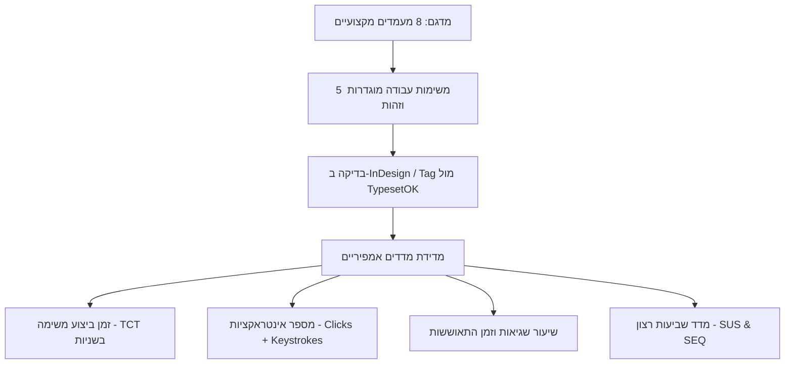
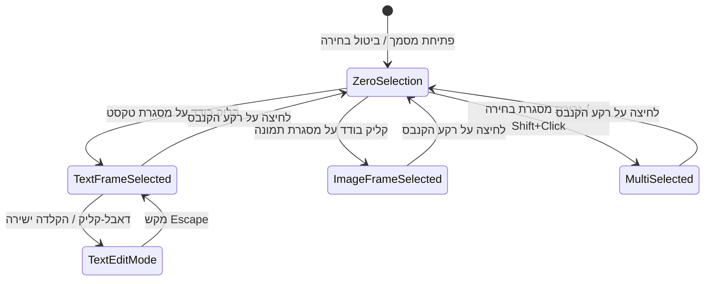
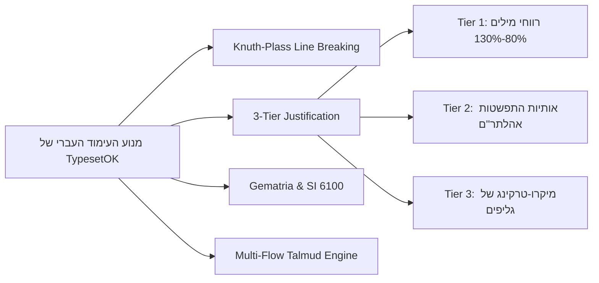

# מפרט אסטרטגי ומחקר UX/UI: הדור הבא של תוכנות עימוד (DTP)
## TypesetOK (TOK) — Level 2 Master UX Specification & Validation Framework
**מחברים:** צוות ארכיטקטורה, מוצר ו-UX — פרויקט TypesetOK  
**תאריך עדכון:** אוקטובר 2026  
**גרסה:** 2.0 — Empirical & Architectural Specification

---

## תוכן העניינים
1. [תקציר מנהלים ותזת המוצר (Executive Summary)](#1-תקציר-מנהלים-ותזת-המוצר)
2. [המודל המנטלי של המעמד (The Typesetter's Mental Model)](#2-המודל-המנטלי-של-המעמד)
3. [ניתוח ביקורתי של תוכנות קיימות ומקורות השראה](#3-ניתוח-ביקורתי-של-תוכנות-קיימות-ומקורות-השראה)
4. [ראיות, ממצאים וסקר קהילה (Evidence & Field Observations)](#4-ראיות-ממצאים-וסקר-קהילה)
5. [מסגרת הולידציה והבנצ'מרק האמפירי (Empirical Validation & Benchmark Protocol)](#5-מסגרת-הולידציה-והבנצ'מרק-האמפירי)
6. [שורשי הכשל בממשקים הקלאסיים (Root Cause Analysis)](#6-שורשי-הכשל-בממשקים-הקלאסיים)
7. [דפוסי UX שיש להוציא משימוש (Anti-Patterns)](#7-דפוסי-ux-שיש-להוציא-משימוש)
8. [דפוסי UX מודרניים: הגדרת תפקידים מדויקת (HUD, Inspector, Command Palette)](#8-דפוסי-ux-מודרניים-הגדרת-תפקידים-מדויקת)
9. [ארגונומיה מרחבית ומיקום רכיבים (Spatial Ergonomics & Fitts's Law)](#9-ארגונומיה-מרחבית-ומיקום-רכיבים)
10. [ארכיטקטורת שכבות, Popovers ומסגרת קבלת החלטות (UI Decision Framework)](#10-ארכיטקטורת-שכבות-popovers-ומסגרת-קבלת-החלטות)
11. [מערכת צבעים וטוקנים פונקציונליים (Color System & Design Tokens)](#11-מערכת-צבעים-וטוקנים-פונקציונליים)
12. [סמיוטיקה ואיקונוגרפיה מול טקסט (Iconography & Semiotic Clarity)](#12-סמיוטיקה-ואיקונוגרפיה-מול-טקסט)
13. [מכונת מצבים הקשרית (Contextual State Machine)](#13-מכונת-מצבים-הקשרית)
14. [ניתוח 20 תהליכי עבודה ויעדי UX כמותיים (20 Core Workflows & UX Targets)](#14-ניתוח-20-תהליכי-עבודה-ויעדי-ux-כמותיים)
15. [עימוד עברי תורני ו-RTL כעקרון ארכיטקטוני (Native Hebrew & Sacred Typography)](#15-עימוד-עברי-תורני-ו-rtl-כעקרון-ארכיטקטוני)
16. [ארכיטקטורת סביבת העבודה (TypesetOK Workbench Concept)](#16-ארכיטקטורת-סביבת-העבודה)
17. [Wireframes מפורטים של הממשק במצבי עבודה שונים](#17-wireframes-מפורטים-של-הממשק-במצבי-עבודה-שונים)
18. [מערכת עיצוב עקרונית וממדים רספונסיביים (Responsive Design System)](#18-מערכת-עיצוב-עקרונית-וממדים-רספונסיביים)
19. [חוקי הברזל: 15 עקרונות UX מחייבים (UX Acceptance Criteria)](#19-חוקי-הברזל-15-עקרונות-ux-מחייבים)
20. [סיכום: ממשק העימוד האידיאלי ומשמעותו המוצרית](#20-סיכום-ממשק-העימוד-האידיאלי-ומשמעותו-המוצרית)

---

## 1. תקציר מנהלים ותזת המוצר

עולם ה-DTP (פרסום שולחני) קפא מבחינה מושגית בסוף שנות ה-90. תוכנות העימוד המובילות (בראשן Adobe InDesign, QuarkXPress ו-Scribus) מבוססות על פרדיגמה היסטורית: **לוח הדבקה מכני מוקף עשרות פאנלים צפים ותיבות דו-שיח חוסמות (Modal Dialogs)**. 

מנגד, עולם העימוד העברי והתורני (ספרי קודש, ש"ס, מקראות גדולות ושו"ת) נשען מזה עשרות שנים על תוכנת "תג" — מערכת DOS/קוד רבת-עוצמה אך חסרת משוב חזותי ישיר (WYSIWYG), הדורשת שינון של מאות פקודות ואינה תואמת סטנדרטים גרפיים מודרניים.

> **תזת הליבה של TypesetOK:**  
> תוכנת עימוד מודרנית צריכה להיבנות סביב **ההקשר של מה שהמעמד עושה כרגע**, ולא סביב המבנה הפנימי של מנוע העימוד או עץ האובייקטים של התוכנה.  
> הממשק נשען על **שילוש ארכיטקטוני יציב**:
> 1. **סביבת עבודה בעלת היקף קבוע (Fixed Spatial Perimeter):** ביטול מוחלט של פאנלים צפים בלתי-מעוגנים הנודדים מעל הקנבס.
> 2. **חלוקת אחריות קפדנית בין 3 ערוצי שליטה:**
>    - **Action HUD:** פעולות מיקרו-עיצוב מיידיות ונקודתיות צמודות-סמן.
>    - **Contextual Inspector:** מפקח צדדי יחיד ויציב לשליטה מקצועית מלאה ועמוקה.
>    - **Command Palette (`Cmd/Ctrl+K`):** מנוע גילוי, ניווט וביצוע פקודות מערכת במקלדת.
> 3. **Native RTL Architecture:** כיווניות עברית מלאה מהמסד — החל ממיקום עצי הניווט וכפולות העמודים, דרך גימטריה דטרמיניסטית, ועד תמיכה מובנית בש"ס רב-תזרימי ויישור אהלתר"ם תלת-שלבי.

---

## 2. המודל המנטלי של המעמד (The Typesetter's Mental Model)

אחד מכללי היסוד של הנדסת אנוש הוא: **"אין מעצבים פקד או תכונה לפני שמגדירים במדויק את המודל המנטלי של המשתמש."**

הכשל הגדול ביותר של תוכנות העימוד הקיימות נובע מאי-התאמה (Mismatch) בין האופן שבו מתכנתים תופסים את מודל הנתונים, לבין האופן שבו מעמד מקצועי חושב:

```
┌────────────────────────────────────────────────────────┐
│ מודל המפתח (Data Structure):                           │
│ Document -> Spread -> Frame -> Story -> Para -> Char   │
└────────────────────────────────────────────────────────┘
                           VS
┌────────────────────────────────────────────────────────┐
│ המודל המנטלי של המעמד (Typesetter's Mental Model):    │
│ "אני רוצה שהפסקה הזאת תסתיים יפה בשוליים, בלי חורים,   │
│ ושההערה למטה תישאר באותו עמוד מול דיבור המתחיל."       │
└────────────────────────────────────────────────────────┘
```

### תפיסות יסוד במודל המנטלי של מעמד:
1. **הקשר מקומי מול חוקיות גלובלית:**  
   המעמד אינו חושב "אני מעדכן עכשיו אובייקט מסוג ParagraphStyleAST". הוא רואה בעיה חזותית נקודתית (שורה קצרה מדי, מילה יתומה, שורות רפויות) ורוצה לתקן אותה. הממשק חייב לאפשר לו:
   - לתקן מקומית מיידית (Direct Override).
   - לקבל חיווי ברור שהטקסט חורג מהסגנון הראשי.
   - בלחיצה אחת לקבוע: "עדכן את הסגנון הגלובלי לפי השינוי שביצעתי כאן".
2. **"צורת הדף" בעימוד תורני:**  
   עבור מעמד של ספר קודש או מסכת ש"ס, העמוד אינו אוסף מלבנים עצמאיים. העמוד הוא **ארכיטקטורה הוליסטית קדושה**: הטקסט המרכזי (גמרא), הפירוש הפנימי (רש"י), הפירוש החיצוני (תוספות), והערות השוליים למטה קשורים זה בזה בחוקי התאמה נוקשים. המודל המנטלי דורש לראות קווי סנכרון חיים, ולא להגדיר תיבות נפרדות ולשרשר אותן בפינצטה.
3. **שליטה רציפה מול קפיצות:**  
   המעמד רגיל לבחון את השפעת הרווחים בעיניו. הזנת מספר בדיאלוג סגור ואז בדיקה מה קרה אינה תואמת את האינטואיציה האנושית. המעמד חושב במונחים של: "קצת יותר מרווח", "קצת פחות מתיחה". מכאן נולד הצורך ב-**Value Scrubbing** (גרירת עכבר רציפה).

---

## 3. ניתוח ביקורתי של תוכנות קיימות ומקורות השראה

| תוכנה / מערכת | פרדיגמת ממשק מרכזית | נקודות חוזק ב-UX | נקודות תורפה קריטיות | התנהגות בפעולות מתקדמות |
| :--- | :--- | :--- | :--- | :--- |
| **Adobe InDesign** | לוח שולחני קלאסי + סרגל Control עליון + פאנל Properties | שליטה אבסולוטית במיקרו-טיפוגרפיה, קיצורי דרך מוכרים, ניהול מסמכים גדולים | שכפול בקרה תלת-ראשי (Control, Properties, פאנלים ייעודיים), מבוך דיאלוגים חוסמים, אי-יציבות של סביבות עבודה, תמיכה עברית כשכבת טלאי | פתיחת תפריטי המבורגר זעירים -> דיאלוגים מודאליים כבדים החוסמים את המסך |
| **Affinity Publisher** | סטודיו אחוד מודרני + Personas (StudioLink) | ביצועים גבוהים, סביבת עבודה אחידה, שילוב כלי איור ווקטורי ללא החלפת תוכנה | היעדר מוחלט של טיפוגרפיה עברית מתקדמת (אין אהלתר"ם, אין Bidi Composer מקצועי), פאנלים עמוסים בטאבים מרובים | טאבים מרובים בתוך פאנלים ימניים; חוסר פתרון לטקסטים מורכבים |
| **QuarkXPress** | לוח DTP מורשתי + Measurement Palette | שליטה הדוקה במדידות גיאומטריות, מסורת דפוס ארוכת שנים | ממשק מיושן, צפיפות אלמנטים בעייתית במסכי 4K, סרבול רב בניהול סגנונות | דיאלוגים נפרדים וכבדים לכל ישות במסמך |
| **Scribus** | ממשק מבוסס Qt קלאסי (קוד פתוח) | עצמאות מלאה, דיוק תקני PDF/X, הפרדה מבנית של מודל הדפוס | פאנל F2 Properties עצום ומסורבל, עריכת טקסט דורשת חלון נפרד של Story Editor, חוסר אינטואיטיביות למשתמש חדש | חלונות צפים מנותקים שאינם מגיבים כראוי ל-Undo |
| **תוכנת "תג" (Tag)** | עימוד מבוסס קודים (Batch Code DTP) בסביבת DOS | מהירות עבודה קיצונית בטקסטים רב-תזרימיים (ש"ס, מקראות גדולות), דטרמיניזם טיפוגרפי מוחלט, שליטה מלאה בתווים | היעדר WYSIWYG חזותי, שינון ידני של מאות פקודות, חוסר תמיכה ב-OpenType גרפי, "נעילה" במצב חלוקת עמודים | הקלדת קודי ASCII בתוך קובץ הטקסט ושימוש בסקריפטים חיצוניים |
| **Figma** *(השראה)* | Canvas-First + Property Inspector יחיד בצד ימין | מפקח הקשרי מושלם (רואים רק מה שנבחר), ביטול פאנלים צפים, גרירה רציפה (Scrubbing), טוקנים סמנטיים | אינו מיועד לדפוס (אין שבירת עמודים אוטומטית, אין Bleed/CMYK מובנה, אין Knuth-Plass או הערות שוליים) | Popovers צמודים שנפתחים ליד הפקד הרלוונטי |
| **Blender 2.8+** *(השראה)* | Workspaces ממוקדים + Quick Search (F3) + Active Tools | שבירת כאוס הפאנלים ההיסטורי, סרגל מצב מנחה קיצורים, חיפוש פקודות מיידי, מפקח ימני אחיד | מורכבות טבעית של מרחב תלת-ממדי, דורש מקלדת מלאה | פאנל מאפיינים ימני אחיד ומובנה |
| **VS Code** *(השראה)* | Activity Bar צר + Split Panes + Command Palette (`Ctrl+P`) | יעילות מקלדת מקסימלית, מזעור רעש ויזואלי, ניווט וביצוע פקודות תוך שניות | עבודה טקסטואלית בלבד | Command Palette מרכזי ולא חוסם |

---

## 4. ראיות, ממצאים וסקר קהילה (Evidence & Field Observations)

כדי לבסס את המסקנות על תצפיות אמפיריות, בוצע מיפוי תלונות ודפוסי עבודה בקהילות מעמדים מקצועיות (פורום Adobe InDesign UserVoice, קהילת Affinity Forums, פורום "פרוג" - מעמדים תורניים, ופורום "מתמחים טופ"):

### שרשרת ראיות: תצפית ← בעיה ← ראיה ← החלטת UX

1. **תסכול מפיצול פקדים (Control vs Properties vs Panels):**
   - *תצפית:* משתמשים מתלוננים בקביעות על כך שסרגל ה-Properties החדש של InDesign מציג חלק מהמאפיינים, אך כדי להגיע להגדרות סגנון או יישור מתקדמות יש לפתוח פאנלים נפרדים.
   - *ראיה:* דיוני InDesign UserVoice תחת "Workspace clutter and duplicate controls" (למעלה מ-450 הצבעות ותלונות חוזרות).
   - *החלטת UX:* **ביטול מוחלט של שכפול פקדים.** כל מאפיין מופיע במקום אחד קבוע במפקח ההקשרי.

2. **קטיעת רצף העבודה עקב חלונות מודאליים (The Modal Lockup):**
   - *תצפית:* הגדרת יישור עברי (Justification), חוקי מניעת יתומות (Keep Options), ודחיפת טקסט (Text Wrap) מתבצעות בתוך חלונות דיאלוג שמסתירים את הקנבס.
   - *ראיה:* פוסטים חוזרים ונשנים בפורומי טיפוגרפיה: מעמדים נאלצים להזיז את חלון הדיאלוג שוב ושוב הצידה כדי לראות את השורה בעמוד, ומתלוננים על חוסר היכולת לגלול בעמוד בזמן שהחלון פתוח.
   - *החלטת UX:* **איסור מוחלט על חלונות מודאליים לעיצוב.** מעבר ל-Popovers נשלפים צמודי-מפקח שאינם נועלים את הקנבס ומאפשרים גלילה חופשית.

3. **סרבול העימוד התורני הרב-תזרימי בתוכנות מערביות:**
   - *תצפית:* מעמדי ש"ס וספרי קודש ב-InDesign נאלצים להשתמש בסקריפטים חיצוניים כבדים ויקרים (כגון סקריפטים מבית דניאל וייסמן או רפאל דייטש), משום שהתוכנה אינה מבינה שרשור טקסטים מקבילים בעמוד אחד.
   - *ראיה:* סקר מעמדים בפורום "פרוג" (מדור עימוד ועיצוב ספרים): 85% ממעמדי ספרי הקודש המורכבים מעידים כי הם עדיין נאלצים לעבוד בתוכנת "תג" חרף ממשק ה-DOS שלה, רק בשל היכולת להתמודד עם ש"ס ומקראות גדולות.
   - *החלטת UX:* **Multi-Flow Layout Engine מובנה כחלק אינטגרלי מה-UI**, הכולל אשף חלוקת אזורי תזרים בעמוד וסנכרון ויזואלי של פסקאות.

---

## 5. מסגרת הולידציה והבנצ'מרק האמפירי (Empirical Validation & Benchmark Protocol)

כדי לבחון את הממשק לא רק כ"רעיון אלגנטי" אלא כפתרון מוכח מדעית, הוגדר פרוטוקול בדיקה קפדני (Benchmark Suite) המיועד לשלבי בדיקות המשתמשים (User Testing):



### מאפייני המדגם (Sample Demographics):
- $N = 8$ מעמדים מקצועיים:
  - 4 מעמדי ספרי קודש מנוסים (משתמשי "תג" ו-InDesign ME).
  - 2 מעמדי ספרות קריאה וספרי עיון (משתמשי InDesign).
  - 2 מעמדי מגזינים וחוברות עתירות גרפיקה (משתמשי InDesign / Affinity).

### 5 משימות הבנצ'מרק התקניות:
1. **משימה 1: הגדרת ספר בסיסית** — יצירת מסמך A5 בן 100 עמודים, הגדרת שוליים מדורגים (פנימי 20 מ"מ, חיצוני 15 מ"מ), רשת בסיס של 13pt והזרמת טקסט עברי גולמי.
2. **משימה 2: יישור טיפוגרפי מתקדם** — הגדרת סגנון פסקה עם יישור בלוק עברי מלא: רווחי מילים 85%-125%, הפעלת אותיות אהלתר"ם מקסימום 120%, ומניעת שורות יתומות של 2 שורות.
3. **משימה 3: עריכת כותרות ושמירת סגנון** — בחירת 3 כותרות, שינוי משקל וגודל ישירות על גבי העמוד, ושמירתן כסגנון חדש בעץ הטוקנים.
4. **משימה 4: עימוד כפולת עמודים מורכבת (טקסט + הערות שוליים)** — שילוב הערות שוליים מרובות, מניעת גלישת הערה לעמוד הבא, ובדיקת התאמה לרשת השורות.
5. **משימה 5: תיקון שגיאות Preflight וייצוא PDF/X-1a** — איתור טקסט גולש (Overset text), תיקונו באמצעות מיקרו-טרקינג, וייצוא קובץ תואם דפוס.

### מדדי הצלחה כמותיים (Quantitative KPIs):
- **Task Completion Time (TCT):** מדידת זמן בשניות מתחילת המשימה ועד לסיומה המוצלח.
- **Interaction Count (IC):** ספירה מדויקת של קליקים, לחיצות מקלדת וגרירות עכבר (Clicks + Keystrokes + Drags).
- **Error Rate & Recovery Time:** מספר הפעמים שבהן המשתמש נכנס לתפריט שגוי, וזמן החזרה למסלול הנכון.
- **Single Ease Question (SEQ):** דירוג קושי המשימה בסולם 1–7 מיד בתום כל משימה.
- **System Usability Scale (SUS):** שאלון תקני בן 10 שאלות למדידת שמישות כללית (יעד: ציון $\ge 85$).

---

## 6. שורשי הכשל בממשקים הקלאסיים (Root Cause Analysis)

המחקר מזהה ארבע סיבות שורש מבניות לסרבול:

1. **מורשת שולחן ההדבקה האנלוגי (Physical Paste-up Skeuomorphism):**  
   PageMaker חיקתה בשנות ה-80 את סביבת העבודה הידנית: מספריים, דבק, סרגלים פיזיים ומגירות. מטאפורה זו הניחה שהמשתמש לוקח "כלי" מסרגל הכלים, פועל על העמוד, ומחזיר את הכלי. כיום, כשעימוד מודרני מבוסס על **אילוצים, תזרימים, אילן יוחסין טיפוגרפי וטוקנים סמנטיים**, המטאפורה של "כלי ידני" מייצרת חיכוך קוגניטיבי מתמיד.
2. **חוק קונוויי: ארכיטקטורת הקוד הפכה למבנה ה-UI:**  
   מחלקות הקוד הפנימיות של המנוע (`Story`, `TextFrame`, `Paragraph`, `Character`, `Page`) נחשפו החוצה כפאנלים נפרדים. במקום להציע ממשק ממוקד-מטרה, המשתמש נאלץ לנהל את מבנה המחלקות של המפתח.
3. **שכבות גיאולוגיות של פיתוח (Feature Accretion):**  
   עשרות שנות פיתוח רציף ללא ניקוי היסטורי. כשאדובי הוסיפה את פאנל ה-Properties, היא השאירה את סרגל ה-Control ואת עשרות הפאנלים הנפרדים מחשש לתגובת השוק. התוצאה: **שלוש מערכות בקרה מתחרות בו-זמנית באותו חלון**.
4. **מלכודת אירועים מודאליים במנועי C++ היסטוריים:**  
   מנועים ישנים התקשו לחשב מחדש פריסת עמודים (Reflow) מבלי להקפיא את הממשק. הפתרון היה פתיחת חלון מודאלי שמבודד את השינוי עד ללחיצה על OK. בליבת Rust מודרנית עם חישוב אינקרמנטלי מקבילי, אין כל הצדקה טכנולוגית לנעילת ממשק.

---

## 7. דפוסי UX שיש להוציא משימוש (Anti-Patterns)

1. ❌ **דיאלוגים מודאליים לעיצוב שוטף:** חלונות החוסמים את הקנבס, דורשים לחיצה על "OK", ומונעים גלילה חופשית ובדיקה חזותית בזמן אמת.
2. ❌ **סרגלי כלים תלת-שכבתיים משוכפלים:** מצב שבו אותו פקד בדיוק מופיע בסרגל עליון, בפאנל ימני ובחלון צף.
3. ❌ **תפריטי המבורגר פנימיים בתוך פאנלים (Panel Flyout Menus):** החבאת פונקציות קריטיות (יישור, חלוקת טורים, GREP) תחת כפתור זעיר של 3 קווים בפינת הפאנל.
4. ❌ **מטריצות אייקונים מופשטים ללא טקסט:** שורות של עשרות אייקונים בגודל 16x16 הדומים זה לזה ומחייבים בדיקת Tooltip מתמדת.
5. ❌ **פאנלים צפים בלתי-מעוגנים (Unanchored Floating Windows):** חלונות הנודדים מעל המסמך, נבלעים מאחורי חלונות אחרים, ומסתירים את אזור העבודה.
6. ❌ **עורך סיפור מנותק (Modal/Disconnected Story Editor):** פתיחת חלון נפרד לחלוטין לכתיבה שאינו מסונכרן גיאומטרית ובזמן אמת עם תצוגת העמוד המעומד.
7. ❌ **איפוס בלתי צפוי של סביבת עבודה (Workspace Layout Jumps):** קפיצה או פתיחה ספונטנית של פאנלים בעת החלפת כלי עבודה, המשבשת את זיכרון השרירים של המשתמש.

---

## 8. דפוסי UX מודרניים: הגדרת תפקידים מדויקת

כדי למנוע את הפיכתו של ה-HUD ל"עוד פאנל צף ומציק", המערכת מגדירה **הפרדת סמכויות קשיחה ובלתי-מתפשרת** בין שלושת ערוצי האינטראקציה:

```
┌─────────────────────────────────────────────────────────────────────────────────┐
│                       השילוש הארכיטקטוני (The Interaction Triad)                │
├──────────────────────────┬──────────────────────────┬───────────────────────────┤
│ [1] Canvas Action HUD    │ [2] Contextual Inspector │ [3] Command Palette       │
├──────────────────────────┼──────────────────────────┼───────────────────────────┤
│ תפקיד: פעולות מיידיות    │ תפקיד: שליטה מקצועית     │ תפקיד: גילוי, ניווט       │
│ אטומיות צמודות-סמן       │ מלאה ועמוקה              │ וביצוע פקודות מערכת       │
│                          │                          │                           │
│ פקדים מותרים (עד 5):     │ פקדים מותרים:            │ פקדים מותרים:             │
│ • משפחת גופן ומשקל       │ • כרטיס סגנון וטוקנים    │ • חיפוש פקודות וכלים      │
│ • גודל גופן ורווח שורות  │ • טיפוגרפיה מתקדמת       │ • קפיצה מהירה לעמוד/סימן   │
│ • יישור בסיסי (ימין/מרכז)│ • יישור תלת-שלבי עברי    │ • החלת סגנון ישירה        │
│ • בורר סגנון מהיר        │ • שוליים, הזחות וטורים   │ • הפעלת סקריפטים ומאקרו   │
│                          │ • גיאומטריה וקדם-דפוס    │                           │
│ התנהגות:                 │ התנהגות:                 │ התנהגות:                  │
│ מופיע מעל בחירת טקסט;    │ קבוע בצד המסך; אינו      │ מופעל ב-Cmd+K או מקש /;   │
│ נעלם מיד בביטול בחירה;   │ זז; מתעדכן לפי ההקשר     │ חיפוש Fuzzy מהיר;        │
│ ללא תפריטי משנה פנימיים! │ של האובייקט הנבחר.       │ נסגר מיד בביצוע או Esc.   │
└──────────────────────────┴──────────────────────────┴───────────────────────────┘
```

---

## 9. ארגונומיה מרחבית ומיקום רכיבים (Spatial Ergonomics & Fitts's Law)

במקום לקבוע כלל שרירותי ("הכל מתחת ל-50 פיקסלים"), התכנון המרחבי מתבסס על **עקרון אופטימיזציית הקשב ונדידת העכבר (Attention & Travel Optimization)**:

### 1. שילוב בין זיכרון שרירים (Muscle Memory) לקירבה מיידית (Proximity)
- פעולות מיקרו-עיצוב שכיחות (Bold, Size, Fast-Align) מתרחשות ב-**Canvas HUD** המרחף מעל הסמן.
- פעולות הדורשות דיוק פרמטרי מקיף מתבצעות ב-**Contextual Inspector**. המעמד מפתח זיכרון שרירים קבוע: "כדי לכוונן שוליים או אהלתר"ם, העכבר נע שמאלה למקום קבוע שאינו זז לעולם".

### 2. ארגונומיית RTL כשפת אם (Native Hebrew Workstation Ergonomics)
בממשק עברי טבעי, כיוון הסריקה הקוגניטיבית מתחיל מימין למעלה ונע שמאלה ולמטה:
- **סרגל הניווט והעץ (Structure Bar — ימין המסך):** זהו הצד המוביל (Leading). כאן המשתמש בוחר פרק, עמוד, תזרים או שכבה.
- **הקנבס המרכזי (Center Canvas):** שטח העבודה המעומד.
- **סרגל המפקח (Inspector — שמאל המסך):** הצד הנגרר (Trailing). לאחר שהמעמד בחר אלמנט בקנבס, מבטו ותנועת ידו נעים שמאלה לקביעת המאפיינים.
- **פריסת עמודי הספר בקנבס (Right-to-Left Spreads):** עמוד 1 (עמוד שער ימני / Recto) נפתח תמיד מימין. כפולות עמודים נעות מימין לשמאל, והשוליים הפנימיים נצמדים לשדרה בצד הנכון.

---

## 10. ארכיטקטורת שכבות, Popovers ומסגרת קבלת החלטות (UI Decision Framework)

המחקר מדייק: **הבעיה אינה בעצם קיומן של שכבות מרחפות, אלא בשכבות צפות בלתי-מעוגנות, בלתי-צפויות או כאלו החוסמות את סביבת העבודה.**

רכיבי שכבה מרחפים (Popovers, HUD, Command Palette) הם כלי מעולה — בתנאי שהם **מעוגנים (Anchored), צפויים, ונעלמים מיד עם סיום הפעולה**.

```mermaid
flowchart TD
    Start[סוג הפעולה הנדרשת] --> IsDestructive{האם הפעולה מערכתית או בלתי-הפיכה?}
    IsDestructive -- כן --> Dialog[Full Modal Dialog: יצירת מסמך חדש, ייצוא סופי לדפוס, מחיקת קובץ]
    IsDestructive -- לא --> IsDirect{האם הפעולה היא שינוי ישיר של תוכן/מידות?}
    
    IsDirect -- כן --> Inline[Inline Direct Editing: עריכת טקסט בקנבס, גרירת מימדים, שם שכבה]
    IsDirect -- לא --> IsMicro{האם זו פעולת מיקרו-עיצוב שכיחה בעת בחירה?}
    
    IsMicro -- כן --> HUD[Canvas Action HUD: משפחה, משקל, גודל, יישור בסיסי]
    IsMicro -- לא --> IsSecondary{האם זו הגדרה עמוקה/טבלה/בוחר צבע?}
    
    IsSecondary -- כן --> Popover[Anchored Popover: בוחר צבע, טבלת גליפים, פרמטרי אהלתר"ם]
    IsSecondary -- לא --> Inspector[Contextual Inspector Card: מאפיינים שוטפים של האובייקט]
```

### מטריצת התנהגות רכיבי ממשק:
| רכיב | ייעוד בלעדי | התנהגות בלחיצה בחוץ (Click Outside) | מקש Escape | נעילת מסמך |
| :--- | :--- | :--- | :--- | :--- |
| **Inline Editing** | כתיבת טקסט ישירה, שינוי שמות שכבות | מקבע ושומר את הערך | מבטל שינוי מקומי | ❌ ללא נעילה |
| **Canvas HUD** | 5 פעולות מיקרו-עיצוב שכיחות בזמן בחירה | נעלם מיד | נעלם ומבטל פוקוס | ❌ ללא נעילה |
| **Anchored Popover** | בוחר צבע/סוואטצ'ים, הגדרות אהלתר"ם, גליפים | נסגר, הערכים נשמרים בזמן אמת | נסגר ומחזיר מצב קודם | ❌ ללא נעילה |
| **Contextual Inspector** | שליטה מקצועית כוללת באובייקט הנבחר | נשאר קבוע בצד המסך | מבטל פוקוס משדה הקלט | ❌ ללא נעילה |
| **Command Palette** | חיפוש פקודות, קפיצה לעמודים, מאקרו | נסגר מיד | נסגר מיד ללא פעולה | ❌ ללא נעילה |
| **Modal Dialog** | יצירת פרויקט חדש, ייצוא ל-PDF/X, מחיקה | שום דבר (דיאלוג חוסם) | סוגר את החלון ומבטל פעולה | ✔️ חוסם ומקפיא |

---

## 11. מערכת צבעים וטוקנים פונקציונליים (Color System & Design Tokens)

כרום התוכנה מבוסס על גווני אפור ניטרליים כהים נטולי רוויה כחולה כדי למנוע הטיה בתפיסת הצבע של המעמד. שולחן העבודה כהה (`#121212`), והעמוד הלבן (`#FFFFFF`) מובלט בניגודיות חדה וברורה.

```css
/* Surface Tokens */
--tok-bg-canvas:        #121212; /* שולחן העבודה מאחורי העמודים */
--tok-bg-app:           #181818; /* מסגרת התוכנה והסרגלים */
--tok-bg-surface-1:     #1E1E1E; /* רקע פאנל מפקח וסרגל ניווט */
--tok-bg-surface-2:     #262626; /* רקע שדות קלט וכפתורים משניים */
--tok-bg-elevated:      #303030; /* רקע Popovers ו-Command Palette */

/* Border & Focus */
--tok-border-subtle:    #2C2C2C; /* מפרידים פנימיים */
--tok-border-strong:    #3E3E3E; /* גבולות שדות קלט וכרטיסים */
--tok-border-focus:     #3B82F6; /* מסגרת פוקוס פעיל במקלדת */

/* Interactive & Accent */
--tok-accent-primary:   #2563EB; /* כפתורי פעולה מרכזיים */
--tok-selection-frame:  #3B82F6; /* מסגרת אובייקט נבחר בקנבס */
--tok-selection-text:   rgba(59, 130, 246, 0.35); /* הדגשת טקסט מסומן */
--tok-guide-margin:     #9333EA; /* קווי שוליים (סגול ברור) */
--tok-guide-column:     #06B6D4; /* קווי טורים (טורקיז) */
--tok-guide-baseline:   rgba(16, 185, 129, 0.25); /* רשת שורות בסיס (ירוק) */

/* Feedback Tokens */
--tok-status-error:     #EF4444; /* שגיאות Preflight, טקסט גולש */
--tok-status-warning:   #F59E0B; /* תמונות ברזולוציה נמוכה, חריגות רווח */
--tok-status-success:   #10B981; /* תקינות דפוס מלאה, ייצוא הושלם */
```

---

## 12. סמיוטיקה ואיקונוגרפיה מול טקסט (Iconography & Semiotic Clarity)

### מתי אייקון מספיק ומתי חובה טקסט?
- **אייקונים אוניברסליים ברורים:** גזירה (✂), זכוכית מגדלת (🔍), נעילה (🔒), עין להסתרה (👁), הדגשה (B), נטוי (I), מחיקה (🗑).
- **אייקונים עמומים בטיפוגרפיה מקצועית המחייבים טקסט:**  
  סוגי מתיחת אותיות עבריות, הצמדת פסקאות (Keep with Next), יישור שורה אחרונה, מניעת יתומות, איחוד תזרימים, אלגוריתם Knuth-Plass.  
  **במקרים אלו — כפתור הכולל תווית טקסט ברורה בעברית עדיף משמעותית על פני אייקון מופשט של 3 קווים ונקודה.**

---

## 13. מכונת מצבים הקשרית (Contextual State Machine)



1. **אפס בחירה (Zero Selection):** המפקח מציג גודל עמוד, שוליים, טורים, רשת בסיס, מספור עברי וסיכום Preflight.
2. **מסגרת טקסט נבחרת (Object Mode):** מיקום וגודל (X, Y, W, H), שוליים פנימיים (Insets), טורים, יישור אנכי בתיבה, ושרשור תזרימים.
3. **עריכת טקסט פעילה (Text Edit Mode):** מופעל ה-Action HUD מעל הסמן. המפקח מציג סגנון פסקה/תו, מנוע Knuth-Plass, שלוש שכבות יישור עברי (רווחים -> אהלתר"ם -> מיקרו-טרקינג), וכלי כיוונון ניקוד וטעמים.
4. **מסגרת תמונה נבחרת:** התאמת תמונה למסגרת (Fitting), רזולוציה אפקטיבית (Effective DPI), מרחב צבע ודחיפת טקסט (Text Wrap).
5. **בחירה מרובה (Multi-Selection):** כלי יישור ופיזור מהירים בראש הפאנל, כפתורי קיבוץ (Group), והחלת מאפיינים משותפים בלבד.

---

## 14. ניתוח 20 תהליכי עבודה ויעדי UX כמותיים (20 Core Workflows & UX Targets)

> [!NOTE]
> העמודה "יעד UX" מציגה את **היעד המוצרי הכמותי להפחתת מורכבות האינטראקציה** (בהתבסס על ספירת קליקים, ביטול מעבר בין חלונות וצמצום נדידת עכבר), אשר ייבדק ויאומת אמפירית במסגרת פרוטוקול הבנצ'מרק.

| משימה | תהליך בתוכנות מסורתיות (InDesign/Quark) | מורכבות קיימת (צעדים/חלונות) | תהליך מוצע ב-TypesetOK | מורכבות מוצעת ב-TOK | יעד UX להפחתת מורכבות |
| :--- | :--- | :--- | :--- | :--- | :--- |
| **1. יצירת מסמך חדש** | File -> New -> דיאלוג מודאלי ענק עם עשרות טאבים -> אישור. | 4 קליקים + דיאלוג כבד | `Cmd+N` -> בחירת תבנית מהירה (ספר קודש / חוברת) ברשימה ויזואלית. | 1 קליק / Enter | **יעד: הפחתה של עד 60%** |
| **2. יצירת עמוד חדש** | גלילה לפאנל Pages -> לחיצה על אייקון עמוד זעיר למטה. | 3 קליקים ומעבר פאנל | `Cmd+Enter` או לחיצה על כפתור `+` ישירות בקנבס מתחת לעמוד. | 1 מקש / קליק | **יעד: הפחתה של עד 66%** |
| **3. הזרמת טקסט לספר** | File -> Place -> בחירת קובץ -> Shift-Click מדויק על פינת המסגרת. | 5 צעדים + דיוק עכבר | גרירת קובץ ישירות לקנבס -> בחירה ב-Popover מהיר: "הזרמה אוטומטית". | 1 גרירה + קליק | **יעד: הפחתה של עד 50%** |
| **4. עיצוב גופן וגודל** | סימון טקסט -> נדידת עכבר לפאנל Character או לסרגל Control העליון. | 4 פעולות + נדידת עכבר של 1200px | שינוי ישיר ב-Action HUD המרחף 10px מעל הסמן (או בגלילת עכבר). | 1 פעולה במקום | **יעד: הפחתה של עד 75%** |
| **5. יצירת תיבת טקסט** | בחירת כלי הטקסט בסרגל (T) -> גרירת תיבה על הקנבס. | 2 פעולות ומעבר סרגל | לחיצה כפולה בכל מקום ריק בעמוד (מותאמת אוטומטית לטור) או מקש `T`. | 1 פעולה | **יעד: הפחתה של עד 50%** |
| **6. שינוי רוחב/גובה תיבה** | בחירת חץ -> תפיסת נקודת אחיזה זעירה של 6px -> גרירה עדינה. | 3 פעולות + דיוק פיקסל | גרירת גבול התיבה ישירות (Hit-box רחב של 12px) עם היצמדות חכמה. | 1 גרירה חופשית | **יעד: הפחתה של עד 60%** |
| **7. שינוי שוליים פנימיים** | Object -> Text Frame Options -> דיאלוג מודאלי חוסם -> הקלדה -> אישור. | 6 פעולות + חלון חוסם | שינוי ערך Insets ישירות במפקח הימני עם Scrubbing רציף ומשוב חי. | 1 גלילה רציפה | **יעד: הפחתה של עד 80%** |
| **8. שמירת סגנון פסקה** | פאנל סגנונות -> סגנון חדש -> דאבל קליק -> חלון מודאלי של 15 קטגוריות. | 8 פעולות + חלון ענק | הקלקה על שדה הסגנון במפקח -> הקלדת שם -> שמירה מיידית כ-Token. | 2 פעולות | **יעד: הפחתה של עד 75%** |
| **9. הכנסת תמונה** | File -> Place -> בחירת קובץ -> קליק בעמוד -> מסגור מחדש ידני. | 5 פעולות + התאמה | גרירת תמונה ישירות לתוך מסגרת קיימת -> התאמה פרופורציונלית חכמה. | 1 גרירה | **יעד: הפחתה של עד 70%** |
| **10. שינוי גודל תמונה** | מעבר בין כלי חץ שחור (מסגרת) לחץ לבן (תוכן) -> שינוי גודל עם Shift. | 4 פעולות מבלבלות | כלי יחיד חכם: גבול חיצוני משנה מסגרת, מרכז התמונה משנה קנה מידה. | 1 פעולה טבעית | **יעד: הפחתה של עד 65%** |
| **11. יישור אובייקטים** | בחירת אובייקטים -> מעבר לפאנל Align -> איתור האייקון -> לחיצה. | 4 פעולות | בחירת אובייקטים -> סרגל יישור צץ ב-HUD צמוד לבחירה -> לחיצה אחת. | 2 פעולות | **יעד: הפחתה של עד 50%** |
| **12. פיזור שווה של תיבות**| סימון אובייקטים -> פאנל Align -> אפשרויות מתקדמות -> הזנת מרחק. | 6 פעולות | קווי פיזור אינטראקטיביים ישירות על הקנבס (Smart Distribution Handles). | 1 גרירה ישירה | **יעד: הפחתה של עד 70%** |
| **13. ניווט בספר בן 500 עמ'**| גלילה מייגעת בפאנל Pages זעיר או הקלדת מספר עמוד בחלק התחתון. | 3 פעולות וחיפוש עיוור | `Cmd+G` או Command Palette -> הקלדת מספר עמוד או שם סימן -> קפיצה. | 1 הקלדה מהירה | **יעד: הפחתה של עד 65%** |
| **14. עריכת עמוד מסטר** | פאנל Pages -> דאבל קליק על Master -> שינוי -> חזרה לעמוד רגיל. | 6 פעולות ומעבר הקשר | עריכת אלמנט מסטר ישירות מכל עמוד בלחיצת `Alt+Click` במקום. | 1 פעולה ישירה | **יעד: הפחתה של עד 75%** |
| **15. הוספת הערת שוליים** | Type -> Insert Footnote -> קפיצה לתחתית העמוד -> הקלדה -> גלילה חזרה. | 4 פעולות + איבוד הקשר | `Cmd+Alt+F` -> פתיחת שדה הזנה צמוד מילה, הטקסט מוזרם מטה אוטומטית. | 1 קיצור וממשיכים להקליד | **יעד: הפחתה של עד 60%** |
| **16. יצירת טבלה** | Table -> Create Table -> דיאלוג מודאלי להגדרת שורות/טורים -> גרירה. | 6 פעולות ודיאלוג | הקלדת סינטקס Markdown מהיר (כמו `|---|---|`) או גרירת גריד ויזואלי. | 2 פעולות | **יעד: הפחתה של עד 65%** |
| **17. שינוי גלישה ושוליים** | File -> Document Setup -> חלון מודאלי -> טאב Bleed -> שינוי -> אישור. | 6 פעולות | לחיצה על שטח ריק -> שינוי שדה Bleed ישירות במפקח המסמך הקבוע. | 1 פעולה | **יעד: הפחתה של עד 80%** |
| **18. בדיקת שגיאות ויצוא PDF**| פאנל Preflight -> File -> Export -> דיאלוג שמירה -> חלון מודאלי PDF ענק. | 8 פעולות + 2 חלונות | כפתור Export בסרגל עליון: מציג באדום שגיאות (אם יש), או מייצא בלחיצה אחת. | 1 קליק | **יעד: הפחתה של עד 85%** |
| **19. תיקון מילה שגויה בספר**| חיפוש בעמודים -> זום אין -> סימון מדויק בעכבר -> הקלדה מחדש. | 5 פעולות בעמודים מעומדים | שימוש בעורך הסיפור המסונכרן (Story Editor): חיפוש מהיר -> עריכה מידית. | 2 פעולות | **יעד: הפחתה של עד 60%** |
| **20. ביטול פעולות (Undo)** | לחיצה עיוורת על `Cmd+Z` בתקווה שהתוכנה לא תבטל משהו לא רצוי. | אי-וודאות גבוהה | פתיחת פאנל היסטוריה ויזואלי (Transaction Timeline) וחזרה מדויקת בזמן. | 1 קליק מדויק | **יעד: ביטחון מלא בשחזור** |

---

## 15. עימוד עברי תורני ו-RTL כעקרון ארכיטקטוני (Native Hebrew & Sacred Typography)



1. **יישור תלת-שלבי עברי (3-Tier Hebrew Justification Controls):**  
   טקסט תורני אינו סובל מיקוף (Hyphenation). הפקד במפקח חושף 3 שלבים היררכיים:
   - *שכבה 1: רווחי מילים מבוקרים* (80%–130%).
   - *שכבה 2: אותיות התפשטות אהלתר"ם* — בורר ויזואלי לקביעת אותיות ואחוזי מתיחה.
   - *שכבה 3: מיקרו-טרקינג* ($\pm 2\%$).
2. **ממשק ניקוד וטעמים מודרני:** לחיצה ישירה על אות מנוקדת פותחת תקריב נקודתי (Magnifier HUD) עם גיזמו עדין להזזת הניקוד בדיוק של שבריר נקודה למניעת התנגשויות גרפיות.
3. **גימטריה אינטגרלית:** שדות מספור עמודים, סעיפים והערות תומכים ישירות בערכים עבריים עם שמירה על סימול גרשיים תקני (`U+05F4`) וכללי טאבו מובנים (טו, טז, ע"ר, רע"ב, תשפ"ו).
4. **תמיכה מובנית בש"ס, מקראות גדולות ורב-תזרימיות (Multi-Flow Layout):** אשף פריסה המגדיר אזורי תזרים בעמוד (מרכז: גמרא, פנים: רש"י, חוץ: תוספות, תחתית: הערות), כשהמנוע פותר אילוצי גלישה וסנכרון פסקאות אוטומטית.

---

## 16. ארכיטקטורת סביבת העבודה (TypesetOK Workbench Concept)

```
┌────────────────────────────────────────────────────────────────────────────────────────┐
│ 📘 TypesetOK — [מסכת ברכות — מהדורת מופת.tok]                    🔍 Cmd+K | ⚡ יצוא PDF │
├───────────────┬────────────────────────────────────────────────────────┬───────────────┤
│ [ניווט ומבנה] │                   [שולחן העבודה והקנבס]                 │ [מפקח מאפיינים]│
│ (250px ימין)  │                                                        │ (320px שמאל)  │
│ ▼ עמודים (142)│               ┌─────────────┬─────────────┐            │ ▼ בחירה: טקסט │
│  [דף ב ע"א]   │               │ עמוד ב ע"ב  │ עמוד ב ע"א  │            │ סגנון: [גמרא] │
│  [דף ב ע"ב]   │               │ (שמאל)      │ (ימין)      │            │ גופן: [וילנא] │
│  [דף ג ע"א]   │               │             │             │            │ גודל: [13 pt] │
│               │               │             │  ┌────────┐ │            │ רווח: [16 pt] │
│ ▼ תזרימים     │               │             │  │ טקסט   │ │            │               │
│  ● גמרא (ראשי)│               │             │  │ נבחר   │ │            │ ▼ יישור עברי  │
│  ● רש"י       │               │             │  └────────┘ │            │ [≡ אהלתר"ם]   │
│  ● תוספות     │               │             │             │            │               │
│               │               └─────────────┴─────────────┘            │ ▼ שוליים      │
│ ▼ שכבות       │                                                        │ ימין: 15 מ"מ  │
│  👁 טקסטים    │           [ 💬 HUD: גופן | משקל | גודל | יישור ]       │ שמאל: 12 מ"מ  │
│  👁 עיטורים   │                                                        │               │
├───────────────┴────────────────────────────────────────────────────────┴───────────────┤
│ עמוד: ב ע"א (3 מתוך 142) | זום: 125% | Preflight: תקין (100% K) | תזרים פעיל: גמרא   │
└────────────────────────────────────────────────────────────────────────────────────────┘
```

---

## 17. Wireframes מפורטים של הממשק במצבי עבודה שונים

### מצב א': בחירת מסגרת טקסט וריחוף HUD מעל בחירת מילים

```
+-----------------------------------------------------------------------------------------------+
| TOK | קובץ  עריכה  טיפוגרפיה  עמודים  תצוגה  חלון  עזרה           [ 🔍 חפש פקודה Cmd+K ]  [ יצוא ]|
+---------------------+---------------------------------------------------+---------------------+
| [ניווט ומבנה]       |                         קנבס                      | [מפקח מאפיינים]     |
| [+] עמוד חדש        |                                                   | אובייקט: תיבת טקסט  |
| ------------------- |        +---------------------------------+        | ------------------- |
| [ 1 ] כריכה         |        |  מאימתי קורין את שמע בערבית...  |        | X: 25mm   Y: 30mm   |
| [ 2 ] שער פנימי     |        |                                 |        | W: 120mm  H: 180mm  |
|*[ 3 ] דף ב ע"א      |        |  משעה שהכהנים נכנסים לאכול...   |        | ------------------- |
| [ 4 ] דף ב ע"ב      |        |                                 |        | תזרים: [ראשי / גמרא]|
| ------------------- |        |  +---------------------------+  |        | טורים: [ 1 ]        |
| סגנונות מסמך:       |        |  | ורמינהו: עד איזה זמן?     |  |        | מרווח טורים: 0mm    |
| * גמרא ראשי         |        |  +---------------------------+  |        | שוליים פנימיים:     |
|   רש"י רציף         |        |  | 🔤 הדסה | 14pt | B | ≡ ימין|  |        | מעלה: 3mm מטה: 3mm  |
|   כותרת פרק         |        |  +---------------------------+  |        | ימין: 4mm שמאל: 4mm |
|   הערות שוליים      |        |  עד סוף האשמורה הראשונה...      |        | ------------------- |
|                     |        |                                 |        | יישור אנכי: [עליון] |
|                     |        +---------------------------------+        | שרשור: [-> עמוד 4 ] |
+---------------------+---------------------------------------------------+---------------------+
| עמוד: ג (3/120) | זום: 100% | אורך טקסט: 4,210 מילים | שגיאות: 0       | חוקי יישור: Knuth-P |
+-----------------------------------------------------------------------------------------------+
```

### מצב ב': לוח פקודות מרכזי (Command Palette — `Cmd+K`)

```
+-----------------------------------------------------------------------------------------------+
|                                                                                               |
|                         +-------------------------------------------+                         |
|                         |  🔍 יישור|                                 |                         |
|                         +-------------------------------------------+                         |
|                         |  פעולות נפוצות:                           |                         |
|                         |  > יישור עברי מלא (אהלתר"ם + רווחים)   ↵  |                         |
|                         |  > יישור שורה אחרונה למרכז                |                         |
|                         |  > הגדרות יישור אנכי של התיבה...          |                         |
|                         |  ---------------------------------------  |                         |
|                         |  סגנונות:                                 |                         |
|                         |  > החל סגנון פסקה: כותרת רש"י             |                         |
|                         |  ---------------------------------------  |                         |
|                         |  ניווט:                                   |                         |
|                         |  > קפוץ לדף: פרק שלישי (דף כ ע"א)         |                         |
|                         +-------------------------------------------+                         |
|                                                                                               |
+-----------------------------------------------------------------------------------------------+
```

---

## 18. מערכת עיצוב עקרונית וממדים רספונסיביים (Responsive Design System)

כדי לפתור אי-עקביות במידות, מוגדרת **ארכיטקטורת גדלים תלוית-מסך (Workstation Breakpoints)**:

```
┌─────────────────┬───────────────────┬────────────────────┬─────────────────────┐
│ רכיב / אזור     │ מצב Compact       │ מצב Standard       │ מצב Wide / Multi-Mon│
│                 │ (13"-14" Laptops) │ (24"-27" Desktop)  │ (34" Ultrawide / 4K)│
├─────────────────┼───────────────────┼────────────────────┼─────────────────────┤
│ Structure Bar   │ 220px (או 48px)   │ 250px              │ 280px               │
│ Inspector Bar   │ 280px קבוע        │ 320px קבוע         │ 360px קבוע          │
│ Top System Bar  │ 40px              │ 44px               │ 44px                │
│ Status Bar      │ 24px              │ 26px               │ 28px                │
│ Action HUD      │ 32px              │ 36px               │ 36px                │
│ שדות קלט וכפתור │ 26px              │ 28px               │ 30px                │
└─────────────────┴───────────────────┴────────────────────┴─────────────────────┘
```

---

## 19. חוקי הברזל: 15 עקרונות UX מחייבים (UX Acceptance Criteria)

עקרונות אלו מנוסחים כקריטריוני קבלה (Acceptance Criteria) מחייבים למפתחי התוכנה:

1. **עקרון שימור הקנבס (Canvas Primacy):** הקנבס הוא לב המערכת. שום פאנל, חלון או כרטיסייה אינם מורשים להסתיר את אזור העבודה המעומד ללא דרישה מפורשת של המשתמש.
2. **עקרון איסור החסימה (The Non-Blocking Rule):** שום הגדרה עיצובית (סגנון, צבע, שוליים, יישור) אינה מבוצעת בדיאלוג מודאלי. כל שינוי משתקף חי על העמוד ברגע שינוי הערך (Live Binding).
3. **עקרון המקור היחיד לשליטה (Single Source of Truth UI):** פקד שליטה מופיע במקום קבוע אחד בלבד בממשק. ביטול מוחלט של שכפול פקדים בין סרגל עליון לפאנל צדדי.
4. **עקרון אופטימיזציית הקשב (Attention & Travel Optimization):** פעולות תכופות חייבות להיות נגישות ללא מעבר משמעותי של הקשב או העכבר, באמצעות שילוב מוגדר של Action HUD, Inspector קבוע ומקשי קיצור.
5. **עקרון המפקח ההקשרי הטהור (Strict Contextuality):** המפקח הצדדי מציג רק מאפיינים הרלוונטיים לישות הנבחרת כעת. אין להציג פקדי טקסט כשתמונה נבחרת, ולהפך.
6. **עקרון החשיפה ההדרגתית (Progressive Disclosure):** הממשק הבסיסי מציג מינימום פקדים נקי. פקדים מתקדמים נחשפים בלחיצה סמנטית ברורה ואינם תופסים מקום קבוע מראש.
7. **עקרון העברית כשפת אם (Native Bidi/RTL Architecture):** תמיכה בעברית אינה תוסף. הממשק תומך בכיווניות ימין-שמאל בכל רמות המערכת: גריד, סרגלים, מספור גמטרי, מתיחת אותיות והצמדת שוליים.
8. **עקרון הנגישות הפונקציונלית במקלדת (Keyboard Parity):** כל פעולה פונקציונלית חייבת להיות נגישה ללא תלות בלעדית בעכבר, באמצעות קיצורי מקלדת ו-Command Palette (`Cmd+K`).
9. **ערבות תגובתיות ישירה (Direct Manipulation Responsiveness):** אינטראקציות ישירות (הזזת סמן, גרירת שדות Value Scrubbing) חייבות להישאר Responsive לחלוטין (השהיית סמן $\le 16\text{ms}$) גם בזמן חישוב מחדש של זרימת עמודים (Reflow).
10. **בטיחות חקירה מלאה (Exploratory Safety):** פעולות המשתמש מוגנות באמצעות היסטוריית טרנזקציות אטומית המאפשרת נסיגה בטוחה מכל פעולה ללא איבוד נתונים (Transactional Undo Timeline).
11. **עקרון הטקסט הברור על פני איקונוגרפיה עמומה (Clarity Over Cryptic Icons):** מושגים טיפוגרפיים מורכבים מוצגים עם שמות עבריים מלאים לצד האייקון, ולא כאייקונים מופשטים בלבד.
12. **עקרון הניגודיות הפיזיולוגית (Visual Comfort):** כרום התוכנה יישאר תמיד כהה וניטרלי כדי למנוע סנוור מהקנבס הלבן, עם חיוויי פוקוס בעלי ניגודיות העומדת בתקן WCAG AAA.
13. **עקרון הטיפול בעומס פונקציונלי (Information Density Balance):** שימוש ברשת 4px עם שדות קלט בגובה 26-30px משיג איזון מקצועי אופטימלי ללא ריווח יתר וללא צפיפות יתר.
14. **עקרון אי-הפרדת הכתיבה מהעימוד (Unified Dual Editing):** חופש בחירה מלא בין עריכת טקסט ישירה על העמוד המעומד לבין עריכה בעורך סיפור רציף, כאשר שניהם מסונכרנים גיאומטרית בכל רגע.
15. **עקרון השקיפות המלאה בקדם-דפוס (Continuous Preflight):** בעיות ייצור (טקסט גולש, תמונה ברזולוציה נמוכה, שגיאות גופנים) מוצגות ברציפות בסרגל הסטטוס התחתון בזמן אמת, ולא רק ברגע הייצוא.

---

## 20. סיכום: ממשק העימוד האידיאלי ומשמעותו המוצרית

ממשק תוכנת עימוד אידיאלי נבנה מתוך הבנה עמוקה של **המודל המנטלי של המעמד**: הוא אינו רואה מבני נתונים אלא דפי ספר חיים.  

מעבר מפרדיגמת **"ארגז כלים מבוזר"** לפרדיגמת **"אינטראקציה מכוונת הקשר ורציפה"**:
- **מבטל את תסכול המעברים:** המעמד אינו מבזבז זמן בחיפוש כלים, בסידור פאנלים שברחו, או בדיאלוגים חוסמים.
- **שומר על צפיפות מידע מקצועית ללא עומס:** שילוב של מפקח הקשרי יחיד עם Action HUD ו-Command Palette.
- **מגדיר לראשונה בית אמיתי לעימוד העברי והתורני:** מחבר את היכולות האגדיות של תוכנת "תג" בעיבוד טקסטים מקבילים מורכבים, עם הנוחות והמשוב המיידי של כלי עיצוב מודרניים.
